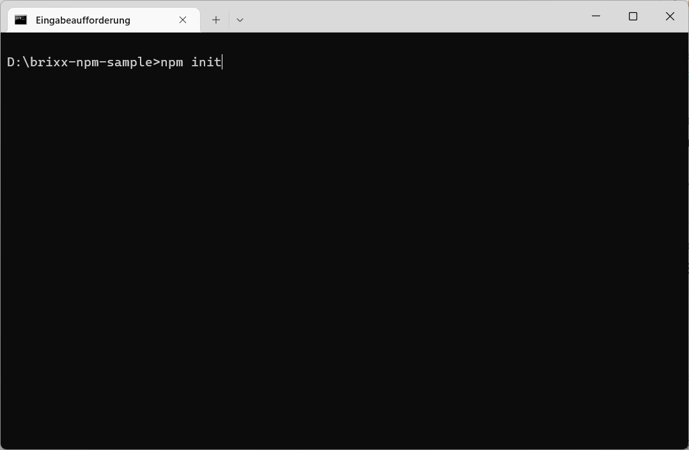

# Projekt Konfiguration package.json

Die **`package.json`** ist die **Konfigurationsdatei** in einem **Node.js** Projekt, die sich in der Regel im Stammverzeichnis (`Root`) des Projekts befindent.

Beispiel für eine *package.json* Datei

    {
      "name": "brixx-simple-element",
      "version": "1.0.0",
      "description": "Brixx simple element sample",
      "main": "index.js",
      "scripts": {
        "build": "webpack --env package_name=%npm_package_name%",
        "start": "webpack-dev-server --env package_name=%npm_package_name%"
      },
      "keywords": [
        "brixx",
        "element"
      ],
      "author": "Frank Biet",
      "license": "MIT",
      "dependencies": {
        "@brixx/script": "1.0.3"
      },
      "devDependencies": {
        "@babel/core": "7.19.6",
        "@babel/preset-env": "7.19.4",
        "@babel/plugin-transform-react-jsx": "7.19.0",
        "babel-loader": "8.2.5",
        "css-loader": "6.7.1",
        "html-webpack-plugin": "5.5.0",
        "style-loader": "3.3.1",
        "webpack": "5.74.0",
        "webpack-cli": "4.10.0",
        "webpack-dev-server": "4.11.1"
      }
    }    

## Wofür wird die package.json benötigt?
Die *package.json* ist der zentrale Ort in einem JavaScript-Projekt, an dem man das Projekt konfigurieren und beschreiben kann und die Abhängigkeiten des Projekts verwaltet werden. Sie wird für das Package-Handling mit npm benötigt, um ein Projekt zu starten, Skripte auszuführen, Abhängigkeiten zu installieren, in der npm-Registry zu veröffentlichen und andere nützliche Aufgaben auszuführen. Die *package.json* erfüllt mehrere Rollen im Projekt, von denen einige nur für in der npm-Registry veröffentlichte Pakete gelten. 

  > Ein Projekt muss eine *package.json* enthalten, bevor Pakete mit npm installiert werden können.

## Wichtige Felder in der package.json
Wir sehen uns die wichtigsten Felder einer *package.json* an. Einige sind für die Veröffentlichung in der npm-Registry erforderlich, während andere helfen, die Anwendung auszuführen oder Abhängigkeiten zu installieren. Es gibt mehr Felder (Eigenschaften) als wir behandeln, aber das sind die wesentlichen die man kennen sollte.

    name: "brixx-simple-element"

Das Feld **`name`** definiert den Namen des Pakets. Beim Veröffentlichen in der npm-Registry ist das der Name, unter dem das Paket aufgelistet wird. Der Name darf nicht mehr als 214 Zeichen lang sein, nur Kleinbuchstaben enthalten und muss URL-sicher sein (Bindestriche und Unterstriche sind erlaubt, aber keine Leerzeichen oder andere Zeichen, die in URLs nicht erlaubt sind).

    "version": "1.0.0"

Das Feld **`version`** ist für jedes veröffentlichte Paket wichtig und bei der Veröffentlichung erforderlich. Es ist die aktuelle Version der Software, die die *package.json* beschreibt.

  > Sie müssen Semantic Version nicht verwenden, aber es ist der verwendete Standard und wird empfohlen. Für ein unveröffentlichtes Paket ist die Eigenschaft nicht erforderlich (optional). Dabei wird die Versionsnummer erhöht, bevor neue Version in npm veröffentlicht wird. Wird ein Paket als Abhängigkeit verwendet, ist es wichtig, die Version auf dem neuesten Stand zu halten, um sicherzustellen, dass andere die richtige Version eines Pakets verwenden.

    "description": "Brixx simple element sample"

Das Feld **`description`** wird von der npm-Registry für veröffentlichte Pakete verwendet, um das Paket in den Suchergebnissen und auf der Website `npmjs.com` zu beschreiben und wird verwendet, Pakete aufzufinden, wenn Benutzer die npm-Registry durchsuchen. Das sollte eine kurze Zusammenfassung sein, wofür das Paket bestimmt ist.

    "main": "index.js"

Das Felt **`main`** ist eine funktionale Eigenschaft der *package.json*. Es definiert den Einstiegspunkt in das Projekt und ist üblicherweise die Datei, die zum Starten des Projekts verwendet wird. In der Regel die Datei **`index.js`** im Stammverzeichnis des Projekts, kann aber jede Datei sein.

    "scripts": {
      "build": "webpack --env package_name=%npm_package_name%",
      "start": "webpack-dev-server --env package_name=%npm_package_name%"
    },

Das Feld **`scripts`** ist eine weitere funktionale Eigenschaft und gibt ein Objekte an, dessen Schlüssel Skripte sind, die mit **`npm run <scriptName>`** aufgeführt werden können. Skripte sind in der Regel Terminalbefehle, mit denen man Aufgaben für ein Projekt ausführen kann, wie im Beispiel **`npm run build`**.

    "keywords": ["brixx", "element"]

Das Feld **`keywords`** ist eine Liste von Schlüsselörter und dient einem ähnlichen Zweck wie die Beschreibung. Es wird von der npm-Registry indiziert, um bei der Suche nach Paketen zu helfen. Jeder Wert ist ein Schlüsselwort, das dem Paket zugeordnet wird. Das Feld wird nicht benötigt und ist optional, wenn das Paket nicht in der npm-Registry veröffentlicht wird.

    "author": "Frank Biet"

Das Feld **`author`** ist eine Zeichenfolge im Format `"Name <email> <url>"`oder ein Objekt mit den Feldern `name`, `email`, `url`. Die Felder E-Mail-Adresse und URL sind optional.

    "author": [{
      "name": "Frank Biet",
      "email": "info@brixx.it",
      "url": "https://brixx.it"
    }],

Das Feld ist nützlich, um einen Kontakt für ein öffentliches Projekt anzugeben.

    "license": "MIT"

Dies ist eine wichtige, oft übersehene Eigenschaft. Mit dem Feld **`license`** wird definiert, welche Lizenz für den Code gilt. Das ist wichtig, wenn man ein Projekt in der npm-Registry veröffentlicht, da die Lizenz die Verwendung der Software durch einige Entwickler oder Organisationen einschränken kann. Eine eindeutige Lizenz hilft, klar zu definieren, unter welchen Bedingungen die Software verwendet werden kann. Das Feld wird nicht benötigt und ist optional, wenn das Paket nicht in der npm-Registry veröffentlicht wird.

  > Der Wert ist normalerweise der Kennungscode der Lizenz – eine Zeichenfolge wie `"MIT"` oder `"ISC"` für die MIT- bzw. ISC-Lizenz. Wenn Sie keine Lizenz bereitstellen oder die Nutzung eines privaten oder unveröffentlichten Pakets ausdrücklich nicht gewähren möchten, können Sie `"UNLICENSED"` angeben.

    "repository": {
      "type": "git",
      "url": "https://github.com/..."
    }

Man kann im Feld **`repository`** angeben wo sich der Code für das Projekt befindet. Das Feld ist ein Objekt, das die URL definiert, unter der sich der Quellcode befindet, und welche Art von Versionskontrollsystem verwendet wird. Das URL-Feld soll darauf hinweisen, von wo aus auf die Versionskontrolle zugegriffen werden kann, nicht nur auf die freigegebene Codebasis. Das Feld wird nicht benötigt und ist optional, wenn das Paket nicht in der npm-Registry veröffentlicht wird.

    "dependencies": {
      "@brixx/script": "1.0.3"
    }

Eines der wichtigsten Felder und der Grund, warum wir die *package.json* benötigen. Alle Abhängigkeiten im Projekt werden hier aufgelistet. Wird ein Paket mit npm installiert, werden alle Abhängigkeiten im Ordner **`[node_modules]`** heruntergeladen und ein Eintrag zur Eigenschaft **`dependencies`** hinzugefügt. Das Feld ist ein Objekt mit dem Paketnamen als Schlüssel und einer Version oder einem Versionsbereich als Wert. Damit „weiß“ npm, welche Pakete in welchen Versionen installiert werden müssen, wenn **`npm install`** im Ordner ausgeführt in der sich die package.json befindet. 

  > Das Caretzeichen **`^`** und die Tilde **`~`** sind zusätzliche Notationen für Versionsbereiche in der *package.json*. [Mehr über Versionen in npm](https://docs.npmjs.com/cli/v6/using-npm/semver)

    "devDependencies": {
      "@babel/core": "7.19.6",
      "@babel/preset-env": "7.19.4",
      "@babel/plugin-transform-react-jsx": "7.19.0",
      "babel-loader": "8.2.5",
      "css-loader": "6.7.1",
      "html-webpack-plugin": "5.5.0",
      "style-loader": "3.3.1",
      "webpack": "5.74.0",
      "webpack-cli": "4.10.0",
      "webpack-dev-server": "4.11.1"
    }

Ähnlich wie das Feld **`dependencies`**, aber für Pakete, die nur für die Entwicklung und nicht in der Produktion benötigt werden.

Ein Beispiel ist **`webpack`**, ein Tools zum erstellen von Projekt Bundles, das nicht mehr benötigt wird, wenn die Anwendung bereitgestellt und in Produktion ist. Mit der Eigenschaft **`devDependencies`** kann man angeben welche Abhängigkeiten in Produktion nicht benötigt werden. Wenn man die Anwendung in einer Produktionsumgebung installieren möchte, kann man **`npm install --production`** verwenden, um nur zu installieren, was im Feld **`dependencies`** aufgeführt ist.

   > Um ein Paket als **`devDependency`** zu installieren, verwendet man  **`npm install --save-dev <package>`**

## Verwalten der package.json

Eine *package.json* Datei muss gültiges **JSON-Dormat** sein. Das bedeutet, dass fehlende Kommas, nicht geschlossene Anführungszeichen oder andere Formatierungsfehler npm hindern, mit der *package.json* zu interagieren und beim nächsten Ausführen eines npm-Befehls wird ein Fehler angezeigt.

  > npm-Packages werden mit den npm-Befehlen **`npm install`**, **`npm uninstall`** und **`npm update`** verwaltet, so dass die Datei *package.json* und der Ordner **`[node_modules]`** synchron gehalten werden. Wenn man einen Eintrag, alse eine Abhängigkeit manuell hinzufüget, muss man **`npm install`** ausführen, bevor die Abhängigkeit im Projekt verwendet werden kann.  
  npm-Packages für die Entwicklung können aternativ im „globalen“ Ordner **`[node_modules]`** mit **`npm install <package> -g`** installiert werden, müssen dann nicht im Projekt bereitgestellt werden, und sind in allen Projekten verfügbar. Das ist nicht empfohlen, wenn man das Projekt z. B. an andere Entwickler weitergeben, oder mit mehreren Entwicklern an einem Projekt arbeiten möchte. Zudem kann es schnell zu Versionskonflikten in Projekten kommen die eine andere Package Version benötigen. Es ist kein Nachteil npm-Packages für ein Projekte bereitzustellen. Zuerst werden npm-Packages im Projektordner gesucht, werden Packages nicht gefunden wird im globalen npm-Package Ordner gesucht.

Mit Hilfe von **`npm init`** zum Erstellen der *package.json* kann man sicherstellen, dass Sie eine gültige *package.json* Datei erstellt wird. Dazu erstellen als Beispiel einen neuen Ordner **`[brixx-npm-sample]`** und wechseln in die Eingabeaufforderung, oder einer anderen Terminal-Anwendung in das erstellte Verzeichnis und starten **`npm init`**

Anschliessend wird man aufgefordert Angaben zum Projekt zu machen.  

Wir können Eingabevorschläge bestätigen und später anpassen oder erweiten.

Wir betätigen die Eingaben in der Eingabeaufforderung und sind fertig.

  > **TIP:** Die *package.json* kann auch im Projektordner **`[brixx-npm-sample]`** in Visual Studio Code in einem Terminal-Fenster (`Ctrl+Shift+ö`) erstellt werden.

Visual Studio Code - Terminal-Fenster