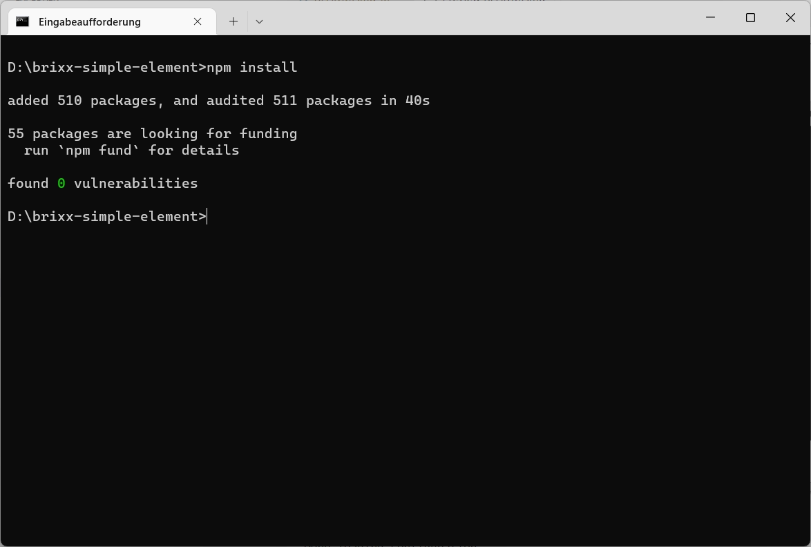
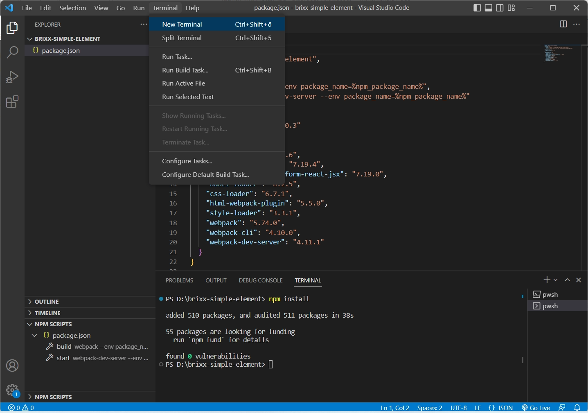

### NPM-Packages installieren 
Wir öffnen die Eingabeaufforderung und wechseln im Beiepiel in den Projektordner **[brixx-simple-element]**. Anschließend werden die NPM-Packages der Abhängigkeiten in der *package.json* mit **`npm install`** installiert und für das Projekt bereitgestellt.

  > **Tip:** Die Abhängigkeiten in der *package.json* können auch in der Entwicklungsumgebung (Visual Studio Code) in einem Terminal-Fenster (Eingabeaufforderung) installiert werden. Dadurch kann man innerhalb der Entwicklungsumgebung bleiben und muss diese nicht für andere Aufgaben verlassen.

Visual Studio Code - Terminal-Fenster

Mit der Erweiterung *NPM-Scripts* für Visual Studio Code haben wir eine weitere Möglichkeit NPM-Packages zu installieren.

Visual Studio Code - Terminal-Fenster

Klick mit rechter Maustaste (Kontextmenü) in der Explorer-Ansicht unter **`[NPM-SCRIPTS]`** auf **`package.json`** und Auswahl vom Menüeintrag **`[Run Intall]`** 

Nach der Installation der NPM-Packages sehen wir im Projektordner in der Explorer-Ansicht den Ordner **`node_modules`** mit den lokalen NPM-Packages und die Datei **`package-lock.json`**

  > Die Datei *package-lock.json* wird automatisch für alle Vorgänge generiert, bei denen npm die *package.json* ändert. Die *package-lock.json* wird erstellt wenn die Datei nicht vorhanden ist. In seltenen Fällen kann es hilfreich sein die Datei *package-lock.json* vor der Installation zu löschen.

Visual Studio Code - Explorer-Ansicht