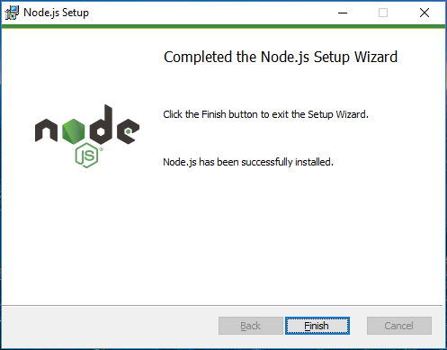

# Install Node.js and npm for Windows
1. Download the Node.js [Windows Installer (.msi)](https://nodejs.org/en/download/)
   
   
   
   Node.js - Downloads

2. Once it is downloaded, run the installer. The Node.js Setup wizard will open.
   
   

   Select `[Next]`
   
   

   Check "I accept the terms in the License Agreement" & Select `[Next]`
   
   

   Set the Destination Folder location to install Node.js & Select `[Next]`
   
   

   Select `[Next]`
   
   

   Select `[Install]`
   
   

   Click `[Finish]`

You can verify the installation in the command prompt with **`node --version`** and **`npm --version`**

   

  > **Tip:** There is another way to install Node.js and npm, and even install different versions side by side. Install the [Node Version Manager (NVM)](https://learn.microsoft.com/de-de/windows/dev-environment/javascript/nodejs-on-windows) for Windows. This is not necessary for building Brixx web components, since there is no special Node.js version dependency. NVM is also available for Linux based operating systems.