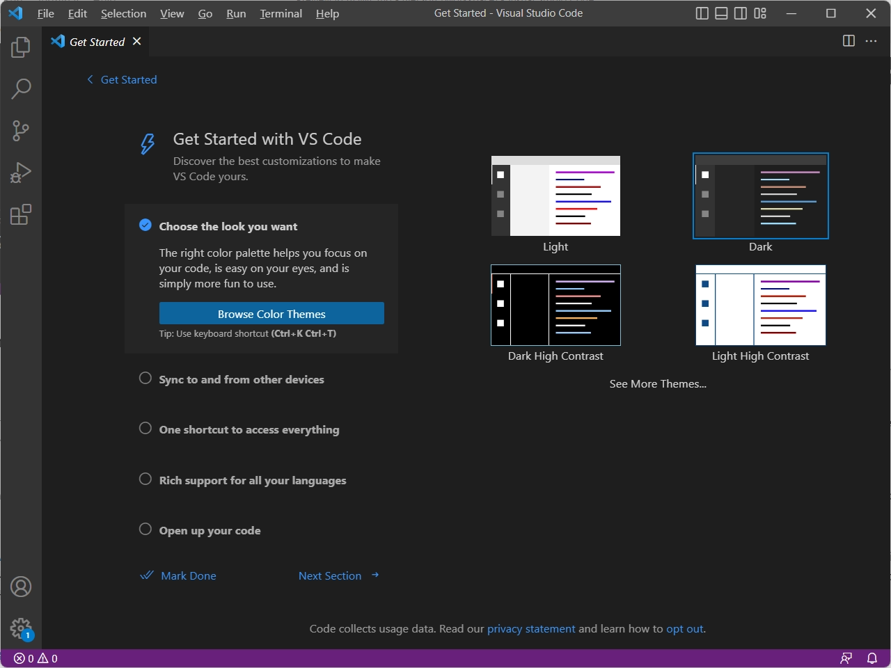
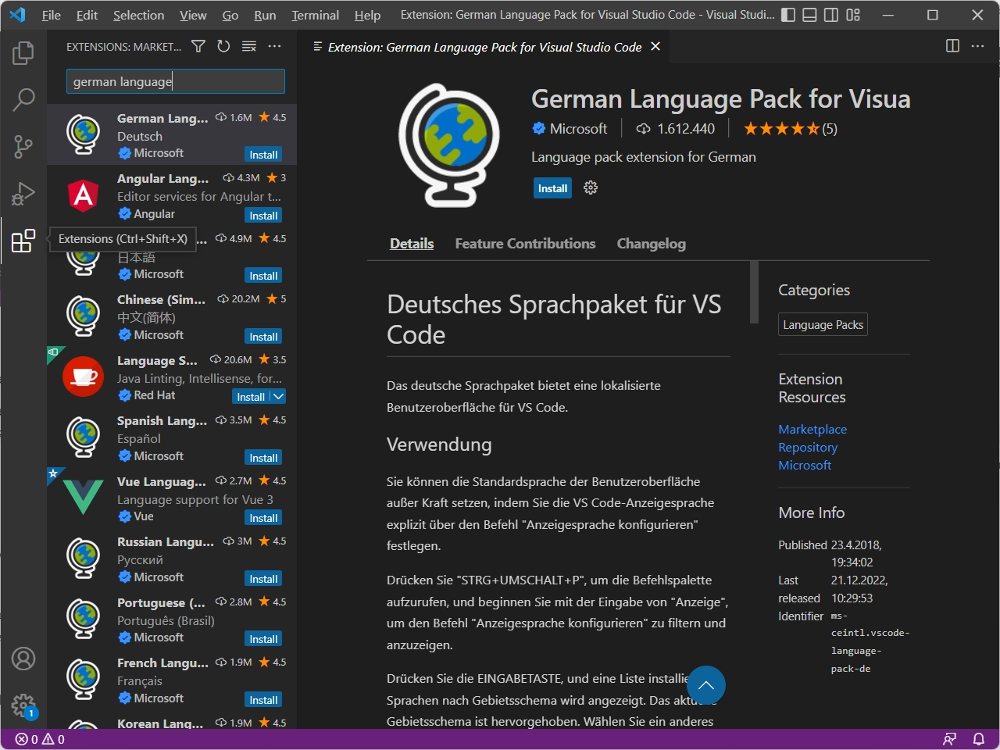
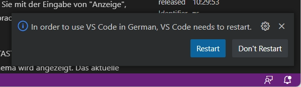
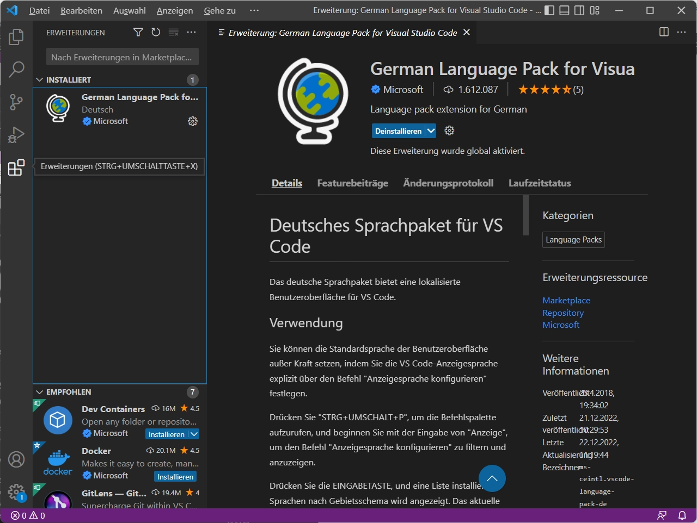

# Install Visual Studio Code for Windows
1. Download the [Visual Studio Code installer](https://go.microsoft.com/fwlink/?LinkID=534107) for Windows.
2. Once it is downloaded, run the installer. This will only take a minute.
3. By default, VS Code is installed under `C:\Users\{Username}\AppData\Local\Programs\Microsoft VS Code`.

Alternatively, you can also download a [Zip archive](https://code.visualstudio.com/docs/?dv=winzip), extract it and run Code from there.

> **Tip:** Setup will add Visual Studio Code to your `%PATH%`, so from the console you can type 'code .' to open VS Code on that > folder. You will need to restart your console after the installation for the change to the `%PATH%` environmental variable to >   take effect.

## User setup versus system setup
VS Code provides both Windows user and system level setups. Installing the [user setup](https://go.microsoft.com/fwlink/?LinkID=534107) does not require Administrator privileges as the location will be under your user Local AppData (LOCALAPPDATA) folder. User setup also provides a smoother background update experience.

The [system setup](https://go.microsoft.com/fwlink/?linkid=852157) requires elevation to Administrator privileges and will place the installation under Program Files. This also means that VS Code will be available to all users in the system.

See the [Download Visual Studio Code](https://code.visualstudio.com/download) page for a complete list of available installation options.

## 32-bit versions
If you need to run a 32-bit version of VS Code, both a 32-bit [Installer](https://go.microsoft.com/fwlink/?LinkId=723965) and [Zip archive](https://go.microsoft.com/fwlink/?LinkID=733265) are available.

Visual Studio Code - Get started

## Visual Studio Code Erweiterungen
Es gibt viele Erweiterungen (Extensions) für Visual Studio Code. Man kann z. B. die Anzeigesprache in Visual Studio Code mit der Erweiterung [German Language Pack for Visual Studio Code](https://marketplace.visualstudio.com/items?itemName=MS-CEINTL.vscode-language-pack-de) auf Deutsch umzustellen. 

 > **Tip:** Wer mit unterschiedlichen Editoren arbeitet sollte die Anzeigesprache in Visual Studio Code nicht umstellen. Das erleichtert die Arbeit mit anderen Editoren die in der Regel die selben englischen Menübezeichnungen verwenden, aber keine Umstellung der Anzeigesprach auf Deutsch möglich ist.

Eine Erweiterung (Extension) kann man entweder im [Visual Studio Code Marketplace](https://marketplace.visualstudio.com/search?target=VSCode&category=Language%20Packs&sortBy=Installs) suchen und installieren oder direkt in Visual Studio Code unter Extensions (`Ctrl+Shift+X`). Hier kann man den gesuchten Betreff im Suchfeld `[Search Extensions in Marktplace]` eingeben und erhält alle passenden Erweiterungen. Im Beispiel exemplarisch mit der Erweiterung *German Language Pack*.

Visual Studio Code - Extensions

Nach der Installation wird man zu einem Restart und die Anzeigesprache ist auf Deutsch umgestellt.

Genauso einfach kann in Visual Studio Code eine Erweiterung auch wieder deinstalliert werden.

## Empfohlene Erweiterungen für die Entwicklung
Es gibt jede Menge nützliche Erweiterungen für Visual Studio Code die uns die Arbeit bei der Entwicklung erleichten. Nahezu unverzichtbare Erweiterungen beispielsweise zur Erstellung von Brixx Webkomponenten sind:

- [Live Server](https://marketplace.visualstudio.com/items?itemName=ritwickdey.LiveServer) Ein lokaler Entwicklungsserver (Webserver) mit Auto Reload (Live reload) bei Änderungen am Quellcode. Der Live Server ermöglicht das Verhalten der Brixx Webkomponente im Browser zu testen, und verhindert die *blocked by CORS policy* ([Cross-Origin Resource Sharing](https://developer.mozilla.org/en-US/docs/Web/HTTP/CORS)) beim Zugriff vom Browser auf lokale Ressourcen.
- [NPM-Scripts](https://marketplace.visualstudio.com/items?itemName=traBpUkciP.vscode-npm-scripts) Anzeigen und Ausführen von NPM-SCRIPTS direkt aus der Explorer-Ansicht.