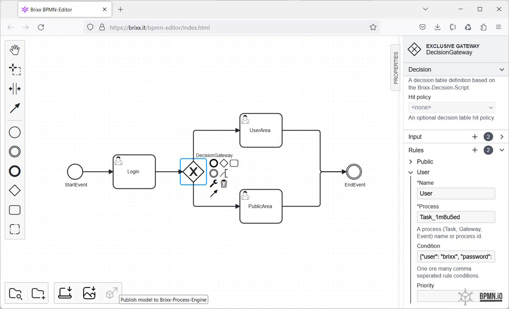

<link rel="stylesheet" href="https://cdnjs.cloudflare.com/ajax/libs/font-awesome/6.4.0/css/all.min.css" integrity="sha512-iecdLmaskl7CVkqkXNQ/ZH/XLlvWZOJyj7Yy7tcenmpD1ypASozpmT/E0iPtmFIB46ZmdtAc9eNBvH0H/ZpiBw==" crossorigin="anonymous" referrerpolicy="no-referrer" />

# Brixx BPMN-Editor

### Package: `@brixx/bpmn-editor`

### Version: `1.2.0` (Release, 08.07.2023)

#

> This document is in progress. For further information on the use of Brixx-Script please feel free to contact [`info@brixx.it`](info@brixx.it)

# Define your process without programming

## Model processes and workflows

With our Brixx BPMN editor for process modeling, all types of business and industrial processes can be mapped with Business Process Model and Notation ( BPMN ) and made available with one click.

-   [Get started](#getstarted)
-   [Install Brixx BPMN-Editor](#installation)
-   [Brixx BPMN-Editor Tutorial](#tutorial)
-   [Brixx BPMN-Editor Referenz](#reference)
-   [Downloads](#downloads)

# 
 Get started

<a href="https://brixx.it/bpmn-editor/index.html" target="_blank"  title="Brixx BPMN-Editor (Try it Online)" alt="Brixx BPMN-Editor (Try it Online)">Brixx BPMN-Editor</a> Version 1.2.0 mit BPMN 2.0 Standard (Try it Online)

Coming soon ...

# 
 Install Brixx BPMN-Editor

# 
 Brixx BPMN-Editor Tutorial

# 
 Brixx BPMN-Editor Referenz

# 
 Downloads

<b>CDN - Latest Stable Version</b>

Version 1.2.0 (Latest)

## <i class="fa-brands fa-windows"></i> Windows Installer

Download Web-Application Package Installer for Windows (Preview).

-   ### [Brixx BPMN-Editor Version 1.2.0 (64-bit)](https://brixx.it/@brixx/setup/Brixx-BPMN-Editor-v1.2.0-x64.exe)

## <i class="fa-brands fa-linux"></i> Linux Installer

Ask for your Linux runtime version.

## <i class="fa-brands fa-apple"></i> Mac OS Installer

Ask for your Mac OS runtime version.

## Copyright and License

#

Copyright © BRIXX.it 2022-present
