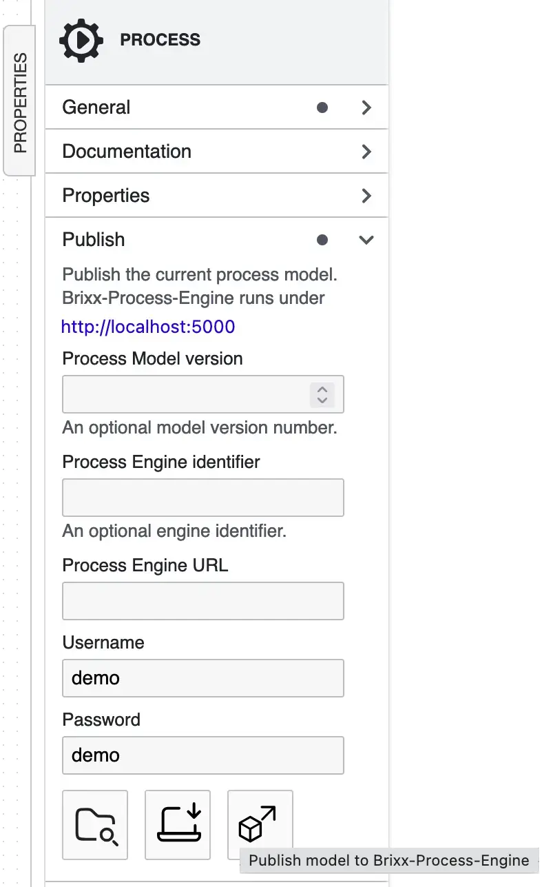

<link rel="stylesheet" href="https://cdnjs.cloudflare.com/ajax/libs/font-awesome/6.4.0/css/all.min.css" integrity="sha512-iecdLmaskl7CVkqkXNQ/ZH/XLlvWZOJyj7Yy7tcenmpD1ypASozpmT/E0iPtmFIB46ZmdtAc9eNBvH0H/ZpiBw==" crossorigin="anonymous" referrerpolicy="no-referrer" />

# Brixx BPMN-Editor

### Package: `@brixx/bpmn-editor`

### Version: `1.5.0` (Release, 13.07.2024)

#

# Define your process without programming

## Model processes and workflows

With our Brixx BPMN editor for process modeling, all types of business and industrial processes can be mapped with Business Process Model and Notation ( BPMN ) and made available with one click.

-   [Get started](#getstarted)
-   [Install Brixx BPMN-Editor](#setup)
    -   [Windows installer](#windows)
-   [Brixx BPMN-Editor Tutorial](#tutorial)
-   [Brixx BPMN-Editor Referenz](#reference)
-   [Downloads](#downloads)

# 
 Get started

<a href="https://brixx.it/bpmn-editor/index.html" target="_blank"  title="Brixx BPMN-Editor (Try it Online)" alt="Brixx BPMN-Editor (Try it Online)">Brixx BPMN-Editor</a> Version 1.5.0 mit BPMN 2.0 Standard (Try it Online)

# 
 Install Brixx BPMN-Editor

## 
 <i class="fa-brands fa-windows"></i> Windows Installer

Select `[OK]`

Select `[Next]`

Select `[Next]`

Select `[Install]`

Installation in progress ...

Select `[Finish]`

After installation, the Brixx BPMN-Editor is available at [`http://localhost:3000`](http://localhost:3000)  
The Brixx BPMN-Editor is opened in the standard browser or use the link above.

Brixx BPMN-Editor in Windows Terminal (PowerShell)

# 
 Brixx BPMN-Editor Tutorial

## Model your first diagram

After launching the Brixx BPMN Editor, we can create a new BPMN diagram immediately or at any time by clicking on the `[Create new BPMN diagram]` icon. This will create a new BPMN model with a **Start Event**. The start event does not have to be specified for the Brixx Process Engine and is automatically inserted, but is required for a standard BPMN process.

We click on the start event icon to add a **Task** by clicking on the `[Append Task]` icon. After this we change the task type to **User Task** by clicking on the wrench icon.

After creating a new BPMN model we append a **End Event** by clicking on the `[Append EndEvent]` icon. 

### Download BPMN diagram

We can download and save the current BPMN model as BPMN diagram file by clicking the `[Download as BPMN 2.0 file]` icon. By default, the BPMN diagram is saved as `diagram.bpmn` in the Downloads folder. This allows us to open and edit the BPMN diagram file at a later point in time.

### Publish model

We can publish the current BPMN model to the Brixx Process Engine by clicking the `[Publish Model to Brixx Process Engine]` icon. By default, the Brixx Process Engine runs under the Process Engine URL `http://localhost:5000` and can be changed in the publish properties section.

# 
 Brixx BPMN-Editor Referenz

## BPMN diagram menu

## BPMN model menu

# 
 Downloads

##  CDN - Latest Stable Version

Version 1.5.0 (Latest)

## <i class="fa-brands fa-windows"></i> Windows Installer

Download Web-Application Package Installer for Windows.

### [Brixx BPMN-Editor Version 1.5.0 (64-bit)](https://brixx.it/@brixx/setup/Brixx-BPMN-Editor-v1.5.0-x64.exe)

## <i class="fa-brands fa-linux"></i> Linux Installer

Ask for your Linux runtime version.

## <i class="fa-brands fa-apple"></i> Mac OS Installer

Ask for your Mac OS runtime version.

## Copyright and License

Copyright © [BRIXX.it](https://brixx.it/) 2022-present
