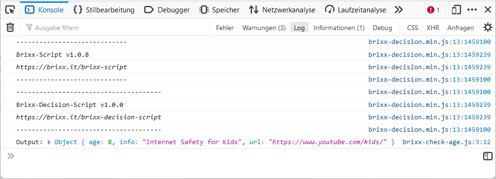
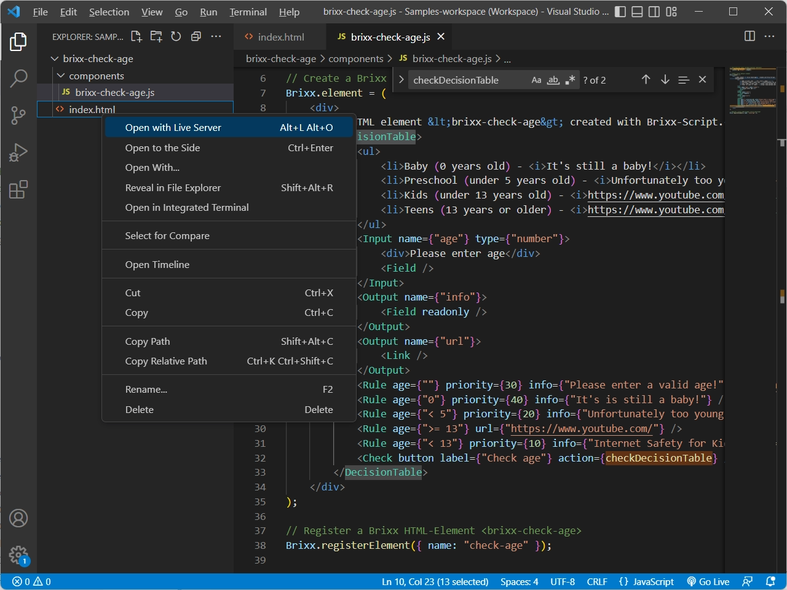
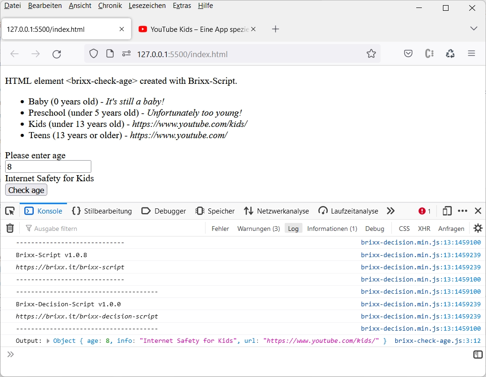
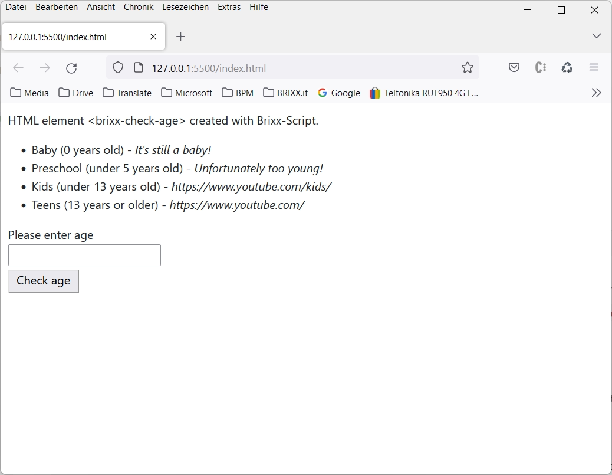
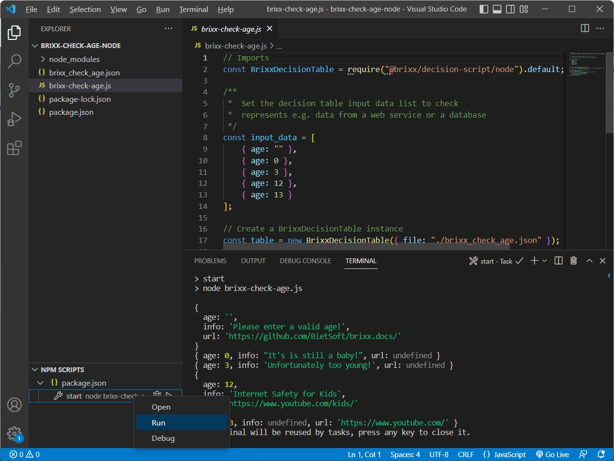

# Brixx-Decision-Script

### Package: `@brixx/decision-script`

### Version: `1.0.3` (Release, 29.01.2023)

#

> This document is being processed and is currently only available in German. However, we have decided to make Brixx-Decision-Script version 1.0.3 available for use. For further information on the use of Brixx-Decision-Script please feel free to contact [`info@brixx.it`](info@brixx.it)

# Was ist Brixx-Decision-Script

## “Decisions make up more than 90% of programming!”

Brixx-Decision-Script is a free JavaScript library for rule-based decision-making systems. With Brixx-Decision-Script, the programming can be reduced to a minimum and replaced by a technical configuration (low-code development) for extensions and adjustments via rules with a **Brixx decision table**. In particular, with [Brixx-Script (smarte web components)](https://brixx.it/brixx-script.html) as Brixx HTML elements or as Brixx-Script components in JavaScript applications and frameworks, rapid integration into any HTML document is possible and also supports JavaScript environments such as [Node.js®](https://nodejs.org/en/)(cross platform JavaScript runtime environment). Rules can be easily managed in an external decision table definition file with the decision model notation ([DMN](https://en.wikipedia.org/wiki/Decision_Model_and_Notation)). No programming tasks or complicated deployments are required for changes or adjustments and basic configurations from a decision table definition file can also be expanded with Brixx-Decision-Script HTML elements. Brixx-Decision-Script was developed for systems for automation and process control with [BPMN (Business Process Model and Notation)](https://de.wikipedia.org/wiki/Business_Process_Model_and_Notation) and is used for our web-based process engine **Brixx-Process-Script**. With Brixx-Decision-Script you can implement processes in your web projects or your own process engine systems with JavaScript. For this we use our Brixx script to create a building bricks-oriented project architecture.

-   [Erste Schritte](#getstarted)
    -   [Brixx Web-Baustein [brixx-check-age] erstellen](#brixx-check-age-web)
-   [Brixx-Decision-Script Tutorial](#tutorial)
    -   [Brixx Web-Baustein [brixx-check-age] erweitern](#brixx-check-age-styles)
    -   [Node.js Application [brixx-check-age] erstellen](#brixx-check-age-node)
    -   [JavaScript Web-Application [brixx-check-age] erstellen](#brixx-check-age-class)
-   [Brixx-Decision-Script Referenz](#reference)
-   [Downloads](#downloads)

# 
 Erste Schritte

Wir verwenden Brixx-Script zur Erstellung einer **Brixx Entscheidungstabelle** (Brixx decision table). Brixx-Script ist Bestandteil in Brixx-Decission-Script und ermöglicht einen minimalen Programmieraufwand und schnelle Integration in ein HTML-Dokument (siehe [Brixx-Script Dokumentation](../brixx-script/README.md)). Dabei ist neben der JavaScript-Engine für Programmierer und erfahrene Webentwickler auch eine komplette Erstellung im HTML-Code möglich. Es können auch beide Systeme kombiniert werden, was Brixx-Decision-Script besonders interessannt und leistungsfähig macht. Im ersten Schritt erstellen wir einen Brixx Web-Baustein (Brixx web component) mit einer Entscheidungstabelle für eine Altersüberprüfung (`brixx-check-age-web`) und danach das Beispiel auch als Node.js Application (`brixx-check-age-node`).

## 
 Brixx Web-Baustein [brixx-check-age] erstellen

Wir erstellen eine einfache Brixx Entscheidungstabelle zur Altersüberprüfung mit Aufruf einer entsprechenden „altersgerechten“ Webseite. Dazu erstellen wir einen Ordner `./components` im Projektordner `[brixx-check-age-web]` wodurch die Projekt-Ordnerstruktur wie folgt aussieht.

    brixx-check-age-web/
    ├── components/
    │   └── brixx-check-age.js
    └── index.html

Darin erstellen wir den Brixx Web-Baustein `[brixx-check-age]` in der Brixx Script-Component Datei `brixx-check-age.js`. Zuersterstellen wir die Funktion `checkDecisionTable` ([JavaScript Arrow Function](https://www.w3schools.com/js/js_arrow_function.asp)) die wir als sogenannte _Callback_-Funktion nur zur Überprüfung der Ergebnisse in der Entwicklung verwenden, dient aber auchgleichzeitig als Beispiel für eine weiterführende Programmierung.

    // Check decision table callback function (optional)
    const checkDecisionTable = (output) => {
        console.log("Output:", output);
    }

> Wir verwenden in den Beispielen [ECMAScript 2015+](https://en.wikipedia.org/wiki/ECMAScript) (ES6) als JavaScript Standard und erstellen im aktuellen Beispiel für die Callback-Funktion eine [JavaScript Arrow Function](https://www.w3schools.com/js/js_arrow_function.asp). Das wird nicht in allen älteren Browsern oder Umgebungen unterstützt und gleichen wir mit Babel aus. Das hat den Vorteil dass man mit Brixx-Script mit aktuellem Standard entwickeln kann, und sich nicht um Abwärtskompatibilität kümmern muss. Dadurch muss man den Code später nicht ändern sondern „nur“ Babel weglassen; ist aber auch notwendig, da Benutzer unterschiedliche Browser und Versionen verwenden.

Die Callback-Funktion alternativ als Function-Object, oder was Babel daraus macht.

    // Check decision table callback function (optional)
    function checkDecisionTable(output) {
        console.log("Output:", output);
    }

Die Callback-Funktion kann optional verwendet werden, und wird nach Überprüfung der Entscheidungstabelle aufgerufen (Callback). Die Callback-Funktion erhält im Beispiel das Ergebnis (Output) der Überprüfung im Parameter `output` und gibt das Ergebnis in der Browserkonsole aus.

> **Tip:** Browserkonsole öffnen mit `Strg + Shift + J` bei Windows oder `Command [⌘] + Option-Taste + J` bei MacOS

  
Werkzeuge für Webentwickler mit Konsole im Firefox Browser ( `Strg + Shift + I`)

Anschließend erstellen wir ein `Brixx.element` mit der Brixx Entscheidungstabelle.

    // Create a Brixx default element
    Brixx.element = (
        

            
HTML element &lt;brixx-check-age&gt; created with Brixx-Script.

            <DecisionTable>
                <ul>
                    <li>Baby (0 years old) - <i>It's still a baby!</i></li>
                    <li>Preschool (under 5 years old) - <i>Unfortunately too young!</i></li>
                    <li>Kids (under 13 years old) - <i>https://www.youtube.com/kids/</i></li>
                    <li>Teens (13 years or older) - <i>https://www.youtube.com/</i></li>
                </ul>
                <Input name={"age"} type={"number"}>
                    
Please enter age

                    <Field />
                </Input>
                <Output name={"info"}>
                    <Field readonly />
                </Output>
                <Output name={"url"}>
                    <Link />
                </Output>
                <Rule age={""} priority={30} info={"Please enter a valid age!"} url={"https://github.com/BietSoft/brixx.docs/"} />
                <Rule age={"0"} priority={40} info={"It's is still a baby!"} />
                <Rule age={"< 5"} priority={20} info={"Unfortunately too young!"} />
                <Rule age={">= 13"} url={"https://www.youtube.com/"} />
                <Rule age={"< 13"} priority={10} info={"Internet Safety for Kids"} url={"https://www.youtube.com/kids/"} />
                <Check button label={"Check age"} action={checkDecisionTable} />
            </DecisionTable>
        

    );

Mit Brixx-Decision-Script werden HTML-Elemente zur Erstellung einer Brixx Entscheidungstabelle im HTML-Dokument bereitgestellt und wir erstellen die Entscheidungstabelle mit dem HTML-Element `<DecisionTable>`.

    ...
    <DecisionTable>
        ...
    </DecisionTable>
    ...

Mit dem HTML-Element `<Input>` erstellen wir ein Eingabefeld zur Dateneingabe mit dem HTML-Attribut (Eigenschaft) `name` und der Eigenschaft `type` (optional) für die Brixx Entscheidungstabelle. Zusätzlich erstellen wir im `<Input>`-Tag eine Benutzer-Information mit `
Please enter age
` und mit dem HTML-Element `<Field>` wird ein Eingabefeld erzeugt. Für eine Entscheidungstabelle kann es beliebig viele Eingabefelder geben.

    ...
    <Input name={"age"} type={"number"}>
        
Please enter age

        <Field />
    </Input>
    ...

Eingabefelder sind optional und müssen nicht verwendet werden. Dateneingaben können auch aus einem HTML-Formular, Webservice oder einer Datenbank kommen, und die verschiedenen Eingabearten mit Brixx-Deision-Script auch kombiniert werden.

> **Tip:** Brixx-Decision-Schript HTML-Elemente können wie normale HTML-Elemente mit CSS-Stylesheets für eigen Anforderungen angepasst werden.

Danach werden Ausgabefelder zur Datenausgabe erstellt. Wir erstellen mit dem HTML-Element `<Output>` die Ausgabefelder `info` und `url`. Für eine Entscheidungstabelle kann es beliebig viele Ausgabefelder geben. Wir verwenden für das Ausgabefeld _`info`_ wieder ein HTML-Element `<Field>`, und wie bei der Dateneingabe wird ein „Eingabefeld” erzeugt, erhält aber zusätzlich das Attribut _`readonly`_. Dadurch wird das Feld zur Datenausgabe verwendet und kann nicht beschrieben werden. Eine Besonderheit ist das HTML-Element `<Link>` für das Ausgabefeld _`url`_. Enthält die Datenausgabe eine gültige URL-Adresse wird automatisch ein Browser-Fenster mit der URL geöffnet. Es gibt noch eine Reihe weiterer Einstellungsmöglichkeiten (siehe [Brixx-Decision-Script Referenz](#reference)).

    ...
    <Output name={"info"}>
        <Field readonly />
    </Output>
    <Output name={"url"}>
        <Link />
    </Output>
    ...

Ausgabefelder sind optional und müssen nicht verwendet werden. Datenausgaben können auch wie im Beispiel mit einer Callback-Funktion verarbeitet werden, und die verschiedenen Ausgabeearten mit Brixx-Deision-Script auch kombiniert werden.

Das Herzstück der Brixx-Decision-Script Entscheidungstabelle sind die **Regeln** (rules). Eine Regel wird mit dem HTML-Element `<Rule>` erstellt und wie bei anderen auf [DMN (Decision Model Notation)](https://en.wikipedia.org/wiki/Decision_Model_and_Notation) basierenden Systemen verwendet. Dabei werden die Bedingungen für die Dateneingabe, im Beispiel das Eingabefeld _`age`_, sowie die Ergebnisswerte für die Ausgabefelder _`info`_ und _`url`_ erstellt (definiert). Dabei müssen nicht für jede Regel alle Eingabe- oder Ausgabefelder verwendet werden.

    ...
    <Rule age={""} priority={30} info={"Please enter a valid age!"} url={"https://github.com/BietSoft/brixx.docs/"} />
    <Rule age={"0"} priority={40} info={"It's is still a baby!"} />
    <Rule age={"< 5"} priority={20} info={"Unfortunately too young!"} />
    <Rule age={">= 13"} url={"https://www.youtube.com/"} />
    <Rule age={"< 13"} priority={10} info={"Internet Safety for Kids"} url={"https://www.youtube.com/kids/"} />
    ...

Für die Entscheidungstabelle können beliebig viele Regeln definiert werden und bei „überschneidenden” Regeln können Prioritäten mit der optionalen Eigenschaft _`priority`_ vergeben werden. Das ist notwendig da wir keine `hitPolicy` definiert haben und standardmäßig _`Priority`_ verwendet wird. Das bedeutet, die erste gefundene passende Regel unter Berücksichtigung der Prioritäten wird ausgegeben (siehe [Brixx-Decision-Script Referenz](#reference)).

Mit dem HTML-Element `<Check>` wird zum Schluß mit dem HTML-Attribut _`button`_ eine Schaltfläche mit der Eigenschaft _`label`_ erstellt. Die Eigenschaft _`action`_ ist optional und legt die _Callback_-Funktion fest, die nach Überprüfung der Entscheidungstabelle aufgerufen werden soll. Im Beispiel wird die Funktion _`checkDecisionTable`_ vom Anfang aufgerufen.

> Die Callback-Funktion wird für die Eignenschaft _`action`_ als Objekt (ohne Anführungszeichen) übergeben und nicht als Objektname (String)

    ...
    <Check button label={"Check age"} action={checkDecisionTable} />
    ...

Abschließend wird das `Brixx.element` als HTML-Elemet `<brixx-chack-age>` registriert.

    // Register a Brixx HTML-Element <brixx-check-age>
    Brixx.registerElement({ name: "check-age" });

Kompletter Brixx Web-Baustein in der Brixx Script-Component Datei `./components/brixx-check-age.js`

    // Check decision table callback function (optional)
    const checkDecisionTable = (output) => {
        console.log("Output:", output);
    }

    // Create a Brixx default element
    Brixx.element = (
        

            
HTML element &lt;brixx-check-age&gt; created with Brixx-Script.

            <DecisionTable>
                <ul>
                    <li>Baby (0 years old) - <i>It's still a baby!</i></li>
                    <li>Preschool (under 5 years old) - <i>Unfortunately too young!</i></li>
                    <li>Kids (under 13 years old) - <i>https://www.youtube.com/kids/</i></li>
                    <li>Teens (13 years or older) - <i>https://www.youtube.com/</i></li>
                </ul>
                <Input name={"age"} type={"number"}>
                    
Please enter age

                    <Field />
                </Input>
                <Output name={"info"}>
                    <Field readonly />
                </Output>
                <Output name={"url"}>
                    <Link />
                </Output>
                <Rule age={""} priority={30} info={"Please enter a valid age!"} url={"https://github.com/BietSoft/brixx.docs/"} />
                <Rule age={"0"} priority={40} info={"It's is still a baby!"} />
                <Rule age={"< 5"} priority={20} info={"Unfortunately too young!"} />
                <Rule age={">= 13"} url={"https://www.youtube.com/"} />
                <Rule age={"< 13"} priority={10} info={"Internet Safety for Kids"} url={"https://www.youtube.com/kids/"} />
                <Check button label={"Check age"} action={checkDecisionTable} />
            </DecisionTable>
        

    );

    // Register a Brixx HTML-Element <brixx-check-age>
    Brixx.registerElement({ name: "check-age" });

### Brixx Web-Baustein verwenden

Die Integration in ein HTML-Dokument ist nicht kompliziert. Wir verwenden für das Beispiel **Brixx-Decision-Script Standalone** vom Brixx CDN-(Content Delivery Network)-Server um eine direkte Integration der Entscheidungstabelle mit dem Brixx Web-Baustein zu ermöglichen.

    <!-- Load Brixx-Decision-Script standalone for development -->
    

Der Brixx Web-Baustein `[brixx-check-age]` in der Brixx Script-Component Datei `./components/brixx-check-age.js"` wird mit einen HTML-`

Für Brixx-Decision-Script Standalone verwenden wir Babel mit `type="text/babel"` um die Brixx Webkomponente in den unterschiedlichen Browsern nutzen zu können. Dann werden die Attribute `data-type="module"` und `data-presets="brixx"` festgelegt, und der Brixx Web-Baustein kann als HTML-Element `<brixx-check-age>` verwendet werden. Das Attribute _data-type_ ist optional und wird zum Import von ECMAScript 2015+ (ES6) Modulen benötigt. Zur Verwendung als HTML-Element werden keine weiteren Programmierkentnisse benötigt.

Zum Schluss müssen wir nur noch das HTML-Element `<brixx-check-age>` in den `<body>`-Tag einfügen und sind fertig.

    <body>
      <!-- Add the Brixx HTML element -->
      <brixx-check-age></brixx-check-age>
    </body>

Komplettes HTML-Dokument in der HTML-Datei `index.html`

    <!DOCTYPE html>
    <html>
    <head>
        <!-- Load Brixx-Decision-Script standalone for development -->
        
        <!-- Include the Brixx script component files for development -->
        
    </head>

    <body>
        <!-- Add the Brixx HTML element -->
        <brixx-check-age></brixx-check-age>
    </body>
    </html>

Komplettes Beispiel v1.0.2 herunterladen [[brixx-check-age-web] (ZIP-Archiv)](../assets/downloads/brixx-check-age-web.zip)

### Brixx Web-Baustein testen

Zum testen von unserem Brixx Web-Baustein öffnen wir den Projektordner `[brixx-check-age]` in Visual Studio Code und starten die HTML-Datei `index.html` mit dem _Live Server_. Dazu gibt es verschiedene Möglichkeiten.

1. Klick auf `[Go Live]` in der Visual Studio Code Status Bar (`Click to run live server`)
2. Öffnen der HTML-Datei im Editor-Fenster mit der Tastenkombination `[ALT+L Alt+O]`
3. Rechtsklick auf die HTML-Datei im **Editor-Fenster** und Auswahl von `[Open with Live Server]`
4. Rechtsklick auf die HTML-Datei in der **Explorer-Ansicht** und Auswahl von `[Open with Live Server]`

    

    Visual-Studio-Code - Explorer-Ansicht `[Open with Live Server]`

    Die HTML-Datei `index.html` wird mit dem _Live Server_ unter der Adresse `http://127.0.0.1:5500/index.html` bereitgestellt und im Standard-Browser geöffnet.

    > **Tip:** Der Browser kann bei den _Live Server_ Einstellungen unter `[Custom Browser]` festgelegt werden (`default=null`).

    

    Der Brixx Web-Baustein `<brixx-check-age>` im Browser-Fenster

# 
 Brixx-Decision-Script Tutorial

## 
 Brixx Web-Baustein [brixx-check-age] erweitern

Wie erweitern die Brixx Webkomponente [brixx-check-age] mit zusätzlichen CSS-Dateien. Dafür erstellen wir zuerst einen Projektordner `[brixx-check-age-styles]` und kopieren alle Dateien aus dem vorherigen Beispiel in den Projektordner.

### HTML Styles hinzufügen

Wir „stylen“ die Brixx Webkomponente mit **CSS** (Cascade Style Sheet) und erstellen dafür einen Ordner `./styles` im Projektordner. Wir nutzen zum einen [Bootstrap](https://getbootstrap.com/) und fügen die CSS-Datei `bootstrap.min.css` vom Cloudflare CDN-(Content Delivery Network)-Server mit einem HTML Stylesheet `<link>` im HTML-Dokument ein.

    <!-- Load Bootstrap styles from cdnjs.cloudflare.com -->
    <link href="https://cdnjs.cloudflare.com/ajax/libs/bootstrap/5.2.3/css/bootstrap.min.css" rel="stylesheet"></head>

Dann erstellen eine weitere CSS-Datei `brixx-check-age.css` im Ordner `[styles]` für die Brixx Entscheidungstabelle und fügen die CSS-Datei auch mit einem HTML Stylesheet `<link>` im HTML-Dokument ein

    <link href="./styles/brixx-check-age.css" rel="stylesheet"></head>

Komplette Styles der CSS-Datei `brixx-check-age.css`

    body {
        margin: 10px;
    }

    .brixx-decision-button {
        padding: 0px 10px 5px;
        margin-top: 5px;
    }

    div.brixx-decision-field {
        color: #8ebf42;
        font-size: 14px;
        margin-top: 0px;
    }

    input.brixx-decision-field {
        margin-top: 2px;
    }

Die verwendeten Styles dienen als einfaches Beispiel und müssen nicht im Einzelnen betrachtet werden. Damit sieht die Projekt-Ordnerstruktur folgendermaßen aus.

    brixx-check-age-web/
    ├── components/
    │   └── brixx-check-age.js
    ├── styles/
    │   └── brixx-check-age.css
    └── index.html

Komplettes HTML-Dokument in der HTML-Datei `index.html`

    <!DOCTYPE html>
    <html>
        <head>
            <!-- Load Bootstrap styles from cdnjs.cloudflare.com -->
            <link href="https://cdnjs.cloudflare.com/ajax/libs/bootstrap/5.2.3/css/bootstrap.min.css" rel="stylesheet">
            <!-- Load Brixx-Decision-Script standalone for development -->
            
            <!-- Include the Brixx script component files for development -->
            
            <link href="./styles/brixx-check-age.css" rel="stylesheet">
        </head>

        <body>
            <!-- Add the Brixx HTML element -->
            <brixx-check-age></brixx-check-age>
        </body>
    </html>

Komplettes Beispiel v1.0.2 herunterladen [[brixx-check-age-stles] (ZIP-Archiv)](../assets/downloads/brixx-check-age-styles.zip)

### Brixx Webkomponente testen

Die Brixx Webkomponente können wir während der Entwicklung jederzeit testen und starten die HTML-Datei `index.html` mit dem _Live Server_.

Der Brixx Web-Baustein `<brixx-check-age>` im Browser-Fenster

## 
 Node.js Application [brixx-check-age] erstellen

Um die Brixx Entscheidungstabelle aus dem Beispiel vorher für eine Node.js (JavaScript) app zu verwenden erstellen wir zuerst den Projektordner `[brixx-check-age-node]` und weil wir mit JavaScript keine HTML-Elemete zur Definition der Entscheidungstabelle verwenden können erstellen wir als „Ersatz” die JSON-**Definitionsdatei** (Brixx decision table definition) `brixx-check-age.json` im Projektordner.

Komplette JSON-Definitionsdatei `brixx_check_age.json`

    {
        "description": "Check age",
        "hitPolicy": "Priority",
        "input": {
            "age": {
                "description": "The age to check",
                "type": "number",
                "default": 0
            }
        },
        "output": {
            "info": {
            "description": "An additional information"
            },
            "url": {
            "description": "The url to link to"
            }
        },
        "rules": {
            "No entry": {
            "age": "",
            "info": "Please enter a valid age!",
            "url": "https://github.com/BietSoft/brixx.docs/",
            "priority": 30
            },
            "Baby": {
            "age": "0",
            "info": "It's is still a baby!",
            "priority": 40
            },
            "Preschool": {
            "age": "< 5",
            "info": "Unfortunately too young!",
            "priority": 20
            },
            "Teens": {
            "age": ">= 13",
            "url": "https://www.youtube.com/"
            },
            "Kids": {
            "age": "< 13",
            "info": "Internet Safety for Kids",
            "url": "https://www.youtube.com/kids/",
            "priority": 10
            }
        }
    }

Anschließend erstellen wir die JavaScript-Datei (Node.js Application) `brixx-check-age.js` im Projektordner und importieren das Brixx-Decision-Script Package mit `require("@brixx/decision-script/node")` für Node.js in der Konstanten `BrixxDecisionTable`.

    // Imports
    const BrixxDecisionTable = require("@brixx/decision-script/node").default

Um das Package `@brixx/decision-script/node` in der JavaScript-Datei importieren zu können muss es vorher installiert werden. Dafür installieren wir das NPM-Package `@brixx/decision-script`, z.B. mit Visual Studio Code im Terminal-Fenster, im Projektordner mit `npm i @brixx/decision-script` (siehe [NPM-Packages installieren](../docs/NPM-install.md)).

    > npm i @brixx/decision-script

Dadurch wird das NPM-Package im Ordner `node_modules` installiert und die _npm_-Konfigurationsdatei `package.json` und `package-lock.json` im Projektordner erstellt. In der `package.json` Datei wird das NPM-Package mit `@brixx/decision-script` im Feld `dependencies` eingetragen.

    {
        "dependencies": {
            "@brixx/decision-script": "^1.0.2"
        }
    }

Wir erweitern die `package.json` Datei ein wenig. Das ist nicht erforderlich, aber wir können dadurch u. a. für eine weitere Bearbeitung in Visual Studio Code in der Explorer-Ansicht die Erweiterung `[NPM-SCRIPTS]` verwenden.

Wir legen zuerst den Namen des Package fest mit `brixx-check-age` und definieren den Einstiegspunkt für den Projektstart mit `brixx-check-age.js`

    ...
    "name": "brixx-check-age",
    "main": "brixx-check-age.js",
    ...

Danach erstellen wir das NPM-Script `start` zu starten der Node.js Application.

    ...
    "scripts": {
        "start": "node brixx-check-age.js"
    },
    ...

Abschließend entfernen das Caretzeichen ( `^` ) bei der Version wodurch nicht mehr automatisch die neueste Version von Brixx-Decision-Script installiert wird ([mehr über Versionen in npm](https://docs.npmjs.com/cli/v6/using-npm/semver)).

    ...
    "dependencies": {
        "@brixx/decision-script": "1.0.2"
    }
    ...

Komplette `package.json` Datei

    {
        "name": "brixx-check-age",
        "main": "brixx-check-age.js",
        "scripts": {
            "start": "node brixx-check-age.js"
        },
        "dependencies": {
            "@brixx/decision-script": "1.0.2"
        }
    }

Die Projekt-Ordnerstruktur sieht damit wie folgt aus.

    brixx-check-age-web/
    ├── node_modules
    ├── brixx-check-age.json
    ├── brixx-check-age.js
    ├── package-lock.json
    └── package.json

Nach dem Import vom Brixx-Decision-Script Package `BrixxDecisionTable` erstellen wir eine Liste `input_data` ([JavaScript Array](https://www.w3schools.com/js/js_arrays.asp)) die mögliche Eingabe- oder Datenquellen für die Node.js Application repräsentieren soll z. B. aus einem Webservice oder einer Datenbank.

    /**
    *  Set the decision table input data list to check
    *  represents e.g. data from a web service or a database
    */
    const input_data = [
        { age: "" },
        { age: 0 },
        { age: 3 },
        { age: 12 },
        { age: 13 }
    ]

Anschließend erstellen wir ein Objekt (Instanz) von `BrixxDecisionTable` mit dem Instanznamen `table` und geben mit einem Konfigurationsobjekt im _constructor_ mit der Eigenschaft `file` die JSON-Definitionsdatei an, die für die Erstellung der Brixx Entscheidungstabelle verwendet werden soll.

    // Create a BrixxDecisionTable instance
    const table = new BrixxDecisionTable({ file: "./brixx_check_age.json" })

Die einzelnen Einträge `input` der Liste `input_data` werden dann mit `const output = table.check(input)` mit der Brixx Entscheidungstabelle überprüft, in der Konstanten `output` gespeichert und mit Unterstützung einer _`JavaScript Array map()`_ nacheinander in der Browserkonsole mit `console.log(output)` ausgegeben.

    // Imports
    const BrixxDecisionTable = require("@brixx/decision-script/node").default

    // Check the decision table input data list
    input_data.map((input) => {
        // Get the output from decision table input data
        const output = table.check(input)
        // Prints the output to console
        console.log(output)
    })

Komplette Node.js Application in der JavaScript-Datei `./brixx-check-age.js`

    // Imports
    const BrixxDecisionTable = require("@brixx/decision-script/node").default

    /**
    *  Set the decision table input data list to check
    *  represents e.g. data from a web service or a database
    */
    const input_data = [
        { age: "" },
        { age: 0 },
        { age: 3 },
        { age: 12 },
        { age: 13 }
    ]

    // Create a BrixxDecisionTable instance
    const table = new BrixxDecisionTable({ file: "./brixx_check_age.json" })

    // Check the decision table input data list
    input_data.map((input) => {
        // Get the output from decision table input data
        const output = table.check(input)
        // Prints the output to console
        console.log(output)
    })

Komplettes Beispiel v1.0.2 herunterladen [[brixx-check-age-node] (ZIP-Archiv)](../assets/downloads/brixx-check-age-node.zip)

### Node.js Application testen

Die Node.js Application kann in der Eingabeaufforderung mit `node brixx-check-age.js` im Projektordner `[brixx-check-age-node]` getestet werden, oder direkt in der Entwicklungsumgebung Visual Studio Code. Wir starten die Node.js Application durch Klick mit der rechten Maustaste auf den Eintrag `[start]` in der Explorer-Ansicht unter `[NPM-SCRIPTS]` und Auswahl von `[Run]` im Kontextmenü oder Klick auf das Symbol **[**  **]**

Visual Studio Code - Run start

Die Node.js Application `[brixx-check-age]` wird anschließend in der Browserkonsole ausgeführt.

## 
 JavaScript Web-Application [brixx-check-age] erstellen

Under construction ...

Wir können auch beide „Welten” auch verbinden und beliebig kombinieren. Dabei ist es sogar möglich dynamische Regeln durch vorhandene Regeln zu erzeugen und bietet dadurch nahezu unbegrenzte Möglichkeiten. Wir erstellen eine JavaScript Web-Application mit einem Brixx Web-Baustein im Projektordner `[brixx-check-age-class]` und verwenden die JSON-Definitionsdatei für die Brixx Entscheidungstabelle der Datei `brixx_check_age.json` aus dem Beispiel vorher. Dann erstellen auch hier wieder den Ordner `[components]` und darin die Brixx Script-Component Datei `brixx-check-age.js`. Abschließend kopieren wir noch die HTML-Datei `index.html` aus dem ersten Beispiel für eienen Brixx Web-Baustein und die Projekt-Ordnerstruktur sieht wie folgt aus.

    brixx-check-age-slass/
        ├── components/
        │   └── brixx-check-age.js
        ├── brixx-check-age.json
        └── index.html

Wir verwenden von der Definitionsdatei die Beschreibung, Hit-Policy und zwei „Basis”-Regeln als „Basis”-Konfiguration. Die „individuelle” Konfiguration erstellen wir in der Web-Application

Komplette JSON-Definitionsdatei `brixx_check_age.json`

    {
        "description": "Check age",
        "hitPolicy": "Priority",
        "rules": {
            "No entry": {
            "age": "",
            "info": "Please enter a valid age!",
            "url": "https://github.com/BietSoft/brixx.docs/",
            "priority": 30
            },
            "Baby": {
            "age": "0",
            "info": "It's is still a baby!",
            "priority": 40
            }
        }
    }

Wir erstellen die Web-Application mit dem Brixx Web-Baustein in der Brixx Script-Component Datei `brixx-check-age.js` und importieren zuerst die JSON-Definitionsdatei in die Variable `DecisionTableDefinition`.

    // Load the decision table definitions
    const DecisionTableDefinition = DecisionTable.load('./brixx_check_age.json')

Alternativ kann die Definition für die Brixx Entscheidungstabelle im Code zu erstellt werden.

    // Set the  decision table definitions
    const DecisionTableDefinition = {
        "description": "Check age",
        "hitPolicy": "Priority",
        "rules": {
            "No entry": {
                "age": "",
                "info": "Please enter a valid age!",
                "url": "https://github.com/BietSoft/brixx.docs/",
                "priority": 30
            },
            "Baby": {
                "age": "0",
                "info": "It's is still a baby!",
                "priority": 40
            }
        }
    }

> Quellcode- und Konfigurationsdateien ermöglichen als Baustein (Bricks) System eine bessere Projektorganisation. Quellcode und Konfigurationen können leichter bearbeitet, getestet, versioniert werden, aber auch einfacher veröffentlicht und verteilt werden.

Anschließend erstellen wir die Brixx Entscheidungstabelle mit dem Brixx Standard-Element.

    // Create a Brixx default element
    Brixx.element = (
        

            
HTML element &lt;brixx-check-age&gt; created with Brixx-Script.

            <DecisionTable definition={DecisionTableDefinition}>
                <ul>
                    <li>Baby (0 years old) - <i>It's still a baby!</i></li>
                    <li>Preschool (under 5 years old) - <i>Unfortunately too young!</i></li>
                    <li>Kids (under 13 years old) - <i>https://www.youtube.com/kids/</i></li>
                    <li>Teens (13 years or older) - <i>https://www.youtube.com/</i></li>
                </ul>
                <Input name={"age"} type={"number"}>
                    
Please enter age

                    <Field />
                </Input>
                <Output name={"info"}>
                    <Field readonly />
                </Output>
                <Output name={"url"}>
                    <Link />
                </Output>
                <Rule age={"< 6"} priority={20} info={"Unfortunately too young!"} />
                <Rule age={">= 13"} url={"https://www.youtube.com/"} />
                <Rule age={"< 13"} priority={10} info={"Internet Safety for Kids"} url={"https://www.youtube.com/kids/"} />
                <Check button label={"Check age"} />
            </DecisionTable>
        

    )

### JavaScript Web-Application verwenden

Für die Integration in ein HTML-Dokument nutzen wir wieder die _Brixx-Decision-Script Standalone_ Version und kopieren die HTML-Datei `index.html` aus dem Beispiel für einen Brixx Web-Baustein in den Projektordner.

Komplettes HTML-Dokument in der HTML-Datei `index.html`

    <!DOCTYPE html>
    <html>
    <head>
        <!-- Load Brixx-Decision-Script standalone for development -->
        
        <!-- Include the Brixx script component files for development -->
        
    </head>

    <body>
        <!-- Add the Brixx HTML element -->
        <brixx-check-age></brixx-check-age>
    </body>
    </html>

Komplettes Beispiel v1.0.3 herunterladen [[brixx-check-age-class] (ZIP-Archiv)](../assets/downloads/brixx-check-age-class.zip)

### JavaScript Web-Application testen

Die JavaScript Web-Application können wir während der Entwicklung jederzeit testen und starten die HTML-Datei `index.html` mit dem _Live Server_.

Die JavaScript Web-Application `<brixx-check-age>` im Browser-Fenster

# 
 Brixx-Decision-Script Referenz

## Brixx-Decision-Script Standalone

Für die Entwicklung steht eine Brixx-Decision-Script Standalone Version zur Verfügung. Dadurch kann Brixx-Decision-Script direkt ohne precompiling verwendet werden. Die Brixx-Decision-Script Standalone Datei [`brixx.min.js`](https://brixx.it/@brixx/standalone/brixx-decision.min.js) kann dazu einfach mit einem `

Brixx-Script ist Bestandteil in Brixx-Decission-Script und ermöglicht einen minimalen Programmieraufwand und schnelle Integration in ein HTML-Dokument (siehe [Brixx-Script Dokumentation](../brixx-script/README.md)) und ein Brixx Web-Baustein kann danach mit einem `

Brixx-Decision-Script Standalone verwendet Babel, um ECMAScript 2015+ Code in eine abwärtskompatible Version von JavaScript in aktuellen und älteren Browsern oder Umgebungen zu konvertieren.

Mit dem Attribut `type` gibt den Medientyp des Skripts an. Für Brixx-Decision-Script verwenden wir Babel mit `type="text/babel"` und hat den Vorteil dass man mit aktuellem Standard entwickeln kann, und sich nicht um Abwärtskompatibilität kümmern muss da Benutzer unterschiedliche Browser und Versionen verwenden.

Das Attribut `src` gibt die URL einer extern verwendeten Brixx Script-Component Datei an, im Beispiel mit `src="./components/brixx-animal-list.js"`

Das Attribut `data-type` ist optional, wird benötigt wenn ECMAScript 2015+ (ES6) Modulen verwendet werden und für Babel mit `data-type="module"` angegeben.

Mit dem Attribut `data-preset` wird angegeben dass Brixx-Script verwendet wird und für Babel mit `data-preset="brixx"` angegeben.

Es wird empfohlen Brixx-Decision-Script Standalone nicht in einer Produktionsumgebung zu verwenden. Beim Start wird in der Browserkonsole folgende Information ausgegeben.

> `You are using the in-browser Brixx transformer. Be sure to precompile scripts for production - https://brixx.it/brixx-script`

## Brixx-Decision-Script Package

### Brixx-Decision-Script Package mit npm installieren

    `npm i @brixx/decision-script`

### Brixx-Decision-Script Package importieren

Das Modul `BrixxDecisionTable` vom Package `@brixx/decision-script` für eine Web-Anwendung importieren.

    import { BrixxDecisionTable } from '@brixx/decision-script'

Das Modul `BrixxDecisionTable` für eine Nodejs-Anwendung importieren.

    const BrixxDecisionTable = require("@brixx/decision-script/node").default;

## Brixx-Decision-Script Library

Das Modul `BrixxDecisionTable` von der Brixx-Decision-Script Library importieren. Dafür kann man die Brixx-Decision-Script Library (minified) [brixx-decision.js](https://brixx.it/@brixx/decision-script/brixx.js) vom Brixx CDN-(Content Delivery Network)-Server in den Projektordner kopieren und anschließend für eine Web-Anwendung importieren.

    import { BrixxDecisionTable } from './brixx-decision'

Das Modul `BrixxDecisionTable` für eine Nodejs-Anwendung importieren.

    const BrixxDecisionTable = require("./brixx-decision/node").default;

> **Tip:** Die Brixx-Decision-Script Library vom Brixx CDN-(Content Delivery Network)-Server ist immer die _Latest_ Version und kann die Version in der npm-Registry überholen. Hier hat man die Möglichkeit vorab die neueste Versionen zu testen.

# 
 Decision table definition

Under construction ...

The Bixx decision table can be defined in JSON format and is used like other [DMN (Decision Model Notation)](https://en.wikipedia.org/wiki/Decision_Model_and_Notation) based systems.

## name

The field `name` defines Brixx decision table object identifier and will be used for the [DecisionTable.check](#decision-table-check) method. The field is optional and not required. If `name` is not set it will set to the `DecisionTable.defaults.description`.

**Example**

    {
        "name": "BrixxDecisionTable"
    }

## description

The field `description` defines Brixx decision table description and could be used for the decision table output. The field is optional and not required. If `description` is not set it will set to the `DecisionTable.defaults.description`.

**Example**

    {
        "description": "Check age"
    }

## hitPolicy

The field `hitPolicy` defines the Brixx decision table hit policy. The field is optional and not required. If `hitPolicy` is not set it will set to `Priority`.

-   `Any` - Multiple matching rules must not make a difference: all matching rules must lead to the same output. (_not available in this version_).
-   `Collect` - Rules do not overlap. Only a single rule can match (_not available in this version_).
-   `First` - Rules are evaluated from top to bottom. Rules may overlap, but only the first match counts.
-   `Priority` (default) - Rule outputs are prioritized. Rules may overlap, but only the match with the highest output priority counts.
-   `Unique` - Rules do not overlap. Only a single rule can match. (_not available in this version_).

**Example**

    {
        "hitPolicy": "Priority"
    }

## input

The field `input` defines the Brixx decision table input object list.

### The input object

**Attributes**

`{String} [{name}: {...}]` - the Brixx decision table input object identifier.

`{String} [default] (optional)` - the Brixx decision table input object default value.

`{String} [description]` - the Brixx decision table input object description.

`{String} [type='text'] (optional)` - the Brixx decision table input object type.

The input object format.

    {name}: {
        {description}: {value},
        {type}: {value},
        {default}: {value}
    }

An input object sample.

    "age": {
        "description": "The age to check",
        "type": "number",
        "default": 0
    }

**Example**

    {
        "input": {
            "age": {
                "description": "The age to check",
                "type": "number",
                "default": 0
            }
        }
    }

## output

The field `output` defines the Brixx decision table output object list.

### The output object

**Attributes**

`{String} [{name}: {...}]` - the Brixx decision table output object identifier.

`{String} [description]` - the Brixx decision table output object description.

The output object format.

    {name}: {
        {description}: {value}
    }

An output object sample.

    "info": {
        "description": "An additional information"
    }

**Example**

    {
        "output": {
                "info": {
                "description": "An additional information"
            },
                "url": {
                "description": "The url to link to"
            }
        }
    }

## rules

The field `rules` defines the Brixx decision table rule object list.

### The rule object

**Attributes**

`{String} [{name}: {...}]` - the Brixx decision table rule object identifier.

`{String} [input] (1,...,n)` - the Brixx decision table rule input condition attribut.

`{String} [output] (1,...,n)` - the Brixx decision table rule output value attribut.

`{Number} [priority] (optional)` - the Brixx decision table rule priority attribut.

The rule object format.

    {name}: {
        {input}: {condition},
        ...
        {output}: {value},
        ...
        {priority}: {value}
    }

A rule object sample.

    {
        "Preschool": {
            "age": "< 5",
            "info": "Unfortunately too young!",
            "priority": 20
        }
    }

**Condition**

The input oject rule conditions. Multiple conditions can be used and combined for a rule. However, it is recommended to use one rule per condition.

"`{value}`" - The value is equal ...

    "age": ""

###

    "age": "0"

"`not {value}`" or "`! {value}`" - The value is not ...

    "age": "not 0"

"`>= {value}`" -  The value is greater than or equal...

    "age": ">= 13"

"`<= {value}`" - The value is lower than or equal...

    "age": "<= 12"

"`< {value}`" - The value is lower than ...

    "age": "< 6"

"`> {value}`" - The value is greater than ...

    "age": "> 0"

**Example**

    {
        "rules": {
            "No entry": {
                "age": "",
                "info": "Please enter a valid age!",
                "url": "https://github.com/BietSoft/brixx.docs/",
                "priority": 30
            },
            "Baby": {
                "age": "0",
                "info": "It's is still a baby!",
                "priority": 40
            },
            "Preschool": {
                "age": "< 5",
                "info": "Unfortunately too young!",
                "priority": 20
            },
            "Teens": {
                "age": ">= 13",
                "url": "https://www.youtube.com/"
            },
            "Kids": {
                "age": "< 13",
                "info": "Internet Safety for Kids",
                "url": "https://www.youtube.com/kids/",
                "priority": 10
            }
        }
    }

# The HTML way

Under construction ...

The other way to define a Brixx decision table are the special HTML elements that are available with Brixx-Decision-Script. All HTML elements and attributes are optional. Brixx-Decision-Script HTML elements and attributes override predefined values from the decision table `definition` attribute and child elements and attributes override parent definitions. For example, a `Check` element overrides the `check` attribute in the `DecisionTable` element. Each Brixx-Decision-Script HTML element can contain subordinate elements and enables free design in the HTML document.

## The HTML elements

## &lt;DecisionTable&gt;

Defines a Brixx decision table `root` element.

**Attributes**

`{Object} [check]` - the Brixx decision table check callback function.

`{Boolean} [checkAtStart]` - the Brixx decision table check at start flag.

`{Object} [data]` - the Brixx decision table input data.

`{String|Object} [definition]` - the Brixx decision table definition. This can be a JSON string or a JSON object.

`{String} [description]` - the Brixx decision table description.

`{String} [hitPolicy='First']` - the rixx decision table hit policy.

`{String} [name]` - the Brixx decision table object identifier.

**Example**

## &lt;Action&gt;

Adds an `Action` object for the Brixx decision table. Can be used for `output` objects. Must be included in the `output` section.

**Attributes**

`{Object} [callback]` - the Brixx decision table output action callback function.

`{Object} [data]` - the Brixx decision table output data callback function.

`{Boolean} [link]` - the Brixx decision table output action link flag. Defines the output value as link and if is set opens a link in a browser window. The output value must be a valid link (URL) adress.

`{String} [process]` - the Brixx decision table output action process id. Runs a Brixx process (_not available in this version_).

`{String} [target='_blank']` - the Brixx decision table output action link target.

**Example**

## &lt;Check&gt;

Adds a `Check` object for the Brixx decision table. Must be included in the `root` section.

`{Object} [action]` - the Brixx decision table check callback function.

`{Boolean} [button]` - the Brixx decision table check button flag. Defines the check object as a button.

`{Boolean} [checkAtStart]` - the Brixx decision table check at start flag.

`{String} [label='Check decision table']` - the Brixx decision table check button label.

**Attributes**

**Example**

## &lt;Condition&gt;

Adds an `Condition` object for the Brixx decision table. Can be used for `input` and `output` objects. Must be included in the `rule` section. For the available rule conditions, see [Decision table definition](#definition).

**Attributes**

`{Object} [element={condition}]` - the Brixx decision table rule condition attribut.

**Example**

    <Condition x={'> 5'}>

## &lt;Field&gt;

Adds a `Field` object for the Brixx decision table. Must be included in a `input` or `output` section.

`{String} [default]` - the Brixx decision table field default input value.

`{String} [description]` - the Brixx decision table field input description.

`{Boolean} [readonly]` - the decision table field readonly flag.

`{String} [type='text']` - the Brixx decision table field input type.

`{String} [value]` - the Brixx decision table field default output value.

**Attributes**

**Example**

## &lt;Input&gt;

Adds a `Input` object for the Brixx decision table.

**Attributes**

`{Object} [data]` - the Brixx decision table input object data.

`{String} [default]` - the Brixx decision table input object default value.

`{String} [element]` - the Brixx decision table input element id. Can be every input element in the HTML document and will be searchd by `getElementById(element)`.

`{String} [description]` - the Brixx decision table input object description.

`{String} [name]` - the Brixx decision table input object identifier.

`{String} [type='text']` - the Brixx decision table input object type.

**Example**

## &lt;Link&gt;

Adds a `Link` object for the Brixx decision table. Can be used for `output` objects. Opens a link in a browser window. The output value must be a valid link (URL) adress. Must be included in the `output` section.

**Attributes**

`{String} [target='_blank']` - the Brixx decision table link target.

**Example**

## &lt;Output&gt;

Adds a `Output` object for the Brixx decision table.

**Attributes**

`{Object} [action]` - the Brixx decision table output action callback function.

`{Object} [data]` - the Brixx decision table output data callback function.

`{String} [description]` - the Brixx decision table output object description.

`{String} [element]` - the Brixx decision table input element id. Can be every input element in the HTML document and will be searchd by `getElementById(element)`.

`{Boolean} [link]` - the decision table output link flag. Defines the output value as link and if is set opens a link in a browser window. The output value must be a valid link (URL) adress.

`{String} [process]` - the Brixx decision table output process id. Runs a Brixx process (_not available in this version_).

`{String} [target='_blank']` - the Brixx decision table output link target.

`{String} [name]` - the Brixx decision table output identifier.

**Example**

## &lt;Process&gt;

Adds a `Process` object for the Brixx decision table. Runs a Brixx process (_not available in this version_). Must be included in the `output` section.

**Attributes**

`{String} [id]` - the Brixx decision table process id.

**Example**

## &lt;Rule&gt;

Adds an `Rule` object for the Brixx decision table. Can be used for `input` and `output` objects. Must be included in the `rule` section. For the available rule conditions, see [Decision table definition](#definition).

**Attributes**

`{String} [name]` - the Brixx decision table rule object identifier.

`{String} [input]` - the Brixx decision table rule input condition attribut.

`{String} [output]` - the Brixx decision table rule output attribut.

`{Number} [priority]` - the Brixx decision table rule priority attribut.

**Example**

# The JavaScript way

## BrixxDecisionTable class

### constructor(`table=null || { file=null, table=null }`)

Constructs a BrixxDecisionTable instance and creates a Brixx decision table with the optional given decision table definition.

**Parameters**  
`{String|Object} [table=null] (optional)` - the Brixx decision table definition. This can be a JSON string or a JSON object.

`{String|Object} [object.table=null] (optional)` - the Brixx decision table JSON string or JSON object. This can be a JSON string or a JSON object.

`{String} [object.file=null] (optional)` - the Brixx decision table definition file name. The file must be in Brixx decision table JSON format.

**Returns**  
`{Object}` - BrixxDecisionTable instance.

**Example**

    const instance = new BrixxDecisionTable()

###

    const instance = new BrixxDecisionTable({ file: './brixx_decision_table.json' })

### .check(input)

Cheks the input data with the Brixx decision table.

**Parameters**  
`{Object} [input]` - the data to check as JSON object.

**Returns**
`{Object}` - Output data as JSON object.

**Example**

    const input = { age: 3 }
    const output = instance.check(input)

###

    > Object { age: 3, info: "Unfortunately too young!", url: undefined }

### .create(table=null || { file=null, table=null })

Creates a Brixx decision table with the given decision table definition.

**Parameters**  
`{String|Object} [table=null] (optional)` - the Brixx decision table definition. This can be a JSON string or a JSON object.

`{String|Object} [object.table=null] (optional)` - the Brixx decision table JSON string or JSON object. This can be a JSON string or a JSON object.

`{String} [object.file=null] (optional)` - the Brixx decision table definition file name. The file must be in Brixx decision table JSON format.

**Returns**  
`{Object}` - Brixx decision table.

**Example**

    const instance = new BrixxDecisionTable()
    instance.create({ file: './brixx_decision_table.json' })

### .parse(table)

Creates a Brixx decision table with the given decision table definition.

**Parameters**  
`{Object} [table]` - the Brixx decision table definition as JSON object.

**Returns**
`{Object}` - Brixx decision table.

**Example**

    const brixx_check_age = {
        "description": "Check age",
        "hitPolicy": "Priority",
        "input": {
            "age": {
                "description": "The age to check",
                "type": "number",
                "default": 0
            }
        },
        "output": {
            "info": {
                "description": "An additional information"
            },
            "url": {
                "description": "The url to link to"
            }
        },
        "rules": {
            "No entry": {
                "age": "",
                "info": "Please enter a valid age!",
                "url": "https://github.com/BietSoft/brixx.docs/",
                "priority": 30
            },
            "Baby": {
                "age": "0",
                "info": "It's is still a baby!",
                "priority": 40
            },
            "Preschool": {
                "age": "< 5",
                "info": "Unfortunately too young!",
                "priority": 20
            },
            "Teens": {
                "age": ">= 13",
                "url": "https://www.youtube.com/"
            },
            "Kids": {
                "age": "< 13",
                "info": "Internet Safety for Kids",
                "url": "https://www.youtube.com/kids/",
                "priority": 10
            }
        }
    }

    instance.parse(brixx_check_age)

## BrixxDecisionTable static properties

### .defaults

Returns the BrixxDecisionTable default values in JSON format.

`Readonly`

**Returns**  
`{Object}` - BrixxDecisionTable default values.

**Example**

    console.log('BrixxDecisionTable defaults: ', BrixxDecisionTable.defaults)

Console output

    BrixxDecisionTable defaults: Object {"checkLabel": "Check decision table", "description": "Decision table", "hitPolicy": "Priority"}

### .version

Returns the BrixxDecisionTable version in semantic versioning format.

`Readonly`

**Returns**  
`{String}` - BrixxDecisionTable version.

**Example**

    console.log('BrixxDecisionTable version: ', BrixxDecisionTable.version)

Console output

    BrixxDecisionTable version: 1.0.3

## DecisionTable static class

The static Brixx class `DecisionTable` is available with the HTML element `<DecisionTable>`.

### 
 .check(name)

Cheks the found Brixx decision tables in the browser window with the given `name`. If the name is not set it will set to the `DecisionTable.defaults.description`. Usually only one Brixx decision table is used in an HTML document, but several decision tables can also exist at the same time.

**Parameters**  
`{String} [name='Decision table'] (optional)` - the name of the Brixx decision table to check. Checks all

**Examples**

    DecisionTable.check()

###

    <DecisionTable name={'BrixxDecisionTable'}>
        ...
    </DecisionTable>
    ...
    DecisionTable.check('BrixxDecisionTable')

### .defaults

Returns the DecisionTable default values in JSON format.

`Readonly`

**Returns**  
`{Object}` - DecisionTable default values.

**Example**

    console.log('DecisionTable defaults: ', DecisionTable.defaults)

Console output

    DecisionTable defaults: Object {"checkLabel": "Check decision table", "description": "Decision table", "hitPolicy": "Priority"}

### .load(file)

Load Brixx decision table definition The file must be in Brixx decision table JSON format.

**Parameters**  
`{String} [file]` - the Brixx decision table definition file name.

**Returns**
`{Object}` - Brixx decision table JSON object.

**Example**

    const DecisionTableDefinition =  DecisionTable.load('./brixx_check_age.json')

### .version

Returns the DecisionTable version in semantic versioning format.

`Readonly`

**Returns**  
`{String}` - DecisionTable version.

**Example**

    console.log('DecisionTable version: ', DecisionTable.version)

Console output

    DecisionTable version: 1.0.3

# 
 Downloads

-   ### [Beispiel v1.0.3 [brixx-check-age-class] (ZIP-Archiv)](../assets/downloads/brixx-check-age-web.zip)
-   ### [Beispiel v1.0.2 [brixx-check-age-web] (ZIP-Archiv)](../assets/downloads/brixx-check-age-web.zip)
-   ### [Beispiel v1.0.2 [brixx-check-age-styles] (ZIP-Archiv)](../assets/downloads/brixx-check-age-styles.zip)
-   ### [Beispiel v1.0.2 [brixx-check-age-node] (ZIP-Archiv)](../assets/downloads/brixx-check-age-node.zip)

## Copyright and License

#

Copyright © BRIXX.it 2022-present
