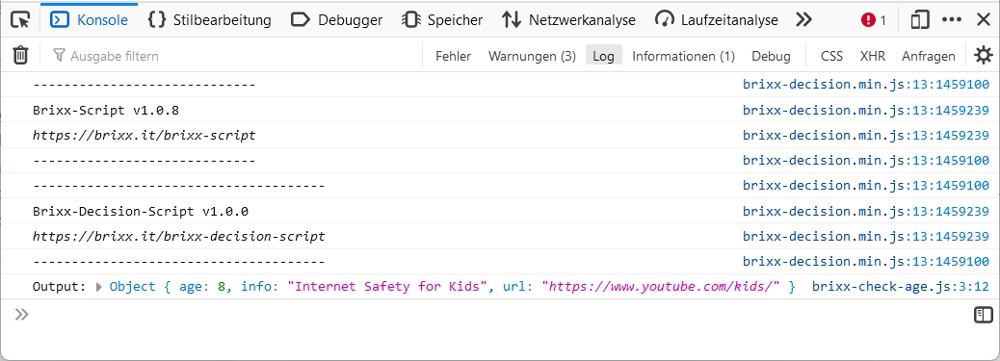
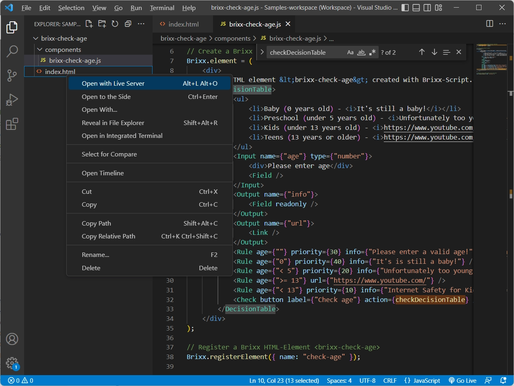
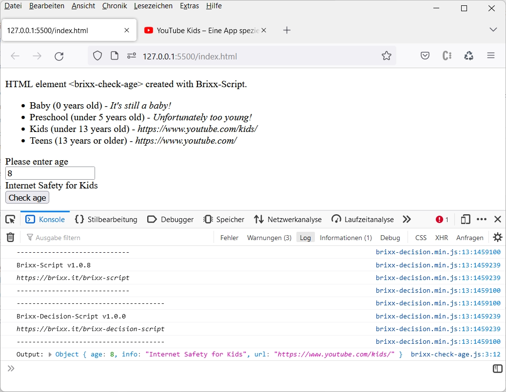
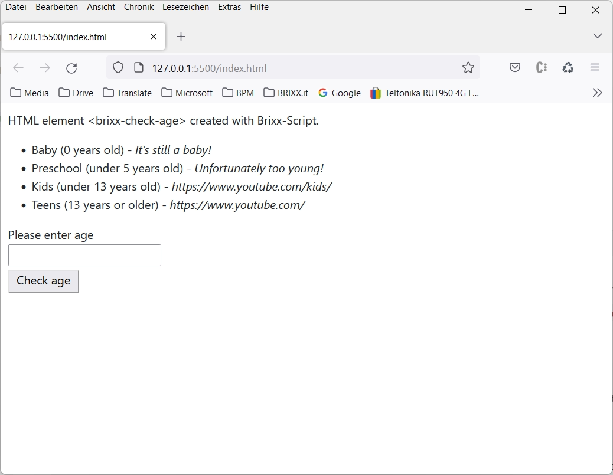

# Brixx-Decision-Script

### Package: `@brixx/decision-script`

### Version: `1.0.0` (Stable, 16.01.2023)

#

> This document is being processed and is currently only available in German. However, we have decided to make Brixx-Decision-Script version 1.0.0 available for use. For further information on the use of Brixx-Decision-Script please feel free to contact [`info@brixx.it`](info@brixx.it)

# Was ist Brixx-Decision-Script

## “Decisions make up more than 90% of programming!”

Brixx-Decision-Script is a free JavaScript library for rule-based decision-making systems. With Brixx-Decision-Script, the programming can be reduced to a minimum and replaced by a technical configuration (low-code development) for extensions and adjustments via rules with a **Brixx decision table**. In particular, with [Brixx-Script (smarte web components)](https://brixx.it/brixx-script.html) as Brixx HTML elements or as Brixx-Script components in JavaScript applications and frameworks, rapid integration into any HTML document is possible and also supports JavaScript environments such as [Node.js®](https://nodejs.org/en/ "Opensource cross platform JavaScript runtime environment").
(cross-platform JavaScript runtime environment).

-   [Erste Schritte](#getstarted)
-   [Brixx-Decision-Script Tutorial](#tutorial)
-   [Brixx-Decision-Script Referenz](#reference)
-   [Downloads](#downloads)

# 
 Erste Schritte

Wir verwenden Brixx-Script zur Erstellung einer **Brixx Entscheidungstabelle** (Brixx decision table). Brixx-Script ist ein Basisbestandteil in Brixx-Decission-Script und ermöglicht uns einen minimalen Programmieraufwand und schnelle Integration in ein HTML-Dokument (siehe [Brixx-Script Dokumentation](https://github.com/BietSoft/brixx.docs/blob/main/brixx-script/README.md)). Dabei ist neben der JavaScript-Engine für Programmierer oder erfahrene Webentwickler auch eine komplette Erstellung im HTML-Code möglich, und es können sogar beide Welten induividuell kombiniert werden was Brixx-Decision-Script besonders interessannt und leistungsfähig macht. Im ersten Schritt erstellen wir einen Brixx Web-Baustein (Brixx web component) mit einer Entscheidungstabelle für eine Altersüberprüfung (`brixx-check-age-web`) und im Anschluß daran das Beispiel als Node.js App (`brixx-check-age-node`).

## Brixx Web-Baustein `[brixx-check-age]` erstellen

Wir erstellen eine einfache Brixx Entscheidungstabelle für eine Altersüberprüfung mit einem direktem Aufruf der entsprechenden „altersgerechten“ Webseite. Dazu erstellen wir einen Ordner **`./components`** im Projektordner **`[brixx-check-age-web]`** wodurch die Projekt-Ordnerstruktur wie folgt aussieht.

    brixx-check-age-web/
    ├── components/
    │   └── brixx-check-age.js
    └── index.html

Darin erstellen wir den Brixx Web-Baustein **`[brixx-check-age]`** in der Brixx Script-Component Datei **`brixx-check-age.js`** und zuerst die Funktion **`checkDecisionTable`**. Die verwenden wir als sogenannte _Callback_-Funktion nur zur Überprüfung der Ergebnisse in der Entwicklung, dient Gleichzeitig aber auch als Beispiel für eine weiterführende Programmierung.

    // Check decision table callback function (optional)
    const checkDecisionTable = (output) => {
        console.log("Output:", output);
    }

Eine Callback-Funktion kann optional verwendet werden, und wird nach Überprüfung der Entscheidungstabelle aufgerufen (Callback). Die Funktion erhält im Beispiel das Ergebnis (Output) der Überprüfung im Parameter **`output`** und gibt das Ergebnis in der Browserkonsole aus.

> **Tip:** Browserkonsole öffnen mit `Strg + Shift + J` bei Windows oder `Command [⌘] + Option-Taste + J` bei MacOS

  
Werkzeuge für Webentwickler mit der Konsole im Firefox Browser ( `Strg + Shift + I`)

Anschließend erstellen wir ein **`Brixx.element`** mit der Brixx Entscheidungstabelle.

    // Create a Brixx default element
    Brixx.element = (
        

            
HTML element &lt;brixx-check-age&gt; created with Brixx-Script.

            <DecisionTable>
                <ul>
                    <li>Baby (0 years old) - <i>It's still a baby!</i></li>
                    <li>Preschool (under 5 years old) - <i>Unfortunately too young!</i></li>
                    <li>Kids (under 13 years old) - <i>https://www.youtube.com/kids/</i></li>
                    <li>Teens (13 years or older) - <i>https://www.youtube.com/</i></li>
                </ul>
                <Input name={"age"} type={"number"}>
                    
Please enter age

                    <Field />
                </Input>
                <Output name={"info"}>
                    <Field readonly />
                </Output>
                <Output name={"url"}>
                    <Link />
                </Output>
                <Rule age={""} priority={30} info={"Please enter a valid age!"} url={"https://github.com/BietSoft/brixx.docs/"} />
                <Rule age={"0"} priority={40} info={"It's is still a baby!"} />
                <Rule age={"< 5"} priority={20} info={"Unfortunately too young!"} />
                <Rule age={">= 13"} url={"https://www.youtube.com/"} />
                <Rule age={"< 13"} priority={10} info={"Internet Safety for Kids"} url={"https://www.youtube.com/kids/"} />
                <Check button label={"Check age"} action={checkDecisionTable} />
            </DecisionTable>
        

    );

Brixx-Decision-Script stellt zur Erstellung einer Entscheidungstabelle im HTML-Dokument spezielle HTML-Elemente bereit. Wir erstellen eine Brixx Entscheidungstabelle mit dem HTML-Element **`<DecisionTable>`** und konfigurieren die Entscheidungstabelle im Beispiel mit den HTML-Elementen **`<Input>`**, **`<Output>`** und **`<Rule>`**.

    ...
    <DecisionTable>
        <Input name={"age"} type={"number"}>
            
Please enter age

            <Field />
        </Input>
        <Output name={"info"}>
            <Field readonly />
        </Output>
        <Output name={"url"}>
            <Link />
        </Output>
        <Rule age={""} priority={30} info={"Please enter a valid age!"} url={"https://github.com/BietSoft/brixx.docs/"} />
        <Rule age={"0"} priority={40} info={"It's is still a baby!"} />
        <Rule age={"< 5"} priority={20} info={"Unfortunately too young!"} />
        <Rule age={">= 13"} url={"https://www.youtube.com/"} />
        <Rule age={"< 13"} priority={10} info={"Internet Safety for Kids"} url={"https://www.youtube.com/kids/"} />
        <Check button label={"Check age"} action={checkDecisionTable} />
    </DecisionTable>
    ...

Mit dem HTML-Element **`<Input>`** erstellen wir ein Eingabefeld zur Dateneingabe mit dem HTML-Attribut (Eigenschaft) **`name`** und der Eigenschaft **`type`** (optional) für die Brixx Entscheidungstabelle. Zusätzlich erstellen wir im `<Input>`-Tag eine Benutzer-Information mit `
Please enter age
` und mit dem HTML-Element **`<Field>`** wird ein Eingabefeld erzeugt. Für eine Entscheidungstabelle kann es beliebig viele unterschiedliche Eingabefelder geben.

    ...
    <Input name={"age"} type={"number"}>
        
Please enter age

        <Field />
    </Input>
    ...

Eingabefelder sind optional und müssen nicht verwendet werden. Dateneingaben können auch aus einem HTML-Formular, Webservice oder einer Datenbank kommen, und die verschiedenen Eingabearten mit Brixx-Deision-Script kombiniert werden.

> **Tip:** Brixx-Decision-Schript HTML-Elemente können wie normale HTML-Elemente mit CSS-Stylesheets für eigen Anforderungen angepasst werden.

Danach werden Ausgabefelder zur Datenausgabe erstellt. Wir erstellen mit dem HTML-Element **`<Output>`** für das Beispiel zwei Ausgabefelder mit den Namen **`info`** und **`url`**. Für eine Entscheidungstabelle kann es beliebig viele unterschiedliche Ausgabefelder geben. Wir verwenden für das Ausgabefeld _`info`_ wieder ein HTML-Element **`<Field>`**, und wie bei der Dateneingabe wird ein „Eingabefeld” erzeugt, erhält aber zusätzlich das Attribut _`readonly`_. Dadurch kann das Feld als Datenausgabe verwendet und nicht beschrieben werden. Eine Besonderheit ist das optionale HTML-Element **`<Link>`** für das Ausgabefeld _`url`_. Enthält die Datenausgabe eine gültige URL-Adresse wird diese automatisch im Browser-Fenster geöffnet. Hierfür gibt weitere Konfigurationsmöglichkeiten (siehe [Brixx-Decision-Script Referenz](#reference)).

    ...
    <Output name={"info"}>
        <Field readonly />
    </Output>
    <Output name={"url"}>
        <Link />
    </Output>
    ...

Ausgabefelder sind optional und müssen nicht verwendet werden. Datenausgaben können wie im Beispiel mit einer Callback-Funktion verarbeitet und die verschiedenen Ausgabeearten mit Brixx-Deision-Script kombiniert werden.

Ein Herzstück einer Brixx-Decision-Script Entscheidungstabelle sind die **Regeln** (rules) und werden wie in anderen auf [DMN (Decision Model Notation)](https://en.wikipedia.org/wiki/Decision_Model_and_Notation) basierenden Systemen verwendet. Eine Regel wird mit dem HTML-Element **`<Rule>`** erstellt. Dabei werden die Bedingungen für die Dateneingabe, in unserem Beispiel für das Eingabefeld _`age`_, sowie die Ergebnisswerte für die Ausgabefelder definiert. Dabei müssen nicht alle Eingabe- oder Ausgabefelder in einer Regel verwendet werden.

    ...
    <Rule age={""} priority={30} info={"Please enter a valid age!"} url={"https://github.com/BietSoft/brixx.docs/"} />
    <Rule age={"0"} priority={40} info={"It's is still a baby!"} />
    <Rule age={"< 5"} priority={20} info={"Unfortunately too young!"} />
    <Rule age={">= 13"} url={"https://www.youtube.com/"} />
    <Rule age={"< 13"} priority={10} info={"Internet Safety for Kids"} url={"https://www.youtube.com/kids/"} />
    ...

Für eine Entscheidungstabelle können beliebig viele Regeln definiert werden und bei „überschneidenden” Regeln können Prioritäten mit der optionalen Eigenschaft _`priority`_ vergeben werden. Das ist notwendig da wir im Beispiel keine explizite **`hitPolicy`** definiert haben und _`Priority`_ als Default verwendet wird. Das bedeutet, die erste gefundene passende Regel unter Berücksichtigung der Prioritäten wird ausgegeben (siehe [Brixx-Decision-Script Referenz](#reference)).

Mit dem HTML-Element **`<Check>`** wird dann noch mit dem HTML-Attribut _`button`_ eine Schaltfläche mit der Eigenschaft _`label`_ erstellt. Die optionale Eigenschaft _`action`_ legt die _Callback_-Funktion fest, die nach der Überprüfung der Entscheidungstabelle aufgerufen werden soll. Im Beispiel wird unsere Funktion _`checkDecisionTable`_ vom Anfang aufgerufen.

    ...
    <Check button label={"Check age"} action={checkDecisionTable} />
    ...

Abschließend wird das Brixx Element als HTML-Elemet **`<brixx-chack-age>`** registriert.

    // Register a Brixx HTML-Element <brixx-check-age>
    Brixx.registerElement({ name: "check-age" });

Kompletter Brixx Web-Baustein in der Brixx Script-Component Datei **`./components/brixx-check-age.js`**

    // Check decision table callback function (optional)
    const checkDecisionTable = (output) => {
        console.log("Output:", output);
    }

    // Create a Brixx default element
    Brixx.element = (
        

            
HTML element &lt;brixx-check-age&gt; created with Brixx-Script.

            <DecisionTable>
                <ul>
                    <li>Baby (0 years old) - <i>It's still a baby!</i></li>
                    <li>Preschool (under 5 years old) - <i>Unfortunately too young!</i></li>
                    <li>Kids (under 13 years old) - <i>https://www.youtube.com/kids/</i></li>
                    <li>Teens (13 years or older) - <i>https://www.youtube.com/</i></li>
                </ul>
                <Input name={"age"} type={"number"}>
                    
Please enter age

                    <Field />
                </Input>
                <Output name={"info"}>
                    <Field readonly />
                </Output>
                <Output name={"url"}>
                    <Link />
                </Output>
                <Rule age={""} priority={30} info={"Please enter a valid age!"} url={"https://github.com/BietSoft/brixx.docs/"} />
                <Rule age={"0"} priority={40} info={"It's is still a baby!"} />
                <Rule age={"< 5"} priority={20} info={"Unfortunately too young!"} />
                <Rule age={">= 13"} url={"https://www.youtube.com/"} />
                <Rule age={"< 13"} priority={10} info={"Internet Safety for Kids"} url={"https://www.youtube.com/kids/"} />
                <Check button label={"Check age"} action={checkDecisionTable} />
            </DecisionTable>
        

    );

    // Register a Brixx HTML-Element <brixx-check-age>
    Brixx.registerElement({ name: "check-age" });

### Brixx Web-Baustein verwenden

Die integration in ein HTML-Dokument ist nicht kompliziert. Wir verwenden für das Beispiel <b>Brixx-Decision-Script Standalone</b> vom Brixx CDN-(Content Delivery Network)-Server um eine direkte Integration von unserer Enttscheidungstabelle mit dem Brixx Web-Baustein zu ermöglichen.

    <!-- Load Brixx-Decision-Script standalone for development-->
    

Der Brixx Web-Baustein **`[brixx-check-age]`** in der Brixx Script-Component Datei **`./components/brixx-check-age.js"`** wird mit einen HTML-**`

Für Brixx-Decision-Script Standalone verwenden wir Babel mit **`type="text/babel"`** um die Brixx Webkomponente in den unterschiedlichen Browserversionen nutzen zu können. Dann werden die Attribute **`data-type="module"`** und **`data-presets="brixx"`** festgelegt, und der Brixx Web-Baustein kann als HTML-Element **`<brixx-check-age>`** verwendet werden. Das Attribute _data-type_ ist optional und wird zum Import von ES6 Modulen benötigt. Zur Verwendung als HTML-Element werden keine weiteren Programmierkentnisse benötigt.

Zum Schluss müssen wir nur noch das HTML-Element **`<brixx-check-age>`** in den `<body>`-Tag einfügen und sind fertig.

    <body>
      <!-- Add the Brixx HTML element -->
      <brixx-check-age></brixx-check-age>
    </body>

Komplettes HTML-Dokument in der HTML-Datei **`index.html`**

    <!DOCTYPE html>
    <html>
    <head>
        <!-- Load Brixx-Decision-Script standalone for development-->
        
        <!-- Include the Brixx script component files for development -->
        
    </head>

    <body>
        <!-- Add the Brixx HTML element -->
        <brixx-check-age></brixx-check-age>
    </body>
    </html>

Komplettes Beispiel v1.0.0 herunterladen [[brixx-check-age-web] (ZIP-Archiv)](../downloads/brixx-check-age-web.zip)

### Brixx Web-Baustein testen

Zum testen vom Brixx Web-Baustein öffnen wir den Projektordner **`[brixx-check-age]`** in Visual Studio Code und starten die HTML-Datei **`index.html`** mit dem _Live Server_. Dazu gibt es verschiedene Möglichkeiten.

1. Klick auf **`[Go Live]`** in der Visual Studio Code Status Bar (**`Click to run live server`**
2. Öffnen der HTML-Datei im Editor-Fenster mit der Tastenkombination **`[ALT+L Alt+O]`**
3. Rechtsklick auf die HTML-Datei im **Editor-Fenster** und Auswahl von **`[Open with Live Server]`**
4. Rechtsklick auf die HTML-Datei in der **Explorer-Ansicht** und Auswahl von **`[Open with Live Server]`**

    

    Visual-Studio-Code - Explorer-Ansicht **`[Open with Live Server]`**

    Die HTML-Datei **`index.html`** wird mit dem _Live Server_ unter der Adresse **`http://127.0.0.1:5500/index.html`** bereitgestellt und im Standard-Browser geöffnet.

    > **Tip:** Der Browser kann bei den _Live Server_ Einstellungen unter **`[Custom Browser]`** festgelegt werden (**`default=null`**).

    

    Der Brixx Web-Baustein `<brixx-check-age>` im Browser-Fenster

### HTML Styles hinzufügen

Wir „stylen“ die Brixx Webkomponente mit **CSS** (Cascade Style Sheet) und erstellen dafür einen Ordner **`./styles`** im Projektordner. Wir nutzen zum einen [Bootstrap](https://getbootstrap.com/) und fügen zusätzlich die CSS-Datei **`bootstrap.min.css`** direkt vom Cloudflare CDN-(Content Delivery Network)-Server mit einem HTML Stylesheet `<link>` im HTML-Dokument ein.

    <!-- Load Bootstrap styles from cdnjs.cloudflare.com -->
    <link href="https://cdnjs.cloudflare.com/ajax/libs/bootstrap/5.2.3/css/bootstrap.min.css" rel="stylesheet"></head>

Dann erstellen eine weitere CSS-Datei **`brixx-check-age.css`** im Ordner **`[styles]`** für die Brixx Entscheidungstabelle und fügen die CSS-Datei auch mit einem HTML Stylesheet `<link>` im HTML-Dokument ein

    <link href="./brixx-check-age.css" rel="stylesheet"></head>

Komplette Styles der CSS-Datei **`brixx-check-age.css`**

    body {
        margin: 10px;
    }

    .brixx-decision-button {
        padding: 0px 10px 5px;
        margin-top: 5px;
    }

    div.brixx-decision-field {
        color: #8ebf42;
        font-size: 14px;
        margin-top: 0px;
    }

    input.brixx-decision-field {
        margin-top: 2px;
    }

Die verwendeten Styles dienen als einfaches Beispiel und müssen nicht im Einzelnen betrachtet werden. Damit sieht die Projekt-Ordnerstruktur folgendermaßen aus.

    brixx-check-age-web/
    ├── components/
    │   └── brixx-check-age.js
    ├── styles/
    │   └── brixx-check-age.css
    └── index.html

Komplettes HTML-Dokument in der HTML-Datei **`index.html`**

    <!DOCTYPE html>
    <html>
        <head>
            <!-- Load Bootstrap styles from cdnjs.cloudflare.com -->
            <link href="https://cdnjs.cloudflare.com/ajax/libs/bootstrap/5.2.3/css/bootstrap.min.css" rel="stylesheet"></head>
            <!-- Load Brixx-Decision-Script standalone for development-->
            
            <!-- Include the Brixx script component files for development -->
            
            <link href="./brixx-check-age.css" rel="stylesheet"></head>
        </head>

        <body>
            <!-- Add the Brixx HTML element -->
            <brixx-check-age></brixx-check-age>
        </body>
    </html>

### Brixx Webkomponente testen

Die Brixx Webkomponente können wir während der Entwicklung jederzeit testen und starten die HTML-Datei **`index.html`** mit dem _Live Server_.

Der Brixx Web-Baustein `<brixx-check-age>` im Browser-Fenster

# 
 Brixx-Decision-Script Tutorial

# 
 Brixx-Decision-Script Referenz

Under Construction ...

## Decision table definition

`@param {string} [name='Decision table']`  
`@param {string} [description='Decision table']`  
`@param {string} [hitPolicy='Priority']`  
`@param {string} [definition={ input: {}, output: {}, rules: {} }]`  
`@param {string} [data={}]`

## input

## output

## rules

# 
 Downloads

## Copyright and License

#

Copyright © BRIXX.it 2022-present
