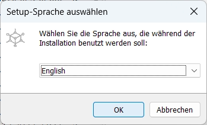
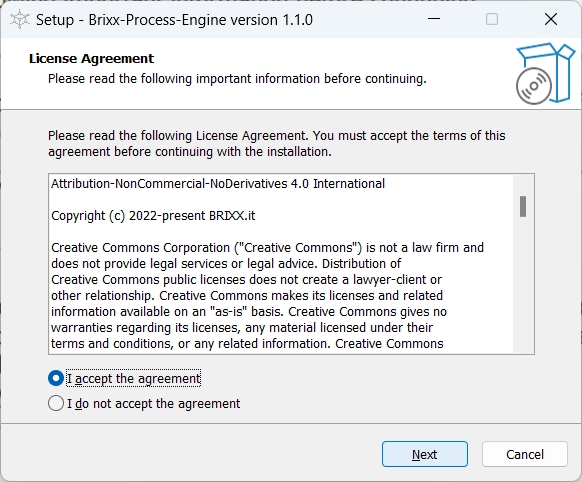
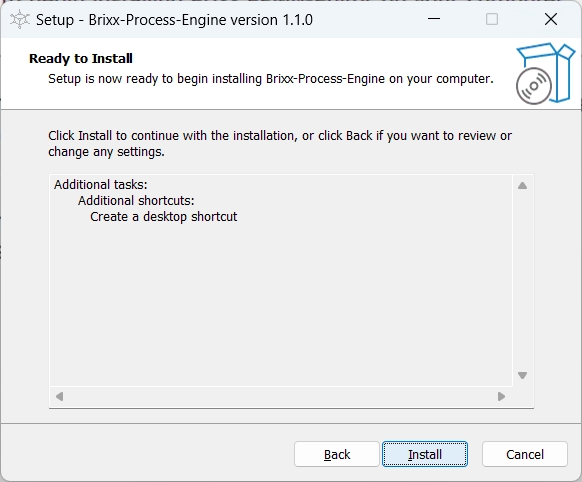
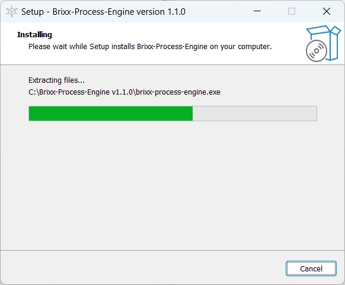
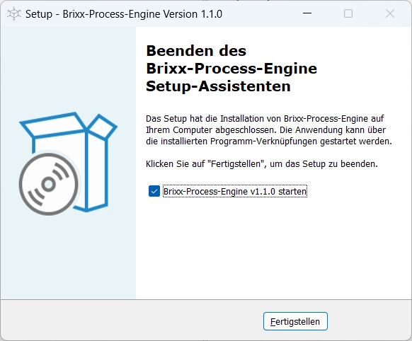
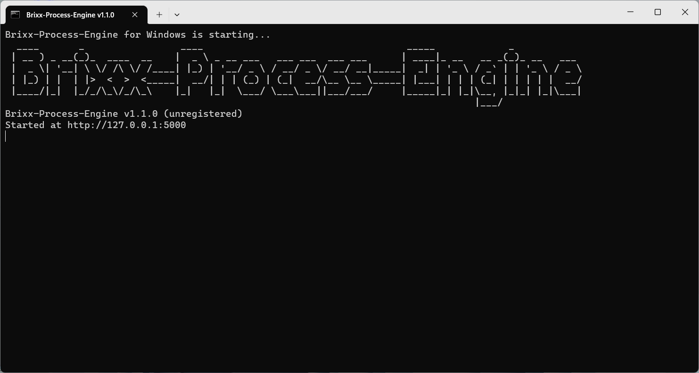
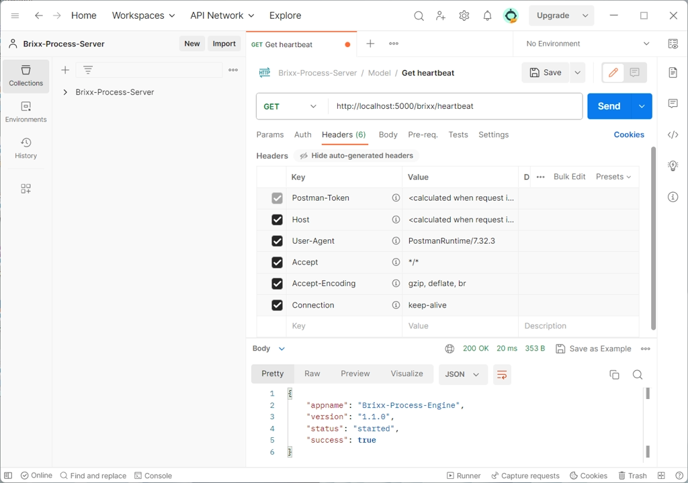

<link rel="stylesheet" href="https://cdnjs.cloudflare.com/ajax/libs/font-awesome/6.4.0/css/all.min.css" integrity="sha512-iecdLmaskl7CVkqkXNQ/ZH/XLlvWZOJyj7Yy7tcenmpD1ypASozpmT/E0iPtmFIB46ZmdtAc9eNBvH0H/ZpiBw==" crossorigin="anonymous" referrerpolicy="no-referrer" />

# Brixx-Process-Engine

### Package: `@brixx/process-engine`

### Version: `1.1.0` (Release, 08.07.2023)

#

> This document is in progress. For further information on the use of Brixx-Script please feel free to contact [`info@brixx.it`](info@brixx.it)

# What is Brixx-Process-Engine

## The easiest way to build digital processes and workflows

With **Brixx Process Engine** we bridge the gap to enterprise process orchestration systems, such as Camunda or X4 BPMS, as a lightweight workflow management system for the automation and digitization of business and industrial processes, processes in web applications and to IoT process control. With minimal development, integration and cost effort, our process can serve as the basis for applications, or be integrated into existing applications as an extension for sub-processes and is the control center for configuration, process creation and processing.

-   Lightweight process enging
-   Simple system integration
-   No special training needed
-   No special server hardware
-   or installation needed
-   No database required
-   Cross platform development
-   Cross ui development
-   Low Code Development
-   Full HTML and JavaScript support
-   IoT (Internet of Things) control and  
    (Single-Board-Computer) support
-   BPMN 2.0 Standard
-   Suitable for BPMN training
-   Cloud (FaaS) and Blockchain ready
-   ChatGPT ready

## Why a process engine for web technologies?

We have published our web-based process engine for creating processes and workflows and can therefore be used in all infrastructure systems. In addition, Brixx Process Script enables integration into HTML and gives non-programmers the opportunity to create simple processes and workflows.

## Who is our process engine for?

We are particularly aimed at small and medium-sized companies in order to enable everyone to have a practice-oriented, uncomplicated and affordable digitization, and no specialists, infrastructure investments or confusing follow-up costs are necessary.

## Model processes and workflows

With our workflow management system, all types of processes and workflows can be processed, and with the [Brixx BPMN editor](../brixx-bpmn-editor/README.md) for process modeling with BPMN (Business Process Model and Notation) can be made available in the Brixx Process Engine with one click.

## Create processes and workflows

With [Brixx-Process-Script](../brixx-process-script/README.md), processes and workflows can be created requirement-oriented and integrated into web applications with HTML and JavaScript. This allows applications with the Four Eyes
Principle (Two-man rule), multi-level forms, or web applications for processing with different actors as an example to be created quickly and easily.

-   [Install Brixx-Process-Engine](#setup)
    -   [Windows installer](#windows)
-   [Brixx-Process-Engine API Reference](#reference)
-   [Downloads](#downloads)
-   [Docker](#docker)
    -   [Docker Hub](#docker-hub)

# 
 Install Brixx-Process-Engine

## 
 <i class="fa-brands fa-windows"></i> Windows Installer

Select `[OK]`

Select `[Next]`

Select `[Next]`

Select `[Install]`

Installation in progress ...

Select `[Finish]`

After installation, the Brixx Process Engine is available at `http://localhost:5000`  
Get the status at the Process Engine API Ressource http://localhost:5000/brixx/heartbeat

Brixx-Process-Engine in Windows Terminal (PowerShell)

# 
 Brixx-Process-Engine API Reference

The Brixx Process Engine comes with an fully integrated RESTful API. With the integrated API, business processes can be modeled, created and managed and is particularly interesting if Brixx-Process-Engine is integrated into another framework or used in a test system, for example. The [Brixx BPMN-Editor](../brixx-bpmn-editor/README.md) and [Brixx-Process-Script](../brixx-process-script/README.md) are also available for developers for uncomplicated integration.

Applications like [SoapUI](https://www.soapui.org/tools/soapui/) or [Postman](https://www.postman.com/pricing/) can also be used for the built-in API for development and testing.

Postman - Brixx Process Engine API heartbeat request example

## Basic API information

### API Base URL

`http://127.0.0.1:5000`

### API Root Ressource

`/brixx`

## Model

## Process

## Publish

## Heartbeat

### `GET /brixx/heartbeat`

Get the status of the Brixx Process Engine.

**Method**  
`GET`  

**Ressource**  
`/brixx/heartbeat`

**Response**  
Status of the Brixx Process Engine.

    {
        "appname":"Brixx-Process-Engine",
        "version":"1.1.0",
        "status":"started",
        "success":true
    }

# 
 Downloads

##  CDN - Latest Stable Version

Version 1.1.0 (Latest)

## <i class="fa-brands fa-windows"></i> Windows Installer

Download Web-Application Package Installer for Windows.

### [Brixx-Process-Engine Version 1.1.0 (64-bit)](https://brixx.it/@brixx/setup/Brixx-Process-Engine-v1.1.0-x64.exe)

## <i class="fa-brands fa-linux"></i> Linux Installer

Ask for your Linux runtime version.

## <i class="fa-brands fa-apple"></i> Mac OS Installer

Ask for your Mac OS runtime version.

# 
 Docker

## 
  Docker Hub

### <a href="#" target="_blank">BRIXX.it docker hub</a>

You will soon find all docker images here.  
Ask for your early access registered version. 

## Copyright and License

Copyright © [BRIXX.it](https://brixx.it/) 2022-present
