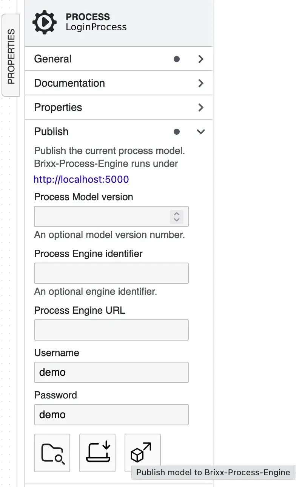

# Brixx-Process-Script

### Package: `@brixx/process-script`

### Version: `1.3.5` (Release, 11.12.2024)

#

> This document is in progress. For further information on the use of Brixx-Process-Script please feel free to contact [`info@brixx.it`](info@brixx.it)

# What is Brixx-Process-Script

## Process Driven Development for everyone

Brixx-Process-Script is a free JavaScript library to create process applications for the [Brixx Process-Engine](https://brixx.it/brixx-process-engine.html) and fill in a gap to enterprise process orchestration systems such as [Camunda](#) or [X4 BPMS](#) as a lean workflow management system for automation and digitization of business processes and industrial processes. For processes in web applications, to control multiple web applications up to IoT control. With minimal development, integration and costs, Brixx Process Engine can serve as the basis for applications or be integrated into existing applications as an extension for sub-processes. With our **Brixx-Process-Script**, the programming can be reduced to a minimum. Fast integration into any HTML document is possible, especially with the integrated [Brixx-Script (smart web components)](https://brixx.it/brixx-script.html) as Brixx HTML elements or as Brixx script components in JavaScript applications and frameworks and also support JavaScript environments such as [Node.js®](https://nodejs.org/en/ "Opensource cross platform JavaScript runtime environment") (cross-platform JavaScript runtime environment).

## Model processes and workflows

With our workflow management system, all types of processes and workflows can be mapped with the [Brixx BPMN-Editor](https://brixx.it/brixx-bpmn-editor.html) for process modeling with Business Process Model and Notation ([BPMN](https://en.wikipedia.org/wiki/Business_Process_Model_and_Notation)) and made available in the Brixx Process Engine with one click.

# Was ist Brixx-Process-Script

## Prozessgesteuerte Entwicklung für jedermann

Brixx-Process-Script ist eine kostenlose JavaScript-Bibliothek, um Prozessanwendungen für die [Brixx Process-Engine](https://brixx.it/brixx-process-engine.html) zu erstellen und als schlankes Workflow-Management-System zur Automatisierung und Digitalisierung von Geschäftsprozessen und Industrieprozessen eine Lücke zu Enterprise-Prozessorchestrierungssystemen wie [Camunda](#) oder [X4 BPMS](#) zu schließen. Für Prozesse in Webanwendungen, zur Steuerung mehrerer Webanwendungen bis hin zur IoT-Steuerung. Mit minimalem Entwicklungs-, Integrations- und Kostenaufwand kann Brixx Process Engine als Grundlage für Anwendungen dienen oder als Erweiterung für Teilprozesse in bestehende Anwendungen integriert werden. Mit unserem **Brixx-Process-Script** kann die Programmierung auf ein Minimum reduziert werden. Insbesondere mit den integrierten [Brixx-Script (Webkomponenten)](https://brixx.it/brixx-script.html) ist eine schnelle Integration in beliebige HTML-Dokumente als Brixx-HTML-Elemente oder als Brixx-Skriptkomponenten in JavaScript-Anwendungen und Frameworks möglich und unterstützt auch JavaScript-Umgebungen wie [Node.js®](https://nodejs.org/en/ „Opensource Cross Platform JavaScript Runtime Environment“) (plattformübergreifende JavaScript-Laufzeitumgebung).

## Modellieren Sie Prozesse und Arbeitsabläufe

Mit unserem Workflow-Management-System können alle Arten von Prozessen und Workflows mit dem [Brixx BPMN-Editor](https://brixx.it/brixx-bpmn-editor.html) zur Prozessmodellierung mit Business Process Model and Notation ([BPMN](https://en.wikipedia.org/wiki/Business_Process_Model_and_Notation)) abgebildet und mit einem Klick in der Brixx Process Engine bereitgestellt werden.

- [Erste Schritte](#getstarted)
  - [Brixx Web-Baustein [brixx-login-process] erstellen (HTML based)](#brixx-login-process-html)
- [Brixx-Process-Script Tutorial](#tutorial)
  - [Brixx Web-Baustein [brixx-login-process] erweitern (HTML based)](#brixx-login-process-styles)
  - [Brixx Web-Baustein [brixx-login-process] erste (JavaScript based)](#brixx-login-process-script)
  - [Node.js Application [brixx-login-process] erstellen](#brixx-login-process-model)
- [Brixx-Process-Script Referenz](#reference)
- [Downloads](#downloads)

# 
 Erste Schritte

Wir verwenden Brixx-Script zur Erstellung von einem **Business Process** (Geschäftsprozess). Brixx-Script ist Bestandteil von Brixx-Process-Script und ermöglicht einen minimalen Programmieraufwand und schnelle Integration in ein HTML-Dokument (siehe [Brixx-Script Dokumentation](../brixx-script/README.md)). Dabei ist neben der JavaScript-Engine für Web-/Entwickler auch eine Erstellung im HTML-Code für Web-/Designer möglich. Es können auch beide Welten kombiniert werden, was Brixx-Process-Script besonders interessant und leistungsfähig macht. Im ersten Schritt erstellen wir einen einfachen Brixx Web-Baustein (Brixx web component) mit einem Benutzer-Login Prozess (`brixx-login-process-html`) und anschließend als JavaScript Element (`brixx-login-process-javascript`) und Node.js Application (`brixx-login-process-node`).

## Vorbereitungen

### Brixx Prozess Engine

Für die Prozess-Erstellung und -Verarbeitung verwenden wir die [Brixx Prozess Engine](../brixx-process-engine/README.md) als Prozess und Workflow Engine und kann zum Beispiel für die Entwicklung unter Windows mit dem [Windows Installer](https://brixx.it/brixx-process-engine.html) und wenigen Mausklicks installiert und lokal bereitgestellt werden.

Installation abgeschlossen - Windows-Installer

Nach der Installation steht die Brixx Prozess Engine standardmäßig unter `http://localhost:5000` für die Entwicklung zur Verfügung und kann mit `http://localhost:5000/brixx/heartbeat` überprüft werden.

Brixx-Process-Engine im Windows Terminal (PowerShell)

### Brixx BPMN-Editor

Anschließend erstellen wir mit dem [Brixx BPMN-Editor](../brixx-bpmn-editor/README.md) einen Benutzer-Login Prozess und verwenden das BPMN-Prozessmodell aus der Datei [`brixx-login-process.bpmn`](../assets/downloads/brixx-login-process.bpmn) Wir öffnen die Datei im BPMN-Editor indem wir im Diagrammmenü auf das Symbol `[Open BPMN diagram from local file]` klicken und veröffentlichen den Benutzer-Login Prozess (Geschäftsprozess) in der Brixx Prozess Engine.

Benutzer-Login Prozessmodell `brixx-login-process` im Brixx BPMN-Editor

Wir können jetzt das aktuelle BPMN-Modell in der Brixx Process Engine veröffentlichen indem wir im Abschnitt der Veröffentlichungseigenschaften auf das Symbol `[Publish model to Brixx-Process-Engine]` klicken; und benötigen dafür nur noch die entsprechenden Zugangsdaten (Credentials) der verwendeten Brixx Process Engine.

Veröffentlichungseigenschaften

> Standardmäßig hat die Brixx Process Engine in der nicht registrierten Version einen Benutzer mit den Credentials _Username_ `demo` und _Password_ `demo`.

Die Details im Benutzer-Login Prozess werden wir später betrachten, vorher erstellen wir zum Testen noch eine Prozessinstanz.

### 
 Administration Tools

Für die Prozessverwaltung stehen der Brixx Process Engine verschiedene Werkzeuge in einer **Management Console** zur Verfügung, beispielsweise die **Administration Tools**, um eine Prozessinstanz zu erstellen.

Administration Tools der Brixx Process Engine

Die Administration Tools stehen in der registrierten Version der Brixx Process Engine zur Verfügung. Für die freie Version erstellen wir ein ein HTML-Dokument als `Helper` für die Brixx Prozess Engine als **Admin Console** zur Prozessverwaltung, und im ersten Schritt zur Erstellung einer Prozessinstanz. Dabei wird eine Prozessinstanz mit der Funktion `BrixxProcessDefinition.process.create` erstellt und die Process-ID (Process identifier) ausgegeben. Die Funktion wird später genauer beschrieben; dabei kann u. a. auch eine Mail mit der Prozess-URL und Projektinstanz als QR-Code an den Ersteller gesendet werden.

Komplettes HTML-Dokument in der HTML-Datei [`brixx-create-process.html`](../assets/downloads/brixx-create-process.html)

    <!DOCTYPE html>
    <html>
    <head>
        <title>Admin Console</title>
    </head>

    <!-- Load Brixx-Process-Script standalone for development -->
    

    <body>
        <h1>Brixx-Process-Engine</h1>
        <h3>Create a process instance</h3>
        <table>
        <tr>
            <td>Model identifier (ID)&nbsp;</td>
            <td>
            <input type="text" id="mid" size="35" />
            </td>
        </tr>
        <tr>
            <td>Model key (Name)</td>
            <td>
            <input type="text" id="key" size="35" />
            </td>
        </tr>
        <tr>
            <td></td>
            <td>
            <input type="button" id="btnCreateProcess" value="Create process" />
            </td>
        </tr>
        <tr>
            <td colspan="2">&nbsp;</td>
        </tr>
        <tr>
            <td>Process-ID (PID)</td>
            <td>
            <input type="text" id="pid" size="35" />
            </td>
        </tr>
        <tr>
            <td></td>
            <td>
            <input
                type="button"
                id="btnCopyProcessID"
                value="Copy to clipboard"
            />
            </td>
        </tr>
        </table>

        
    </body>
    </html>

Die _Admin Console_ verwendt Brixx-Process-Script standalone und kann dadurch während der Entwicklung, z. B. mit dem _Live Server_ in Visual Studio Code, direkt im Browser gestartet werden.

Die _Admin Console_ im Browser-Fenster

Mit dem _Model identifiers (ID)_ oder dem _Model key (Name)_ aus dem Brixx BPMN-Editor kann eine Prozessinstanz mit Klick auf die Schaltfläche `[Create Process]` in der Brixx Prozess Engine erstellt, und mit Klick auf die Schaltfläche `[Copy to clipboard]` die _Process-ID (PID)_ in die Zwischenablage kopiert werden.

## 
 Brixx Web-Baustein [brixx-login-process] erstellen (HTML based)

Wir erstellen einen einfachen Benutzer-Login Prozess mit einem privaten und öffentlichen Bereich. Dazu erstellen wir einen Ordner `./components` im Projektordner `[brixx-login-process-html]` wodurch die Projekt-Ordnerstruktur wie folgt aussieht.

    brixx-login-process-html/
    ├── components/
    │   └── brixx-login-process.js
    └── index.html

Darin erstellen wir den Brixx Web-Baustein `[brixx-login-process]` in der Brixx Script-Component Datei `brixx-login-process.js` und suchen zuerst mit der Funktion `BrixxProcessDefinition.getProcessIdentifier` nach einem URL-Parameter `pid` und im `BrixxProcessDefinition.context` nach einer gültigen Process-ID. Wird keine gültigen Process-ID gefunden, wird nach der Process-ID mit einem Eingabedialog gefragt. Diese Funktion wird in der Regel für die Entwicklung verwendet.

    // Get search param
    const pid = BrixxProcessDefinition.getProcessIdentifier();

Eingabedialog für eine Process-ID im Browser-Fenster.

Das kann eine Process-ID oder ein Identifier von einem Process-Element sein, beispielsweise eine Task-ID. Hier können wir die Process-ID einfügen, die wir mit der _Admin Console_ aus den Vorbereitungen erstellen und in die Zwischenablage kopieren können.

Anschließend erstellen wir ein Standard `Brixx.element` mit dem Benutzer-Login Prozess.

    // Create a Brixx default element
    Brixx.element = (
    <ProcessDefinition mid="Process_nehz6cn" pid={pid}>
        <Task mid="Task_0r94slz" action={(data) => addLoginElement(data)}>
        <Gateway
            mid="Gateway_0r8twz8"
            action={(data) =>
            BrixxProcessDefinition.process.done({ gid: data.gid })
            }
        >
            <Task
            mid="Task_1m8u5ed"
            action={(data) =>
                addMessageElement(data, "You have entered the user area.")
            }
            />
            <Task
            mid="Task_0zs24yh"
            action={(data) =>
                addMessageElement(data, "You have entered the public area.")
            }
            />
        </Gateway>
        </Task>
    </ProcessDefinition>
    );

Mit Brixx-Process-Script werden HTML-Elemente zur Erstellung von einem Geschäftsprozess oder Workflow im HTML-Dokument zur Verfügung gestellt. Wir erstellen den Benutzer-Login Prozess mit dem HTML-Element `<ProcessDefinition>` und dem HTML-Attribut (Eigenschaft) `mid` für die Model-ID in der Brixx Prozess Engine. Mit der Eigenschaft `pid` wird die Process-ID als persönlicher identifier angegeben.

    ...
    <ProcessDefinition mid="Process_nehz6cn" pid={pid}>
        ...
    </ProcessDefinition>
    ...

Danach erstellen wir einen Task Process mit dem HTML-Element `<Task>` und der Eigenschaft `mid` für die Task-ID aus dem übergeordneten Prozessmodell. Mit der Eigenschaft `action` geben wir an welche Aktion ausgeführt werden soll nachdem der Task Process im Prozessablauf aktiviert wurde. Im Beispiel wird die Funktion `addLoginElement` als Callback Funktion aufgerufen und die aktuellen Prozesseigenschaften im Parameter `data` übergeben.

    ...
    <Task mid="Task_0r94slz" action={(data) => addLoginElement(data)}>
        ...
    </Task>
    ...

Im Task-Element erstellen wir einen untergeordneten Gateway Prozess mit dem HTML-Element `<Gateway>` und der Eigenschaft `mid` für die Gateway-ID. Der Gateway Prozess verwendet eine integrierte Brixx Entscheidungstabelle, und wie beim Task Process wird mit `action` angegeben welche Aktion ausgeführt werden soll, sobald der Gateway Process die Entscheidungstabelle verarbeitet hat. Im Beispiel wird der Gateway Process mit der Funktion `BrixxProcessDefinition.process.done` beendet, und mit der Objekt Eigenschaft `git` die Gateway-ID übergeben. Anschließend werden alle nachfolgenden Prozess-Elemente im Prozessablauf aktiviert.

    ...
    <Gateway
        mid="Gateway_0r8twz8"
        action={(data) =>
            BrixxProcessDefinition.process.done({ gid: data.gid })
        }
    >
        ...
    </Gateway>
    ...

Danach erstellen wir im Gateway-Element untergeordnete Task-Elemente und mit der Eigenschaft `action` wird die Funktion `addMessageElement` aufgerufen, mit dem Parameter `data` die aktuellen Prozesseigenschaften, und einem weiteren Parameter `message` eine _Nachricht_ übergeben.

    ...
    <Task
        mid="Task_1m8u5ed"
        action={(data) =>
            addMessageElement(
                data,
                "You have entered the user area."
            )
        }
    />
    <Task
        mid="Task_0zs24yh"
        action={(data) =>
            addMessageElement(
                data,
                "You have entered the public area."
            )
        }
    />
    ...

Abschließend wird das `Brixx.element` als HTML-Elemet `<brixx-login-process>` registriert.

    // Register a Brixx HTML-Element <brixx-login-process>
    Brixx.registerElement({ name: "login-process" });

Die Funktionen `addMessageElement` und `addLoginElement` werden als Brixx „Standard“-Element erstellt und erst beim Aufruf angezeigt (gerendert), wobei die Funktion `addMessageElement` keine besondere Aufgabe hat und im Beispiel nur als Platzhalter für die Action Callback Function dient.

    // Message task action callback function
    const addMessageElement = (data, message = `${data.mid} is running.`) => {
        const { tid } = data;
        const element = (
            

                <h2>{message}</h2>
                

                <input type="button" id={"btn_" + tid} value={"Next"} />
            

        );
        new Brixx().render({ element });
        document.getElementById("btn_" + tid).addEventListener("click", () => {
            // Set process done
            BrixxProcessDefinition.process.done({ tid });
        });
    };

Dabei wird die _Nachricht_ aus dem Parameter `message` angezeigt, und die Schaltfläche `[Next]` erzeugt. Mit Klick auf die Schaltfläche wird der Task Prozess mit der Funktion `BrixxProcessDefinition.process.done` und der Objekt Eigenschaft `tid` beendet. Für die Schaltfläche wird eine eindeutige Button-ID `{"btn_" + tid}` generiert, mit der Task-ID aus dem Parameter `data` mit den aktuellen Prozesseigenschaften.

Mit der Funktion `addLoginElement` werden die Benutzerdaten zur Authentifizierung abgefragt Mit Klick auf die Schaltfläche `[Login]` wird der Task Prozess mit der Funktion `BrixxProcessDefinition.process.task.next` und der Objekt Eigenschaft `tid` beendet, und der nachfolgenden Gateway Prozess aktiviert. Dabei werden die Benutzerdaten mit dem Parameter `store` an den Gateway Prozess weitergegeben, und mit der integrierten Entscheidungstabelle verarbeitet.

    // Login task action callback function
    const addLoginElement = (data) => {
        const { tid } = data;
        const element = (
            

                <h2>Authentication</h2>
                

                    User: <input type="text" id={"user"} />
                

                

                    Password: <input type="text" id={"password"} />
                

                <input type="button" id={"btn_login"} value={"Login"} />
            

        );
        new Brixx().render({ element });
        document.getElementById("btn_login").addEventListener("click", () => {
            // Set next process task active with store data
            const store = {
                user: document.getElementById("user").value,
                password: document.getElementById("password").value,
            };
            BrixxProcessDefinition.process.task.next({ tid, store });
        });
    };

Kompletter Brixx Web-Baustein in der Brixx Script-Component Datei `./components/brixx-login-process.js`

    // Get search param
    const pid = BrixxProcessDefinition.getProcessIdentifier();

    // Message task action callback function
    const addMessageElement = (data, message = `${data.mid} is running.`) => {
        const { tid } = data;
        const element = (
            

                <h2>{message}</h2>
                

                <input type="button" id={"btn_" + tid} value={"Next"} />
            

        );
        new Brixx().render({ element });
        document.getElementById("btn_" + tid).addEventListener("click", () => {
            // Set process done
            BrixxProcessDefinition.process.done({ tid });
        });
    };

    // Login task action callback function
    const addLoginElement = (data) => {
        const { tid } = data;
        const element = (
            

                <h2>Authentication</h2>
                

                    User: <input type="text" id={"user"} />
                

                

                    Password: <input type="text" id={"password"} />
                

                <input type="button" id={"btn_login"} value={"Login"} />
            

        );
        new Brixx().render({ element });
        document.getElementById("btn_login").addEventListener("click", () => {
            // Set next process task active with store data
            const store = {
                user: document.getElementById("user").value,
                password: document.getElementById("password").value,
            };
            BrixxProcessDefinition.process.task.next({ tid, store });
        });
    };

    // Create a Brixx default element
    Brixx.element = (
        <ProcessDefinition mid="Process_nehz6cn" pid={pid}>
            <Task mid="Task_0r94slz" action={(data) => addLoginElement(data)}>
                <Gateway
                    mid="Gateway_0r8twz8"
                    action={(data) =>
                        BrixxProcessDefinition.process.done({ gid: data.gid })
                    }
                >
                    <Task
                        mid="Task_1m8u5ed"
                        action={(data) =>
                            addMessageElement(
                                data,
                                "You have entered the user area."
                            )
                        }
                    />
                    <Task
                        mid="Task_0zs24yh"
                        action={(data) =>
                            addMessageElement(
                                data,
                                "You have entered the public area."
                            )
                        }
                    />
                </Gateway>
            </Task>
        </ProcessDefinition>
    );

    // Register a Brixx HTML-Element <brixx-login-process>
    Brixx.registerElement({ name: "login-process" });

### Brixx Web-Baustein verwenden

Zur Integration in ein HTML-Dokument verwenden wir für das Beispiel **Brixx-Process-Script Standalone** vom Brixx CDN-(Content Delivery Network)-Server um eine direkte Integration vom Benutzer-Login Prozess mit dem Brixx Web-Baustein zu ermöglichen.

    <!-- Load Brixx-Process-Script standalone for development-->
    

Das Brixx-Procss-Script Package kann auch von CDN-Systemen wie [jsDelivr - A free global CDN](https://www.jsdelivr.com/) verwendet werden. Hier muss beachtet werden, dass es sich beispielsweise bei _jsDelivr_ um ein automatisiertes System handelt, und dort nicht die Brixx-Process-Script Standalone, sondern das Brixx-Process-Script NPM-Package bereitgestellt wird. Das erfordert gegenüber der Dokumentation von _jsDelivr_ einen zusätzlichen Babel import.

    <!-- Load Babel -->
    
    <!-- Load Brixx-Procss-Script from jsDelivr CDN -->
    

> **Info:** Der import von _jsDelivr_ darf mit Ausnahme verwendet werden, auch wenn die Lizenzbestimmungen nicht eingehalten werden.

Der Brixx Web-Baustein `[brixx-login-process]` in der Brixx Script-Component Datei `./components/brixx-login-process.js"` wird mit einen HTML-`

Für Brixx-Process-Script Standalone verwenden wir Babel mit `type="text/babel"` um die Brixx Webkomponente in den unterschiedlichen Browsern nutzen zu können. Dann werden die Eigenschaften `data-type="module"` und `data-presets="brixx"` festgelegt, und der Brixx Web-Baustein kann als HTML-Element `<brixx-check-age>` verwendet werden. Die Eigenschaft _data-type_ ist optional und wird zum Import von ECMAScript 2015+ (ES6) Modulen benötigt. Zur Verwendung als HTML-Element werden keine weiteren Programmierkentnisse benötigt.

Jetzt müssen wir nur noch das HTML-Element `<brixx-login-process>` im `<body>`-Bereich einfügen.

    <body>
        <!-- Add the Brixx HTML element -->
        <brixx-login-process></brixx-login-process>
    </body>

Komplettes HTML-Dokument in der HTML-Datei `index.html`

    <!DOCTYPE html>
    <html>
    <head>
        <!-- Load Brixx-Process-Script standalone for development-->
        

        <!-- Include the Brixx script component files for development -->
        
    </head>

    <body>
        <!-- Add the Brixx HTML element -->
        <brixx-login-process></brixx-login-process>
    </body>
    </html>

Komplettes Beispiel [[brixx-login-process-html] (ZIP-Archiv)](../assets/downloads/brixx-login-process-html.zip) herunterladen.

### Brixx Web-Baustein testen

Zum testen öffnen wir den Projektordner `[brixx-login-process-html]` in Visual Studio Code und starten die HTML-Datei `index.html` mit dem _Live Server_. Dazu gibt es verschiedene Möglichkeiten.

1. Klick auf `[Go Live]` in der Visual Studio Code Status Bar (`Click to run live server`)
2. Öffnen der HTML-Datei im Editor-Fenster mit der Tastenkombination `[ALT+L Alt+O]`
3. Rechtsklick auf die HTML-Datei im **Editor-Fenster** und Auswahl von `[Open with Live Server]`
4. Rechtsklick auf die HTML-Datei in der **Explorer-Ansicht** und Auswahl von `[Open with Live Server]`

   

   Visual Studio Code - Explorer-Ansicht `[Open with Live Server]`

   > **Tip:** Der Browser kann bei den _Live Server_ Einstellungen unter `[Custom Browser]` festgelegt werden (`default=null`).

Die HTML-Datei `index.html` wird mit dem _Live Server_ bereitgestellt und im Standard-Browser geöffnet.

Eingabedialog für eine Process-ID im Browser-Fenster.

Wird keine güötige Process-ID gefunden, beispielsweise in der Prozess-URL mit dem URL-Parameter `pid`, z.B. `index.html?pid=f1d49482-a46e-7a1f-aee3-e5ece9aaa093`, wid man mit einem Eingabedialog aufgefortert eine Prozess-ID einzugeben (siehe [Admin Console](#administration-tools))

Der Brixx Web-Baustein `<brixx-login-process>` im Browser-Fenster

# 
 Brixx-Process-Script Tutorial

## 
 Brixx Web-Baustein [brixx-login-process] erweitern (HTML based)

Wie erweitern den Benutzer-Login Prozess `[brixx-login-process]` mit HTML Styles und  einer JavaScript-Datei für die JSX-Komponenten. Dafür erstellen wir zuerst einen Projektordner `[brixx-login-process-styles]`, kopieren alle Dateien aus dem vorherigen Beispiel in benennen im Projektordner den Ordner `[components]` in `[js]` um. Als Ersatz erstellen wir im Ordner `[js]` eine JavaScript-Datei `components.js`.

### HTML Styles hinzufügen

Wir „stylen“ im ersten Schritt die Brixx Webkomponente mit **CSS** (Cascade Style Sheet) und erstellen dafür einen Ordner `./css` im Projektordner. Wir nutzen **Bootstrap** vom CDN von [jsdelivr.com](https://cdn.jsdelivr.net/npm/bootstrap@5.3.3/dist/css/bootstrap.min.css)  und erstellen im Ordner `[styles]` eine CSS-Datei `index.css` für die Brixx Webkomponente.

Komplette Styles der CSS-Datei `index.css`

    /*
    *  Brixx styles
    *
    * Copyright 2024 The BRIXX.it Authors
    */

    body {
    margin: 25px 10px;
    }

    input[type="button"],
    input[type="submit"],
    input[type="reset"] {
    margin: 4px 0px;
    padding: 8px 16px;
    color: white;
    background-color: #0d6efd;
    border: 1px solid #0a58ca;
    border-radius: 8px;
    text-decoration: none;
    cursor: pointer;
    }

    input[type="button"]:hover,
    input[type="submit"]:hover,
    input[type="reset"]:hover {
    background-color: #0a58ca;
    }

Die verwendeten HTML Styles dienen als Beispiel und werden im Einzelnen nicht betrachtet. Damit sieht die Projekt-Ordnerstruktur folgendermaßen aus.

    brixx-login-process-styles/
    ├── css/
    │   └── index.css
    ├── js/
    │   ├── brixx-login-process.js
    │   └── components.js
    └── index.html

### Brixx Web-Baustein anpassen

Wir lagern die JSX-Komponenten aus dem Brixx Web-Baustein in der JavaScript-Datei `./js/components.js` aus und erhalten dadurch einen optimierten Web-Baustein (HTML-Element) `<brixx-login-process>` als Low-Code **Brixx Process Login-Komponente**

Kompletter Brixx Web-Baustein in der Brixx Script-Component Datei `./js/brixx-login-process.js`

    /**
    * Brixx HTML-Element
    * <brixx-login-process>
    *
    * Copyright 2024 The BRIXX.it Authors
    */

    // Get process identifier
    const pid = await BrixxProcessDefinition.getProcessIdentifier();

    // Create a Brixx default element
    Brixx.element = (
    <ProcessDefinition mid="Process_nehz6cn" pid={pid}>
        <Task mid="Task_0r94slz" action={(data) => LoginComponent(data)}>
        <Gateway
            mid="Gateway_0r8twz8"
            action={(data) =>
            BrixxProcessDefinition.process.done({ gid: data.gid })
            }
        >
            <Task
            mid="Task_1m8u5ed"
            action={(data) =>
                MessageComponent(data, "You have entered the user area!")
            }
            ></Task>
            <Task
            mid="Task_0zs24yh"
            action={(data) =>
                MessageComponent(data, "You have entered the public area!")
            }
            >
            <Event
                mid="Event_12hx5eq"
                action={(data) =>
                MessageComponent(data, "Login Process completed!", false)
                }
            />
            </Task>
        </Gateway>
        </Task>
    </ProcessDefinition>
    );

    // Register Brixx HTML element
    Brixx.registerElement({ name: "login-process" });

### JSX-Komponenten auslagern

Wir lagern die JSX-Komponenten aus dem Brixx Web-Baustein in der JavaScript-Datei `./js/components.js` aus und erhalten dadurch die JSX-Components JavaScript-Datei `./js/components.js`

Komplette JSX-Components JavaScript-Datei `./js/components.js`

    /**
    * Brixx JSX Components
    *
    * Copyright 2024 The BRIXX.it Authors
    */

    /**
    * Message component
    *
    * Creates the brixx message component
    */
    const MessageComponent = (
    data,
    message = `${data.mid} is running.`,
    next = true
    ) => {
    // Get process identifier
    const { tid } = data;

    // Set brixx element
    const element = (
        

        <h2>Login Process</h2>
        <h4>{message}</h4>
        

            

            {next ? (
                <input type="button" id={"btn_" + tid} value={"Next"} />
            ) : null}
            

        

        

    );

    // Render brixx jsx component
    new Brixx().render({ element });

    // Set next process task active
    if (next) {
        // Next button click handler
        document.getElementById("btn_" + tid).addEventListener("click", () => {
        // Set process task done
        BrixxProcessDefinition.process.done({ tid });
        });
    }
    };

    /**
    * Login component
    *
    * Creates the brixx login component
    */
    const LoginComponent = (data) => {
    // Get process identifier
    const { tid } = data;

    // Set brixx element
    const element = (
        

        <h2>Login Process</h2>
        <h4>Authentication</h4>
        

            
User:

            

            <input type="text" id={"user"} />
            

        

        

            
Password:

            

            <input type="text" id={"password"} />
            

        

        

        

            

            <input type="button" id={"btn_login"} value={"Login"} />
            

        

        

    );

    // Render brixx jsx component
    new Brixx().render({ element });

    // Login button click handler
    document.getElementById("btn_login").addEventListener("click", () => {
        // Set task store data
        const store = {
        user: document.getElementById("user").value,
        password: document.getElementById("password").value,
        };

        // Set next process task active with store data
        BrixxProcessDefinition.process.task.next({ tid, store });
    });
    };

### HTML-Dokument erweitern

Wir erweitern das HTML-Dokument im `<head>`-Bereich und fügen die neu erstellen Dateien `components.js` aus dem Ordner `[js]` und `index.css` aus dem Ordner `[css]` hinzu.

Komplettes HTML-Dokument in der HTML-Datei `index.html`

    <!DOCTYPE html>
    <html>
    <head>
        <!-- Load Brixx-Process-Script standalone for development-->
        
        
        <!-- Load Brixx components -->
        
        <!-- Load Brixx HTML element -->
        

        <!-- Load Bootstrap styles v5.3.3 -->
        <link
        href="https://cdn.jsdelivr.net/npm/bootstrap@5.3.3/dist/css/bootstrap.min.css"
        rel="stylesheet"
        integrity="sha384-QWTKZyjpPEjISv5WaRU9OFeRpok6YctnYmDr5pNlyT2bRjXh0JMhjY6hW+ALEwIH"
        crossorigin="anonymous"
        />
        <!-- Load Brixx styles -->
        <link href="./css/styles.css" rel="stylesheet" />
    </head>

    <body>
        <!-- Add Brixx HTML element -->
        <brixx-login-process></brixx-login-process>
    </body>
    </html>

Komplettes Beispiel [[brixx-login-process-styles] (ZIP-Archiv)](../assets/downloads/brixx-login-process-styles.zip) herunterladen.

### Brixx Web-Baustein testen

Zum testen öffnen wir den Projektordner [brixx-login-process-styles] in Visual Studio Code und starten die HTML-Datei index.html mit dem Live Server.

Der Brixx Web-Baustein `<brixx-login-process>` im Browser-Fenster

## 
 Brixx Web-Baustein [brixx-login-process] erstellen (JavaScript based)

tbd

## 
 Node.js Application [brixx-login-process] erstellen

tbd

# 
 Brixx-Process-Script Referenz

## Brixx-Process-Script Standalone

Für die Entwicklung steht eine Brixx-Process-Script Standalone Version zur Verfügung. Dadurch kann Brixx-Process-Script direkt ohne precompiling verwendet werden. Die Brixx-Process-Script Standalone Datei [`brixx-process.min.js`](https://brixx.it/@brixx/standalone/brixx-process.min.js) kann dazu einfach mit einem HTML-`

Brixx-Script ist Bestandteil in Brixx-Process-Script und ermöglicht einen minimalen Programmieraufwand und schnelle Integration in ein HTML-Dokument (siehe [Brixx-Script Dokumentation](../brixx-script/README.md)) und ein Brixx Web-Baustein kann danach mit einem HTML-`

Brixx-Process-Script Standalone verwendet Babel, um ECMAScript 2015+ Code in eine abwärtskompatible Version von JavaScript in aktuellen und älteren Browsern oder Umgebungen zu konvertieren.

Die Eigenschaft `type` gibt den Medientyp des Skripts an. Für Brixx-Process-Script verwenden wir Babel mit `type="text/babel"` und hat den Vorteil dass man mit aktuellem Standard entwickeln kann, und sich nicht um Abwärtskompatibilität kümmern muss, da Benutzer unterschiedliche Browser und Versionen verwenden.

Die Eigenschaft `src` gibt die URL einer extern verwendeten Brixx Script-Component Datei an, im Beispiel mit `src="./components/brixx-animal-list.js"`

Die Eigenschaft `data-type` ist optional, wird benötigt wenn ECMAScript 2015+ (ES6) Modulen verwendet werden und für Babel mit `data-type="module"` angegeben.

Die Eigenschaft `data-preset` wird angegeben dass Brixx-Script verwendet wird und für Babel mit `data-preset="brixx"` angegeben.

Es wird empfohlen Brixx-Process-Script Standalone nicht in einer Produktionsumgebung zu verwenden. Beim Start wird in der Browserkonsole folgende Information ausgegeben.

> `You are using the in-browser Brixx transformer. Be sure to precompile scripts for production - https://brixx.it/brixx-script`

## Brixx-Process-Script Package

### Brixx-Process-Script Package installieren

    `npm i @brixx/process-script`

### Brixx-Process-Script Package importieren

Das Modul `BrixxProcessDefinition` vom Package `@brixx/process-script` für eine Web-Anwendung importieren.

    import { BrixxProcessDefinition } from '@brixx/process-script'

Das Modul `BrixxProcessDefinition` für eine Nodejs-Anwendung importieren.

    const BrixxProcessDefinition = require("@brixx/process-script/node").default;

## Brixx-Process-Script Library

Das Modul `BrixxProcessDefinition` von der Brixx-Process-Script Library importieren. Dafür kann man die Brixx-Process-Script Library (minified) [brixx-process.js](https://brixx.it/@brixx/script/brixx-process.js) vom Brixx CDN-(Content Delivery Network)-Server in den Projektordner kopieren und anschließend für eine Web-Anwendung importieren.

    import { BrixxProcessDefinition } from './brixx-process'

Das Modul `BrixxProcessDefinition` für eine Nodejs-Anwendung importieren.

    const BrixxProcessDefinition = require("./brixx-process/node").default;

> **Tip:** Die Brixx-Process-Script Library vom Brixx CDN-(Content Delivery Network)-Server ist immer die _Latest_ Version und kann die Version in der npm-Registry überholen. Hier hat man die Möglichkeit vorab die neueste Versionen zu testen.

# The HTML way

The first way to define a Brixx business process is through the special HTML elements available with Brixx Process Script. All HTML elements and attributes are optional. Each Brixx Process Script HTML element can contain subordinate elements and enables free design in the HTML document.

## The HTML elements

## &lt;ProcessDefinition&gt;

Defines a Brixx business process `root` element.

**Attributes**

`{Boolean} [checkAtStart=false]` - the check at start flag. Defines if an existing `Start Event` will be checked. If is `true`, the `Start Event` must be handled in the process definition with the HTML element `<Event>`

`{String} [mid]` - the model identifier.

`{String} [key]` - the model key (name).

`{String} [pid]` - the process identifier.

**Example**

## &lt;Event&gt;

Adds an `Event` object for the Brixx business process.

**Attributes**

`{String} [mid]` - the model event identifier.

`{String} [key]` - the model event key (name).

`{Object} [action]` - the event action callback function.

**Example**

## &lt;Gateway&gt;

Adds an `Gateway` object for the Brixx business process.

**Attributes**

`{String} [mid]` - the model gateway identifier.

`{String} [key]` - the model gateway key (name).

`{Object} [action]` - the gateway action callback function.

**Example**

## &lt;Task&gt;

Adds an `Task` object for the Brixx business process.

**Attributes**

`{String} [mid]` - the model task identifier.

`{String} [key]` - the model task key (name).

`{Object} [action]` - the task action callback function.

**Example**

# The JavaScript way

## BrixxProcessDefinition class

### constructor()

Constructs a BrixxProcessDefinition instance and creates a Brixx business process.

**Parameters**

**Returns**  
`{Object}` - BrixxProcessDefinition instance.

**Example**

## BrixxProcessDefinition static properties

### .baseURL

Returns the BrixxProcessDefinition base url. 

`Readonly`

**Returns**  
`{String} [baseURL=http://127.0.0.1:5000/brixx]` - the Brixx Process Engine base url.

### .pid

tbd

### .serverURL

tbd

### .version

Returns the BrixxProcessDefinition version in semantic versioning format.

`Readonly`

**Returns**  
`{String}` - BrixxProcessDefinition version.

**Example**

    console.log('BrixxProcessDefinition version: ', BrixxProcessDefinition.version)

## BrixxProcessDefinition.context object

### .available

tbd

### .clear

tbd

### .get

tbd

### .set

tbd

### .remove

tbd

## BrixxProcessDefinition static methods

### .getProcessIdentifier

Gets the process identifier from the `BrixxProcessDefinition.context`. If this is not found, the search continues in the `window.location.href` for the search parameter `pid`. If the process identifier is not found, you will be asked for a process identifier in an input dialog, which is typically used for development.

**Returns**  
`{String}` - the process identifier.

**Example**  

    const pid = BrixxProcessDefinition.process.getProcessIdentifier()
    ...
    BrixxProcessDefinition.process.start({ pid });

### .setProcessIdentifier

Sets the process identifier to the `BrixxProcessDefinition.context`.

**Parameters**

`{String} [pid]` - the process identifier.

**Example**

    const pid = BrixxProcessDefinition.process.getSearchParam('pid')
    BrixxProcessDefinition.process.setProcessIdentifier(pid)

### .getSearchParam

Gets a search param with a personl identifier from `window.location.href`. If the search parameter is not found, you will be asked for your personal identifier in an input dialog, which is typically used for development.

**Parameters**

`{String} [paramName]` - the name of the sarch param.

**Returns**  
`{String}` - search param value.

**Example**

    const pid = BrixxProcessDefinition.process.getSearchParam('pid')
    ...
    BrixxProcessDefinition.process.start({ pid });

### .forceUpdate

Force update the process instance state. 
Use for browser application only.

**Example**

    BrixxProcessDefinition.forceUpdate();

### .process

Returns the BrixxProcessDefinition process object.

**Returns**  
`{Object}` - BrixxProcessDefinition process object

### .setTokenCookie

tbd

### .getTokenCookie

tbd

### .refreshCookieToken

tbd

### .refreshCookieToken

tbd

### .deleteCookieToken

tbd

### .getAccessToken

tbd

## Process object

### .create

Creates a process instance with an published business process model in the Brixx Process Engine.

**Parameters**

`{String} [baseURL=BrixxProcessDefinition.baseURL] (optional)` - the Brixx Process Engine base url.

`{String} [mid=null] (optional)` - the model identifier.

`{String} [key=null] (optional)` - the model key (name).

`{String} [mail=null] (optional)` - the mail recipient for the process creation response.

`{String} [unit=null] (optional)` - the unit name. Enables the process instances to be managed in the Brixx Process Engine at the model level.

`{String} [urlTPL==null] (optional)` - the url template for the process creation response. The url template can also be changed globally for the Brixx Process Engine. (default=`http://localhost?pid=${pid}`).

`{Object} [callback=null] (optional)` - the callback function.

**Example**

    ...
    BrixxProcessDefinition.process.create({
        mid: 'Process_nehz6cn',
        callback: (response) => (console.log(response.pid)),
    });
    ...

### 
 .done

Set the state of a prcoess instance or process element to `done` and by default the state of a following process element to `active`. This can be used, for example, to archive completed processes.

**Parameters**

`{String} [pid=null] (optional)` - the process identifier.

`{Object} [data=null] (optional)` - the request data.

`{String} [eid=null] (optional)` - the event identifier.

`{String} [gid=null] (optional)` - the gateway identifier.

`{String} [tid=null] (optional)` - the task identifier.

`{Object} [store=null] (optional)` - the store data.

`{Boolean} [next=true] (optional)` - the next flag. Defines if the state of a following process element will be set to `active`.

**Example**

    ...
    // Set process definition iterator
    BrixxProcessDefinition.process.iterator = (data) => {
        ...
        BrixxProcessDefinition.process.done({ tid: data.tid });
        ...
    };
    ...

### .event

Returns the BrixxProcessDefinition process event object.

**Returns**  
`{Object}` - BrixxProcessDefinition process event object

## Event object

### .done

Set the state of an event element to `done` and by default the state of a following process element to `active`. See also [`BrixxProcessDefinition.process.done`](#process.done)

**Parameters**

`{String} [eid=null] (optional)` - the event identifier.

`{Object} [store=null] (optional)` - the store data.

`{Boolean} [next=true] (optional)` - the next flag. Defines if the state of a following process element will be set to `active`.

**Example**

    ...
    const { eid } = data;
    const store = { user: user, password: password };
    BrixxProcessDefinition.process.event.done({ eid, store });
    ...

### .get

Returns the BrixxProcessDefinition event element data.

**Parameters**

`{String} [baseURL=BrixxProcessDefinition.baseURL] (optional)` - the Brixx Process Engine base url.

`{String} [eid=null] (optional)` - the event identifier.

`{Object} [callback=null] (optional)` - the callback function.

**Example**

    ...
    const { eid } = data;
    const callback = (data) => {
        console.log(data)
    }
    BrixxProcessDefinition.process.event.get({ eid, callback })
    ...

### .next

Set the next process element active.

**Parameters**

`{String} [eid=null] (optional)` - the event identifier.

`{Object} [store=null] (optional)` - the store data.

**Example**

    ...
    const { eid } = data;
    const store = { user: user, password: password };
    BrixxProcessDefinition.process.event.next({ eid, store })
    ...

### .set

Sets the BrixxProcessDefinition event element data.

**Parameters**

`{String} [baseURL=BrixxProcessDefinition.baseURL] (optional)` - the Brixx Process Engine base url.

`{String} [eid=null] (optional)` - the event identifier.

`{Object} [data=null] (optional)` - the request data.

`{Object} [callback=null] (optional)` - the callback function.

**Example**

    ...
    const eid = '...'
    const data = {
        "state": "done",
        "store": { user: user, password: password },
        "next": true
    }
    BrixxProcessDefinition.process.event.set({ eid, data })
    ...

#

### .gateway

Returns the BrixxProcessDefinition process gateway object.

**Returns**  
`{Object}` - BrixxProcessDefinition process gateway object

## Gateway object

### .done

Set the state of a gateway element to `done` and by default the state of a following process element to `active`. See also [`BrixxProcessDefinition.process.done`](#process.done)

**Parameters**

`{String} [gid=null] (optional)` - the gateway identifier.

`{Object} [store=null] (optional)` - the store data.

`{Boolean} [next=true] (optional)` - the next flag. Defines if the state of a following process element will be set to `active`.

**Example**

    ...
    const { gid } = data;
    const store = { user: user, password: password };
    BrixxProcessDefinition.process.gateway.done({ gid, store, next: false });
    ...

### .get

Returns the BrixxProcessDefinition gateway element data.

**Parameters**

`{String} [baseURL=BrixxProcessDefinition.baseURL] (optional)` - the Brixx Process Engine base url.

`{String} [gid=null] (optional)` - the gateway identifier.

`{Object} [callback=null] (optional)` - the callback function.

**Example**

    ...
    const { gid } = data;
    const callback = (data) => {
        console.log(data)
    }
    BrixxProcessDefinition.process.gateway.get({ gid, callback })
    ...

### .next

Set the next process element active.

**Parameters**

`{String} [gid=null] (optional)` - the gateway identifier.

`{Object} [store=null] (optional)` - the store data.

**Example**

    ...
    const { gid } = data;
    const store = { user: user, password: password };
    BrixxProcessDefinition.process.gateway.next({ gid, store })
    ...

### .set

Sets the BrixxProcessDefinition gateway element data.

**Parameters**

`{String} [baseURL=BrixxProcessDefinition.baseURL] (optional)` - the Brixx Process Engine base url.

`{String} [gid=null] (optional)` - the gateway identifier.

`{Object} [data=null] (optional)` - the request data.

`{Object} [callback=null] (optional)` - the callback function.

**Example**

    ...
    const gid = '...'
    const data = {
        "state": "done",
        "store": { user: user, password: password },
        "next": true
    }
    BrixxProcessDefinition.process.gateway.set({ gid, data })
    ...

#

### .get

Returns the BrixxProcessDefinition process instance data.

**Parameters**

`{String} [baseURL=BrixxProcessDefinition.baseURL] (optional)` - the Brixx Process Engine base url.

`{String} [pid=null] (optional)` - the process identifier.

`{Object} [callback=null] (optional)` - the callback function.

**Example**

    ...
    const callback = (data) => {
        console.log(data)
    }
    BrixxProcessDefinition.process.get({ pid, callback })
    ...

### 
 .iterator

The `iterator` function executes a provided function once per each active process element in the process instance object and returns the process element data. See also [`BrixxProcessDefinition.process.start`](#process.start)

**Parameters**

`{String} [baseURL=BrixxProcessDefinition.baseURL] (optional)` - the Brixx Process Engine base url.

**Example**

    ...
    BrixxProcessDefinition.process.iterator = (data) => {
        const { key, tid } = data;
        switch (key) {
            case "Login":
                const user = prompt("User: ");
                const password = prompt("Password: ");
                const store = { user: user, password: password };
                BrixxProcessDefinition.process.done({ tid, store });
                break;
            case "UserArea":
                console.log("You have entered the user area.");
                BrixxProcessDefinition.process.done({ tid });
                break;
            case "PublicArea":
                console.log("You have entered the public area.");
                BrixxProcessDefinition.process.done({ tid });
                break;
        }
    };

    BrixxProcessDefinition.process.start({ pid });
    ...

### .set

Sets the BrixxProcessDefinition process instance data.

**Parameters**

`{String} [baseURL=BrixxProcessDefinition.baseURL] (optional)` - the Brixx Process Engine base url.

`{String} [pid=null] (optional)` - the process identifier.

`{Object} [data=null] (optional)` - the request data.

`{Object} [callback=null] (optional)` - the callback function.

**Example**

    ...
    const data = {
        "state": "done",
        "store": { user: user, password: password },
        "next": true
    }
    BrixxProcessDefinition.process.set({ pid, data })
    ...

### 
 .start

Starts a process instance or process element. See also [`BrixxProcessDefinition.process.iterator`](#process.iterator)

**Parameters**

`{Boolean} [checkAtStart=false]` - the check at start flag. Defines if an existing `Start Event` will be checked. If is `true`, the `Start Event` must be handled in the process definition with the HTML element `<Event>`

`{String} [baseURL=BrixxProcessDefinition.baseURL] (optional)` - the Brixx Process Engine base url.

`{String} [pid=null] (optional)` - the process identifier.

`{String} [eid=null] (optional)` - the event identifier.

`{String} [gid=null] (optional)` - the gateway identifier.

`{String} [tid=null] (optional)` - the task identifier.

`{String} [unit=null] (optional)` - the unit name. Enables the process instances to be managed in the Brixx Process Engine at the model level.

`{Object} [callback=null] (optional)` - the callback function.

**Example**

    const pid = BrixxProcessDefinition.process.getSearchParam('pid')
    ...
    BrixxProcessDefinition.process.iterator = (data) => {
        const { mid } = data;
        switch (mid) {
            ...
        }
    };

    BrixxProcessDefinition.process.start({ pid });
    ...

### .task

Returns the BrixxProcessDefinition process task object.

**Returns**  
`{Object}` - BrixxProcessDefinition process task object

## Task object

### .done

Set the state of a task element to `done` and by default the state of a following process element to `active`. See also [`BrixxProcessDefinition.process.done`](#process.done)

**Parameters**

`{String} [tid=null] (optional)` - the task identifier.

`{Object} [store=null] (optional)` - the store data.

`{Boolean} [next=true] (optional)` - the next flag. Defines if the state of a following process element will be set to `active`.

**Example**

    ...
    const { tid } = data;
    const store = { user: user, password: password };
    BrixxProcessDefinition.process.task.done({ tid, store, next: false });
    ...

### .get

Returns the BrixxProcessDefinition task element data.

**Parameters**

`{String} [baseURL=BrixxProcessDefinition.baseURL] (optional)` - the Brixx Process Engine base url.

`{String} [tid=null] (optional)` - the task identifier.

`{Object} [callback=null] (optional)` - the callback function.

**Example**

    ...
    const { tid } = data;
    const callback = (data) => {
        console.log(data)
    }
    BrixxProcessDefinition.process.task.get({ tid, callback })
    ...

### .next

Set the next process element active.

**Parameters**

`{String} [tid=null] (optional)` - the task identifier.

`{Object} [store=null] (optional)` - the store data.

**Example**

    ...
    const { tid } = data;
    const store = { user: user, password: password };
    BrixxProcessDefinition.process.task.next({ tid, store })
    ...

### .set

Sets the BrixxProcessDefinition task element data.

**Parameters**

`{String} [baseURL=BrixxProcessDefinition.baseURL] (optional)` - the Brixx Process Engine base url.

`{String} [tid=null] (optional)` - the task identifier.

`{Object} [data=null] (optional)` - the request data.

`{Object} [callback=null] (optional)` - the callback function.

**Example**

    ...
    const tid = '...'
    const data = {
        "state": "done",
        "store": { user: user, password: password },
        "next": true
    }
    BrixxProcessDefinition.process.task.set({ tid, data })
    ...

# 
 Downloads

- ### [Helper [brixx-create-process.html] (HTML-Datei)](../assets/downloads/brixx-create-process.html)

- ### [Beispiel [brixx-login-process.bpmn] (BPMN-Datei)](../assets/downloads/brixx-login-process.bpmn)

- ### [Beispiel [brixx-login-process-html] (ZIP-Archiv)](../assets/downloads/brixx-login-process-html.zip)

## Copyright and License

Copyright © [BRIXX.it](https://brixx.it/) 2022-present
