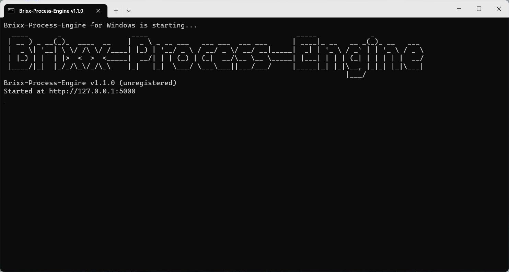
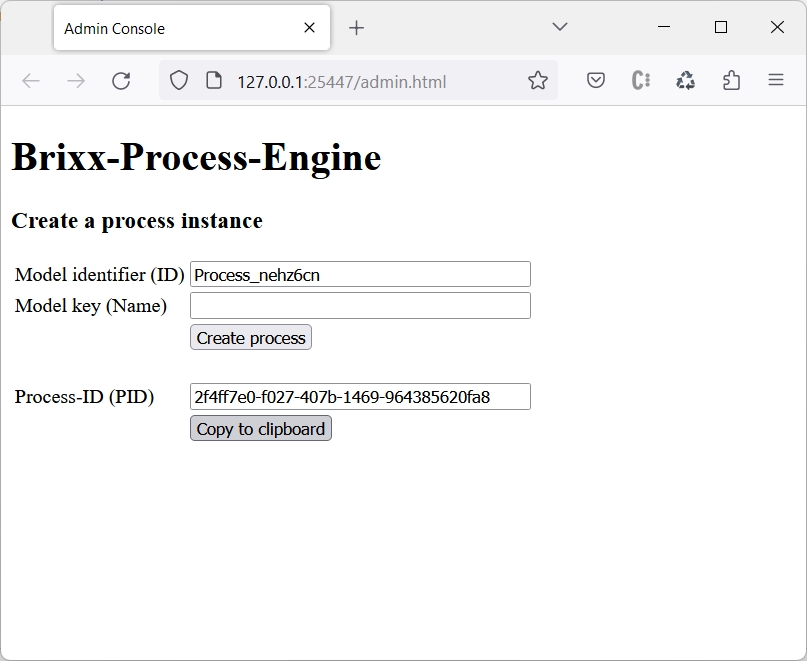

# Brixx-Process-Script

### Package: `@brixx/process-script`

### Version: `1.0.1` (Release, 08.07.2023)

#

> This document is in progress. For further information on the use of Brixx-Script please feel free to contact [`info@brixx.it`](info@brixx.it)

# Process Driven Development for everyone

## Create processes and workflows

Brixx-Process-Script is a free JavaScript library to create process applications for the [Brixx Process-Engine](https://brixx.it/brixx-process-engine.html) and fill in a gap to enterprise process orchestration systems such as [Camunda](#) or [X4 BPMS](#) as a lean workflow management system for automation and digitization of business processes and industrial processes. For processes in web applications, to control multiple web applications up to IoT control. With minimal development, integration and costs, Brixx Process Engine can serve as the basis for applications or be integrated into existing applications as an extension for sub-processes. With our **Brixx-Process-Script**, the programming can be reduced to a minimum. Fast integration into any HTML document is possible, especially with the integrated [Brixx-Script (smart web components)](https://brixx.it/brixx-script.html) as Brixx HTML elements or as Brixx script components in JavaScript applications and frameworks and also support JavaScript environments such as [Node.js®](https://nodejs.org/en/ "Opensource cross platform JavaScript runtime environment") (cross-platform JavaScript runtime environment).

## Model processes and workflows

With our workflow management system, all types of processes and workflows can be mapped with the [Brixx BPMN-Editor](https://brixx.it/brixx-bpmn-editor.html) for process modeling with Business Process Model and Notation ([BPMN](https://en.wikipedia.org/wiki/Business_Process_Model_and_Notation)) and made available in the Brixx Process Engine with one click.

-   [Erste Schritte](#getstarted)
    -   [Brixx Web-Baustein [brixx-login-process] erstellen (HTML based)](#brixx-login-process-html)
-   [Brixx-Process-Script Tutorial](#tutorial)
    -   [Brixx Web-Baustein [brixx-login-process] erste (JavaScript based)](#brixx-login-process-script)
    -   [Node.js Application [brixx-login-process] erstellen](#brixx-login-process-model)
-   [Brixx-Process-Script Referenz](#reference)
-   [Downloads](#downloads)

# 
 Erste Schritte

Wir verwenden Brixx-Script zur Erstellung von einem **Geschäftsprozess** (business process). Brixx-Script ist Bestandteil in Brixx-Process-Script und ermöglicht einen minimalen Programmieraufwand und schnelle Integration in ein HTML-Dokument (siehe [Brixx-Script Dokumentation](../brixx-script/README.md)). Dabei ist neben der JavaScript-Engine für Web-/Entwickler auch eine komplette Erstellung im HTML-Code für Web-/Designer möglich. Es können auch beide „Welten” kombiniert werden, was Brixx-Process-Script besonders interessant und leistungsfähig macht. Im ersten Schritt erstellen wir einen einfachen Brixx Web-Baustein (Brixx web component) mit einem Benutzer-Login Prozess (`brixx-login-process-html`) und anschließend als JavaScript Element (`brixx-login-process-javascript`) und Node.js Application (`brixx-login-process-node`).

## Vorbereitungen

### Brixx Prozess Engine

Für die Prozess-Erstellung und -Verarbeitung verwenden wir die [Brixx Prozess Engine](../brixx-process-engine/README.md) als Prozess und Workflow Engine und kann zum Beispiel für die Entwicklung unter Windows mit dem [Windows Installer](https://brixx.it/brixx-process-engine.html) und wenigen Mausklicks installiert und lokal bereitgestellt werden.

Installation abgeschlossen - Windows-Installer

Nach der Installation steht die Prozess Engine unter http://localhost:5000 für die Entwicklung zur Verfügung und kann mit http://localhost:5000/brixx/heartbeat überprüft werden.

Brixx Prozess Script im Windows Terminal (PowerShell)

### Brixx BPMN-Editor
Anschließend erstellen wir einen Benutzer-Login Prozess und verwenden das Prozessmodell aus der BPMN Datei [`brixx-login-process.bpmn`](../assets/downloads/brixx-login-process.bpmn) Wir öffnen die Datei im [Brixx BPMN-Editor](../brixx-bpmn-editor/README.md) und veröffentlichen für das Prozessmodell als Geschäftsprozess in der Brixx Prozess Engine.

Benutzer-Login Prozessmodell `brixx-login-process` im Brixx BPMN-Editor

### 
 Admin Console

Die Details im Benutzer-Login Prozess werden wir später betrachten. Wir erstellen vorher noch ein HTML-Dokument als `Helper` für die Brixx Prozess Engine zur Verwaltung der Geschäftsprozesse, und im ersten Schritt nur zur Erstellung einer Prozessinstanz. Dabei wird eine Prozessinstanz mit der Funktion `BrixxProcessDefinition.process.create` erstellt und die Process-ID (Process instance identifier) ausgegeben. Die Funktion wird später noch genauer beschrieben; dabei kann u. a. eine Mail mit der Prozess-URL und Projektinstanz als QR-Code an den Ersteller gesendet werden.

Komplettes HTML-Dokument in der HTML-Datei [`brixx-create-process.html`](../assets/downloads/brixx-create-process.html)

    <!DOCTYPE html>
    <html>
        <head>
            <title>Admin Console</title>
        </head>

        <!-- Load Brixx-Process-Script standalone for development -->
        

        <body>
            <h1>Brixx-Process-Engine</h1>
            <h3>Create a process instance</h3>
            <table>
                <tr>
                    <td>Model identifier (ID)</td>
                    <td>
                        <input type="text" id="mid" size="35" />
                    </td>
                </tr>
                <tr>
                    <td>Model key (Name)</td>
                    <td>
                        <input type="text" id="key" size="35"/>
                    </td>
                </tr>
                <tr>
                    <td></td>
                    <td>
                        <input type="button" id="btnCreateProcess" value="Create process" />
                    </td>
                </tr>
                <tr>
                    <td colspan="2">&nbsp;</td>
                </tr>
                <tr>
                    <td>Process-ID (PID)</td>
                    <td>
                        <input type="text" id="pid" size="35" />
                    </td>
                </tr>
                <tr>
                    <td></td>
                    <td>
                        <input type="button" id="btnCopyProcessID" value="Copy to clipboard" />
                    </td>
                </tr>
            </table>

            
        </body>
    </html>

Die _Admin Console_ verwendt Brixx-Process-Script standalone und kann dadurch während der Entwicklung, z. B. mit dem _Live Server_ in Visual Studio Code, direkt im Browser gestartet werden.

Die _Admin Console_ im Browser-Fenster

Mit dem _Model identifiers (ID)_ oder dem _Model key (Name)_ aus dem Brixx BPMN-Editor kann eine Prozessinstanz mit Klick auf die Schaltfläche `[Create Process]` in der Brixx Prozess Engine erstellt, und mit Klick auf die Schaltfläche `[Copy to clipboard]` die _Process-ID (PID)_ in die Zwischenablage kopiert werden.

## 
 Brixx Web-Baustein [brixx-login-process] erstellen (HTML based)

Wir erstellen einen einfachen Benutzer-Login Prozess mit einem privaten und öffentlichen Bereich. Dazu erstellen wir einen Ordner `./components` im Projektordner `[brixx-login-process-html]` wodurch die Projekt-Ordnerstruktur wie folgt aussieht.

    brixx-login-process-html/
    ├── components/
    │   └── brixx-login-process.js
    └── index.html

Darin erstellen wir den Brixx Web-Baustein `[brixx-login-process]` in der Brixx Script-Component Datei `brixx-login-process.js`
und suchen zuerst mit der Funktion `BrixxProcessDefinition.getSearchParam` nach dem URL-Parameter `pid` mit einer Process-ID. Ist der nicht in der URL enthalten wird nach der Process-ID mit einem Eingabedialog gefragt. Diese Funktion wird in der Regel für die Entwicklung verwendet.

    // Get search param
    const pid = BrixxProcessDefinition.getSearchParam("pid");

Eingabedialog für eine Process-ID im Browser-Fenster.

Das kann eine Process-ID oder ein Identifier von einem Process-Element sein, beispielsweise eine Task-ID. Hier können wir die Process-ID einfügen, die wir mit der _Admin Console_ aus den Vorbereitungen erstellen und in die Zwischenablage kopieren können.

Anschließend erstellen wir ein Standard `Brixx.element` mit dem Benutzer-Login Prozess.

    // Create a Brixx default element
    Brixx.element = (
        <ProcessDefinition mid="Process_nehz6cn" pid={pid}>
            <Task mid="Task_0r94slz" action={(data) => addLoginElement(data)}>
                <Gateway
                    mid="Gateway_0r8twz8"
                    action={(data) =>
                        BrixxProcessDefinition.process.done({ gid: data.gid })
                    }
                >
                    <Task
                        mid="Task_1m8u5ed"
                        action={(data) =>
                            addMessageElement(
                                data,
                                "You have entered the user area."
                            )
                        }
                    />
                    <Task
                        mid="Task_0zs24yh"
                        action={(data) =>
                            addMessageElement(
                                data,
                                "You have entered the public area."
                            )
                        }
                    />
                </Gateway>
            </Task>
        </ProcessDefinition>
    );

Mit Brixx-Process-Script werden HTML-Elemente zur Erstellung von einem Geschäftsprozess oder Workflow im HTML-Dokument zur Verfügung gestellt. Wir erstellen den Benutzer-Login Prozess mit dem HTML-Element `<ProcessDefinition>` und dem HTML-Attribut (Eigenschaft) `mid` für die Model-ID in der Brixx Prozess Engine. Mit der Eigenschaft `pid` wird die Process-ID als persönlicher identifier angegeben.

    ...
    <ProcessDefinition mid="Process_nehz6cn" pid={pid}>
        ...
    </ProcessDefinition>
    ...

Danach erstellen wir einen Task Process mit dem HTML-Element `<Task>` und der Eigenschaft `mid` für die Task-ID aus dem übergeordneten Prozessmodell. Mit der Eigenschaft `action` geben wir an welche Aktion ausgeführt werden soll nachdem der Task Process im Prozessablauf aktiviert wurde. Im Beispiel wird die Funktion `addLoginElement` als Callback Funktion aufgerufen und die aktuellen Prozesseigenschaften im Parameter `data` übergeben.

    ...
    <Task mid="Task_0r94slz" action={(data) => addLoginElement(data)}>
        ...
    </Task>
    ...

Im Task-Element erstellen wir einen untergeordneten Gateway Prozess mit dem HTML-Element `<Gateway>` und der Eigenschaft `mid` für die Gateway-ID. Der Gateway Prozess verwendet eine integrierte Brixx Entscheidungstabelle, und wie beim Task Process wird mit `action` angegeben welche Aktion ausgeführt werden soll, sobald der Gateway Process die Entscheidungstabelle verarbeitet hat. Im Beispiel wird der Gateway Process mit der Funktion `BrixxProcessDefinition.process.done` beendet, und mit der Objekt Eigenschaft `git` die Gateway-ID übergeben. Anschließend werden alle nachfolgenden Prozess-Elemente im Prozessablauf aktiviert.

    ...
    <Gateway
        mid="Gateway_0r8twz8"
        action={(data) =>
            BrixxProcessDefinition.process.done({ gid: data.gid })
        }
    >
        ...
    </Gateway>
    ...

Danach erstellen wir im Gateway-Element untergeordnete Task-Elemente und mit der Eigenschaft `action` wird die Funktion `addMessageElement` aufgerufen, mit dem Parameter `data` die aktuellen Prozesseigenschaften, und einem weiteren Parameter `message` eine _Nachricht_ übergeben.

    ...
    <Task
        mid="Task_1m8u5ed"
        action={(data) =>
            addMessageElement(
                data,
                "You have entered the user area."
            )
        }
    />
    <Task
        mid="Task_0zs24yh"
        action={(data) =>
            addMessageElement(
                data,
                "You have entered the public area."
            )
        }
    />
    ...

Abschließend wird das `Brixx.element` als HTML-Elemet `<brixx-login-process>` registriert.

    // Register a Brixx HTML-Element <brixx-login-process>
    Brixx.registerElement({ name: "login-process" });

Die Funktionen `addMessageElement` und `addLoginElement` werden als Brixx „Standard“-Element erstellt und erst beim Aufruf angezeigt (gerendert), wobei die Funktion `addMessageElement` keine besondere Aufgabe hat und im Beispiel nur als Platzhalter für die Action Callback Function dient.

    // Message task action callback function
    const addMessageElement = (data, message = `${data.mid} is running.`) => {
        const { tid } = data;
        const element = (
            

                <h2>{message}</h2>
                

                <input type="button" id={"btn_" + tid} value={"Next"} />
            

        );
        new Brixx().render({ element });
        document.getElementById("btn_" + tid).addEventListener("click", () => {
            // Set process done
            BrixxProcessDefinition.process.done({ tid });
        });
    };

Dabei wird die _Nachricht_ aus dem Parameter `message` angezeigt, und die Schaltfläche `[Next]` erzeugt. Mit Klick auf die Schaltfläche wird der Task Prozess mit der Funktion `BrixxProcessDefinition.process.done` und der Objekt Eigenschaft `tid` beendet. Für die Schaltfläche wird eine eindeutige Button-ID `{"btn_" + tid}` generiert, mit der Task-ID aus dem Parameter `data` mit den aktuellen Prozesseigenschaften.

Mit der Funktion `addLoginElement` werden die Benutzerdaten zur Authentifizierung abgefragt Mit Klick auf die Schaltfläche `[Login]` wird der Task Prozess mit der Funktion `BrixxProcessDefinition.process.task.next` und der Objekt Eigenschaft `tid` beendet, und der nachfolgenden Gateway Prozess aktiviert. Dabei werden die Benutzerdaten mit dem Parameter `store` an den Gateway Prozess weitergegeben, und mit der integrierten Entscheidungstabelle verarbeitet.

    // Login task action callback function
    const addLoginElement = (data) => {
        const { tid } = data;
        const element = (
            

                <h2>Authentication</h2>
                

                    User: <input type="text" id={"user"} />
                

                

                    Password: <input type="text" id={"password"} />
                

                <input type="button" id={"btn_login"} value={"Login"} />
            

        );
        new Brixx().render({ element });
        document.getElementById("btn_login").addEventListener("click", () => {
            // Set next process task active with store data
            const store = {
                user: document.getElementById("user").value,
                password: document.getElementById("password").value,
            };
            BrixxProcessDefinition.process.task.next({ tid, store });
        });
    };

Kompletter Brixx Web-Baustein in der Brixx Script-Component Datei `./components/brixx-login-process.js`

    // Get search param
    const pid = BrixxProcessDefinition.getSearchParam("pid");

    // Message task action callback function
    const addMessageElement = (data, message = `${data.mid} is running.`) => {
        const { tid } = data;
        const element = (
            

                <h2>{message}</h2>
                

                <input type="button" id={"btn_" + tid} value={"Next"} />
            

        );
        new Brixx().render({ element });
        document.getElementById("btn_" + tid).addEventListener("click", () => {
            // Set process done
            BrixxProcessDefinition.process.done({ tid });
        });
    };

    // Login task action callback function
    const addLoginElement = (data) => {
        const { tid } = data;
        const element = (
            

                <h2>Authentication</h2>
                

                    User: <input type="text" id={"user"} />
                

                

                    Password: <input type="text" id={"password"} />
                

                <input type="button" id={"btn_login"} value={"Login"} />
            

        );
        new Brixx().render({ element });
        document.getElementById("btn_login").addEventListener("click", () => {
            // Set next process task active with store data
            const store = {
                user: document.getElementById("user").value,
                password: document.getElementById("password").value,
            };
            BrixxProcessDefinition.process.task.next({ tid, store });
        });
    };

    // Create a Brixx default element
    Brixx.element = (
        <ProcessDefinition mid="Process_nehz6cn" pid={pid}>
            <Task mid="Task_0r94slz" action={(data) => addLoginElement(data)}>
                <Gateway
                    mid="Gateway_0r8twz8"
                    action={(data) =>
                        BrixxProcessDefinition.process.done({ gid: data.gid })
                    }
                >
                    <Task
                        mid="Task_1m8u5ed"
                        action={(data) =>
                            addMessageElement(
                                data,
                                "You have entered the user area."
                            )
                        }
                    />
                    <Task
                        mid="Task_0zs24yh"
                        action={(data) =>
                            addMessageElement(
                                data,
                                "You have entered the public area."
                            )
                        }
                    />
                </Gateway>
            </Task>
        </ProcessDefinition>
    );

    // Register a Brixx HTML-Element <brixx-login-process>
    Brixx.registerElement({ name: "login-process" });

### Brixx Web-Baustein verwenden

Zur Integration in ein HTML-Dokument verwenden wir für das Beispiel **Brixx-Process-Script Standalone** vom Brixx CDN-(Content Delivery Network)-Server um eine direkte Integration vom Benutzer-Login Prozess mit dem Brixx Web-Baustein zu ermöglichen.

    <!-- Load Brixx-Process-Script standalone for development-->
    

Brixx-Procss-Script kann von CDN-Systemen wie [jsDelivr - A free global CDN](https://www.jsdelivr.com/) verwendet werden. Hier muss beachtet werden, dass es sich z. B. bei _jsDelivr_ um ein automatisiertes System handelt, und dort nicht die Brixx-Script Standalone, sondern das Brixx-Script NPM-Package bereitgestellt wird. Das erfordert gegenüber der Dokumentation von _jsDelivr_ einen zusätzlichen Babel import.

    <!-- Load Babel -->
    
    <!-- Load Brixx-Procss-Script from jsDelivr CDN -->
    

> **Info:** Der import von _jsDelivr_ darf mit Ausnahme verwendet werden, auch wenn die Lizenzbestimmungen nicht eingehalten werden.

Der Brixx Web-Baustein `[brixx-login-process]` in der Brixx Script-Component Datei `./components/brixx-login-process.js"` wird mit einen HTML-`

Für Brixx-Process-Script Standalone verwenden wir Babel mit `type="text/babel"` um die Brixx Webkomponente in den unterschiedlichen Browsern nutzen zu können. Dann werden die Eigenschaften `data-type="module"` und `data-presets="brixx"` festgelegt, und der Brixx Web-Baustein kann als HTML-Element `<brixx-check-age>` verwendet werden. Die Eigenschaft _data-type_ ist optional und wird zum Import von ECMAScript 2015+ (ES6) Modulen benötigt. Zur Verwendung als HTML-Element werden keine weiteren Programmierkentnisse benötigt.

Jetzt müssen wir nur noch das HTML-Element `<brixx-login-process>` im `<body>`-Bereich einfügen.

    <body>
        <!-- Add the Brixx HTML element -->
        <brixx-login-process></brixx-login-process>
    </body>

Komplettes HTML-Dokument in der HTML-Datei `index.html`

    <!DOCTYPE html>
    <html>
        <head>
            <!-- Load Brixx-Process-Script standalone for development-->
            

            <!-- Include the Brixx script component files for development -->
            
        </head>

        <body>
            <!-- Add the Brixx HTML element -->
            <brixx-login-process></brixx-login-process>
        </body>
    </html>

Komplettes Beispiel [[brixx-login-process-html] (ZIP-Archiv)](../assets/downloads/brixx-login-process-html.zip) herunterladen.

### Brixx Web-Baustein testen

Zum testen öffnen wir den Projektordner `[brixx-login-process-html]` in Visual Studio Code und starten die HTML-Datei `index.html` mit dem _Live Server_. Dazu gibt es verschiedene Möglichkeiten.

1. Klick auf `[Go Live]` in der Visual Studio Code Status Bar (`Click to run live server`)
2. Öffnen der HTML-Datei im Editor-Fenster mit der Tastenkombination `[ALT+L Alt+O]`
3. Rechtsklick auf die HTML-Datei im **Editor-Fenster** und Auswahl von `[Open with Live Server]`
4. Rechtsklick auf die HTML-Datei in der **Explorer-Ansicht** und Auswahl von `[Open with Live Server]`

    

    Visual Studio Code - Explorer-Ansicht `[Open with Live Server]`

    Die HTML-Datei `index.html` wird mit dem _Live Server_ bereitgestellt und im Standard-Browser geöffnet.

    > **Tip:** Der Browser kann bei den _Live Server_ Einstellungen unter `[Custom Browser]` festgelegt werden (`default=null`).

Eingabedialog für eine Process-ID im Browser-Fenster.

Wird kein URL-Parameter `pid` in der Prozess-URL gefunden, z. B. `index.html?pid=f1d49482-a46e-7a1f-aee3-e5ece9aaa093`, wid man mit einem Eingabedialog aufgefortert eine Prozess-ID einzugeben (siehe [Admin Console](#admin-console))

Der Brixx Web-Baustein `<brixx-login-process>` im Browser-Fenster

# 
 Brixx-Process-Script Tutorial

## 
 Brixx Web-Baustein [brixx-login-process] erstellen (JavaScript based)

## 
 Node.js Application [brixx-login-process] erstellen

# 
 Brixx-Process-Script Referenz

## Brixx-Process-Script Standalone

Für die Entwicklung steht eine Brixx-Process-Script Standalone Version zur Verfügung. Dadurch kann Brixx-Process-Script direkt ohne precompiling verwendet werden. Die Brixx-Process-Script Standalone Datei [`brixx-process.min.js`](https://brixx.it/@brixx/standalone/brixx-process.min.js) kann dazu einfach mit einem HTML-`

Brixx-Script ist Bestandteil in Brixx-Process-Script und ermöglicht einen minimalen Programmieraufwand und schnelle Integration in ein HTML-Dokument (siehe [Brixx-Script Dokumentation](../brixx-script/README.md)) und ein Brixx Web-Baustein kann danach mit einem HTML-`

Brixx-Process-Script Standalone verwendet Babel, um ECMAScript 2015+ Code in eine abwärtskompatible Version von JavaScript in aktuellen und älteren Browsern oder Umgebungen zu konvertieren.

Die Eigenschaft `type` gibt den Medientyp des Skripts an. Für Brixx-Process-Script verwenden wir Babel mit `type="text/babel"` und hat den Vorteil dass man mit aktuellem Standard entwickeln kann, und sich nicht um Abwärtskompatibilität kümmern muss, da Benutzer unterschiedliche Browser und Versionen verwenden.

Die Eigenschaft `src` gibt die URL einer extern verwendeten Brixx Script-Component Datei an, im Beispiel mit `src="./components/brixx-animal-list.js"`

Die Eigenschaft `data-type` ist optional, wird benötigt wenn ECMAScript 2015+ (ES6) Modulen verwendet werden und für Babel mit `data-type="module"` angegeben.

Die Eigenschaft `data-preset` wird angegeben dass Brixx-Script verwendet wird und für Babel mit `data-preset="brixx"` angegeben.

Es wird empfohlen Brixx-Process-Script Standalone nicht in einer Produktionsumgebung zu verwenden. Beim Start wird in der Browserkonsole folgende Information ausgegeben.

> `You are using the in-browser Brixx transformer. Be sure to precompile scripts for production - https://brixx.it/brixx-script`

## Brixx-Process-Script Package

### Brixx-Process-Script Package installieren

    `npm i @brixx/process-script`

### Brixx-Process-Script Package importieren

Das Modul `BrixxProcessDefinition` vom Package `@brixx/process-script` für eine Web-Anwendung importieren.

    import { BrixxProcessDefinition } from '@brixx/process-script'

Das Modul `BrixxProcessDefinition` für eine Nodejs-Anwendung importieren.

    const BrixxProcessDefinition = require("@brixx/process-script/node").default;

## Brixx-Process-Script Library

Das Modul `BrixxProcessDefinition` von der Brixx-Process-Script Library importieren. Dafür kann man die Brixx-Process-Script Library (minified) [brixx-process.js](https://brixx.it/@brixx/script/brixx-process.js) vom Brixx CDN-(Content Delivery Network)-Server in den Projektordner kopieren und anschließend für eine Web-Anwendung importieren.

    import { BrixxProcessDefinition } from './brixx-process'

Das Modul `BrixxProcessDefinition` für eine Nodejs-Anwendung importieren.

    const BrixxProcessDefinition = require("./brixx-process/node").default;

> **Tip:** Die Brixx-Process-Script Library vom Brixx CDN-(Content Delivery Network)-Server ist immer die _Latest_ Version und kann die Version in der npm-Registry überholen. Hier hat man die Möglichkeit vorab die neueste Versionen zu testen.

# 
 Downloads

-   ### [Helper [brixx-create-process.html] (HTML Datei)](../assets/downloads/brixx-create-process.html)

-   ### [Beispiel [brixx-login-process.bpmn] (BPMN Datei)](../assets/downloads/brixx-login-process.bpmn)

## Copyright and License

#

Copyright © BRIXX.it 2022-present
