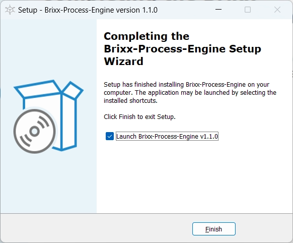

# Brixx-Process-Script

### Package: `@brixx/process-script`

### Version: `1.0.1` (Release, 08.07.2023)

#
> This document is in progress. For further information on the use of Brixx-Script please feel free to contact [`info@brixx.it`](info@brixx.it)

# Process Driven Development for everyone

## Create processes and workflows

Brixx-Process-Script is a free JavaScript library to create process applications for the [Brixx Process-Engine](https://brixx.it/brixx-process-engine.html) and fill in a gap to enterprise process orchestration systems such as [Camunda](#) or [X4 BPMS](#) as a lean workflow management system for automation and digitization of business processes and industrial processes. For processes in web applications, to control multiple web applications up to IoT control. With minimal development, integration and costs, Brixx Process Engine can serve as the basis for applications or be integrated into existing applications as an extension for sub-processes. With our **Brixx-Process-Script**, the programming can be reduced to a minimum. Fast integration into any HTML document is possible, especially with the integrated [Brixx-Script (smart web components)](https://brixx.it/brixx-script.html) as Brixx HTML elements or as Brixx script components in JavaScript applications and frameworks and also support JavaScript environments such as [Node.js®](https://nodejs.org/en/ 'Opensource cross platform JavaScript runtime environment') (cross-platform JavaScript runtime environment).

## Model processes and workflows

With our workflow management system, all types of processes and workflows can be mapped with the [Brixx BPMN-Editor](https://brixx.it/brixx-bpmn-editor.html) for process modeling with Business Process Model and Notation ([BPMN](https://en.wikipedia.org/wiki/Business_Process_Model_and_Notation)) and made available in the Brixx Process Engine with one click.

-   [Erste Schritte](#getstarted)
    -   [Brixx Web-Baustein [brixx-login-process] erstellen](#brixx-login-process)
-   [Brixx-Process-Script Tutorial](#tutorial)
-   [Brixx-Process-Script Referenz](#reference)
-   [Downloads](#downloads)

# 
 Erste Schritte

Wir verwenden Brixx-Script zum Erstellen von einem einfachen Gesch&auml;ftsprozess (Workflow). Brixx-Script ist Bestandteil in Brixx-Process-Script und ermöglicht einen minimalen Programmieraufwand und schnelle Integration in ein HTML-Dokument (siehe [Brixx-Script Dokumentation](../brixx-script/README.md)). Dabei ist neben der JavaScript-Engine für Web-/Entwickler auch eine komplette Erstellung im HTML-Code für Web-/Designer möglich. Es können auch beide „Welten” kombiniert werden, was Brixx-Process-Script besonders interessannt und leistungsfähig macht. Im ersten Schritt erstellen wir einen einfachen Brixx Web-Baustein (Brixx web component) mit Benutzer-Login (`brixx-login-process-html`) und anschließend das Beispiel auch als Node.js Application (`brixx-login-process-node`).

## Vorbereitung

Wir ben&ouml;tigen eine laufende [Brixx Prozess Engine](../brixx-process-engine/README.md) und kann zum Beispiel f&uuml;r die Entwicklung unter Windows mit dem [Windows Installer](https://brixx.it/brixx-process-engine.html) lokal installiert werden.

Brixx Prozess Script - Windows-Installer

Die Brixx Prozess Engine steht anschlie&szlig;end lokal unter http://localhost:5000 f&uuml;r die Entwicklung zur Verf&uuml;gung.

Brixx Prozess Script im Power-Shell Fenster

F&uuml;r den Benutzer-Login Gesch&auml;ftsprozess verwenden wir die BPMN Model Datei [brixx-login-process.bpmn](../assets/downloads/brixx-login-process.bpmn), die wir bequem mit dem [Brixx BPMN-Editor](../brixx-bpmn-editor/README.md) &ouml;ffnen und den Gesch&auml;ftsprozess direkt ver&ouml;ffentlichen k&ouml;nnen.

Benutzer-Login Model `brixx-login-process` im Brixx BPMN-Editor

## 
 Brixx Web-Baustein [brixx-login-process] erstellen

Wir erstellen einen Gesch&auml;ftsprozess für ein Benutzer-Login. Dazu erstellen wir einen Ordner `./components` im Projektordner `[brixx-login-process-html]` wodurch die Projekt-Ordnerstruktur wie folgt aussieht.

    brixx-login-process-html/
    ├── components/
    │   └── brixx-login-process.js
    └── index.html

# 
 Brixx-Process-Script Tutorial

# 
 Brixx-Process-Script Referenz

# 
 Downloads

-   ### [Beispiel [brixx-login-process.bpmn] (BPMN-Model)](../assets/downloads/brixx-login-process.bpmn)

## Copyright and License

#

Copyright © BRIXX.it 2022-present