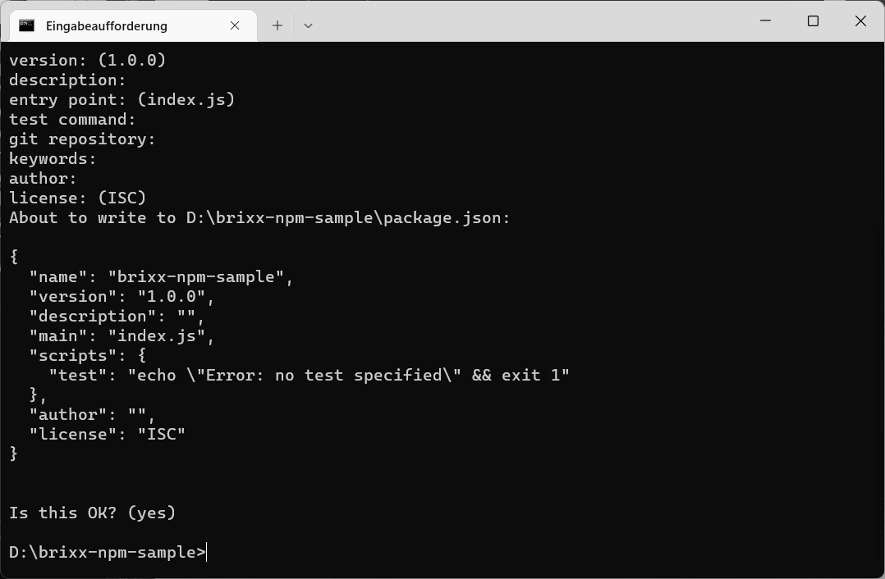
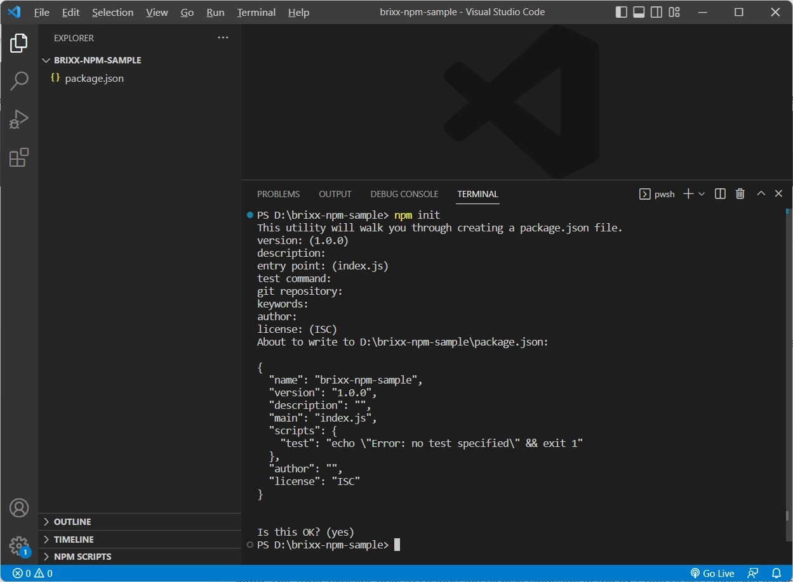
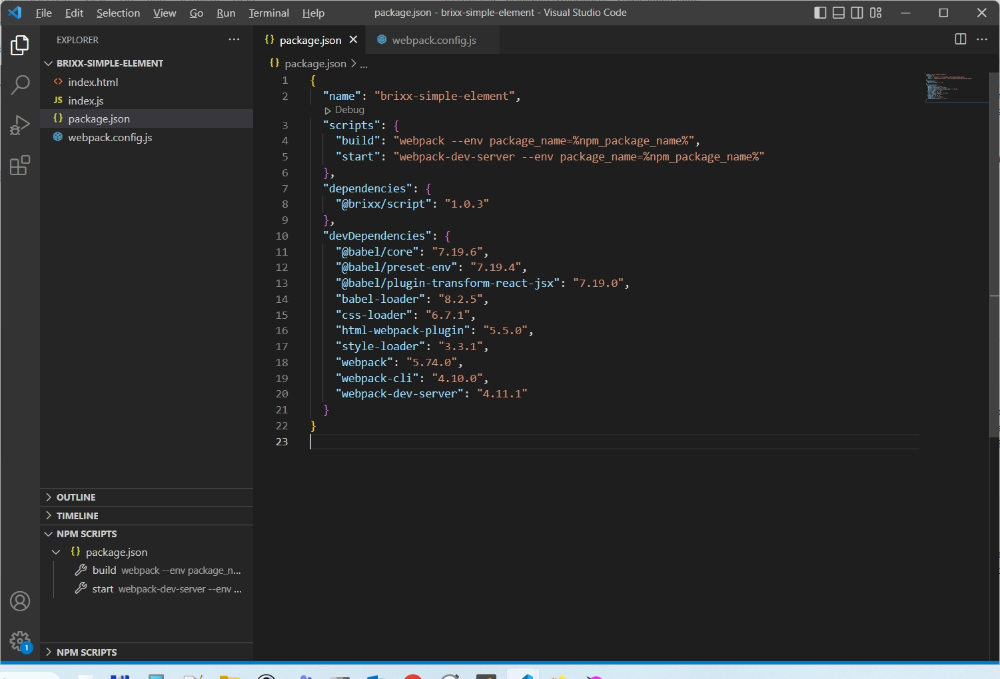
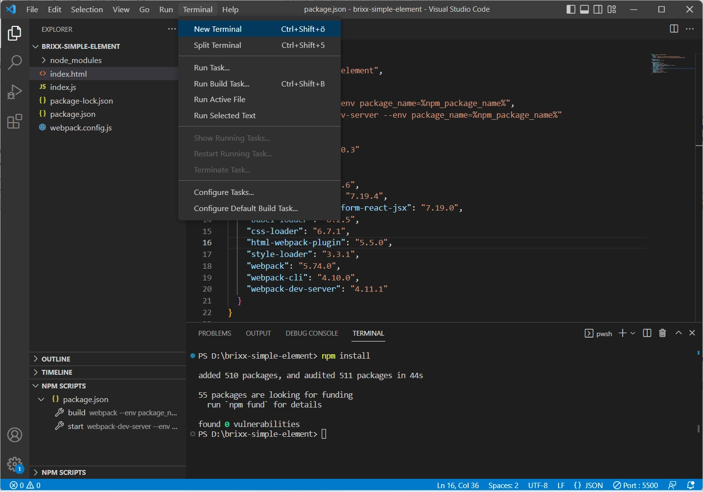

# Brixx-Script.

  > This document is being processed and is currently only available in German. However, we have decided to make Brixx-Script version 1.0.3 available for use. For further information on the use of Brixx-Script please feel free to contact [`info@brixx.it`](info@brixx.it)

Brixx-Script ist eine freie JavaScript-Library Zur Erstellung von unabhängigen Webkomponenten (Web-Bausteinen). Mit Brixx-Script können **„Smarte“-Web-Bausteine** (Brixx) für Webseiten und Webanwendungen erstellt werden. Dadurch kann Programmieraufwand und Projektkomplexität für eine **Low-Code-Entwicklung** auf ein Minimum reduziert werden. **Brixx Web-Bausteine** können als *Brixx HTML-Element* in jedem HTML-Dokument und als *Brixx Script-Baustein* in JavaScript-Projekten und Frameworks verwendet werden, und werden mit JavaScript und [JSX (JavaScript XML)](https://en.wikipedia.org/wiki/JSX_(JavaScript)) erstellt. JSX wurde 2014 mit [React](https://en.wikipedia.org/wiki/React_(JavaScript_library)) eingeführt und gleicht im Syntax [E4X (EcmaScript for XML)](https://en.wikipedia.org/wiki/ECMAScript_for_XML) zur Integration von XML in JavaSript. Brixx-Script hat in 1998 als LaSSiE seinen Ursprung als plattformunabhängige Web-Entwicklung und wurde in 2005 mit E4X erweitert. Nachdem E4X von der Mozilla Foundation in 2014 als deprecated gekennzeichnet ist, wurde E4X in LaSSiE durch JSX ersetzt und beispielsweise in **Brixx-Decision-Script** und **Brixx-Process-Script** als Baustein-System verwendet. Aufgrund der großen Popularität und Verbreitung von JSX wurde LaSSiE in 2022 als freie JavaScript-Library **BrixxScript** Zur Erstellung von **Brixx Webkomponenten** (Web-Bausteine) umbenannt und veröffentlicht.

## Package `@brixx/script`

### Version: `1.0.0`

# Was wird alles benötigt?

## Quellcode Editor
Für die Entwicklung kann ein Texteditor, wie der in der Linux Community beliebte [Vim](https://www.vim.org/), oder ein Quellcode Editor wie [Notpad++](https://notepad-plus-plus.org/downloads/) oder [Sublime Text](https://www.sublimetext.com/) verwendet werden. Ein kostenfreie Alternative zu einer professionellen integrierten Entwicklungsumgebung (IDE) ist [Visual Studio Code](https://code.visualstudio.com/) (VS Code) als leichtgewichtiger Quellcode Editor mit vielen IDE Erweiterungen. Visual Studio Code ist dadurch mehr als nur ein Quellcode Bearbeitungstool und derzeit der wohl beliebteste Quellcode Editor.

### [Install Visual Studio Code for Windows](../VSCode.md)

## Node.js und npm
Um eigenständige Brixx **Webkomponenten** zu erstellen verwenden wir [Node.js®](https://nodejs.org/en/ 'Opensource cross platform JavaScript runtime environment') (cross-platform JavaScript runtime environment) und [npm](https://www.npmjs.com/ 'Node package manager') (Node Package Manager). 

### Node.js
Node.js wird als Entwicklungswerkzeug für den **Build** (Erstellung) eigenständiger Brixx Webkomponenten verwendet, **nicht zur Laufzeit** benötigt, und erfordert keine besonderen Node.js Kenntnisse. Durch die Verwendung von Node.js haben wir die Möglichkeit alle **State-of-the-art** Entwicklungswerkzeuge wie Webpack und Babel zu verwenden.

### Npm
Npm ist fester Bestandteil bei der Installation von Node.js und ist im Ursprung ein **Node Package Manager** zur Verwaltung der benötigten JavaScript Packages, sowohl für den Build von Brixx Webkomponenten als auch für die Entwicklungswerkzeuge. Npm wird wie Node.js zur Entwicklung benötigt.

### [Install Node.js and npm for Windows](../Nodejs.md)

## Webpack
Mit dem Modul-Bundler [Webpack](https://webpack.js.org/ 'Opensource JavaScript modul packer') für moderne JavaScript-Anwendungen können sogenannte **Bundles** erstellt werden in denen alle Assets bereitgestellt werden. Dadurch ist eine einfache Intergration und Verteilung von Brixx Webkomponenten möglich. Zur Erstellung einer Brixx Webkomponente mit Webpack stehen Beispiele und Templates zur Verfügung, erfordert keine besonderen Vorkenntnisse, und hat eine niedrige Einstigshürde.

## Babel
Der JavaScript Compiler [Babel](https://babeljs.io/ 'Opensource JavaScript transcompiler') wird verwendet ECMAScript 2015+ Code in eine abwärtskompatible Version für nicht kompatible und ältere Browser zu konvertieren und wird zusammen mit Webpack verwendet. Dadurch können Brixx Webkomponenten in allen Browsern und JavaScript-Umgebungen verwendet werden. Für die Verwendung von Babel mit Webpack stehen Beispiele und Templates zur Verfügung, erfordert keine besonderen Vorkenntnisse, und hat eine niedrige Einstigshürde.

## Erste Schritte

Wir verwenden moderne, State-of-the-art Tools und Technologien, um eie einfache Integration in HTML-Dokumentens und Web-Projekten zu ermöglichen. Hierzu zählen neben [Node.js](https://nodejs.org/en/ 'Opensource cross platform JavaScript runtime environment') und [npm](https://www.npmjs.com/ 'Node package manager') auch [Webpack](https://webpack.js.org/ 'Opensource JavaScript modul packer') und [Babel](https://babeljs.io/ 'Opensource JavaScript transcompiler'), um Brixx Webkomponenten zu erstellen. Zusätzlich steht für die Entwicklung auch eine Standalone Version zur Verfügung.

## Brixx Web-Baustein [brixx-animal-list] erstellen

 Brixx Web-Bausteine (Webkomponenten) werden in der Regel im Ordner **`[components]`** erstellt und erwartet. Dazu erstellen wir den Ordner **`.\components`** im Projektordner **`[brixx-element-sample]`** wodurch die Prokekt-Ordnerstruktur im Beispiel wie folgt aussieht.

```
[brixx-element-sample]
 │
 ├── [components]
 │    │
 │    └── brixx-animal-list.js
 │
 └── index.html
```

Darin erstellen wir unsere erste Brixx Webkomponente **`[brixx-animal-list]`** in der JavaScript-Datei **`brixx-animal-list.js`**. Zuerst wird eine Liste ([JavaScript Array](https://www.w3schools.com/js/js_arrays.asp)) **`anials`** erstellt und symbolisiert im Beispiel spätere Eingabequellen z. B. aus einem HTML-Formular, Webservice oder einer Datenbank.

    // Set an animal list
    const animals = ["Dog", "Cat", "Mouse"];

Anschließend wird ein Brixx Standard Element **`Brixx.element`** mit einer untergeordneten HTML-Liste und JSX erstellt.

    // Create a Brixx default element
    Brixx.element = 
    <div>
      <h2>Animals</h2>
      <ul>
        ...
      </ul>
    </div>

  > **Tip:** Die Formatierung ist wie bei HTML frei. Wir empfehlen zur besseren Projektstruktur und JavaScript Integration JSX-Code in *Parentheses* **`()`** zu verwenden.

    ...
    Brixx.element = (
      <div>
        <h2>Animals</h2>
        <ul>
          ...
        </ul>
      </div>
    );

Die einzelnen Einträge **`anial`** der Liste **`anials`** werden dann als HTML-Listenelement **`<h3>{animal}</h3>`** mit Unterstützung der JavaScript Methode [Array map()](https://www.w3schools.com/jsref/jsref_map.asp) nacheinander ausgegeben. JavaScript Erweiterungen können, wie im Beispiel zu sehen ist, sehr einfach mit *Curly Brackets* **`{}`** mit Brixx-Script integriert werden.

    ...
    { 
      animals.map((animal) => (
          <li>
            <h3>{animal}</h3>
          </li>
        )
      ) 
    }
    ...

Abschließend wird das erstellte Brixx Element als HTML-Elemet **`<brixx-animal-list>`** für das HTML-Dokument im Browser registriert.

    // Register the Brixx HTML-Element <brixx-animal-list>
    Brixx.registerElement({ name: "brixx-animal-list" });

Kompletter Brixx Web-Baustein in der JavaScript-Datei **`./components/brixx-animal-list.js`**

    // Set an animal list
    const animals = ["Dog", "Cat", "Mouse"];

    // Create a Brixx default element
    Brixx.element = (
      <div>
        <h2>Animals</h2>
        <ul>
          {animals.map((animal) => (
            <li>
              <h3>{animal}</h3>
            </li>
          ))}
        </ul>
      </div>
    );

    // Register the Brixx HTML-Element <brixx-animal-list>
    Brixx.registerElement({ name: "brixx-animal-list" });

## Brixx Web-Baustein [brixx-animal-list] verwenden
Die integration in ein HTML-Dokument oder eine Webanwendung ist unkompliziert. Der einfachste Weg ist die Brixx-Script **Standalone** Version zu verwenden. Diese beinhaltet alle nötigen Bestandteile, ist aber im Wesentlichen für die Entwicklung vorgesehen. Bei Verwendung der Standalone Version wird in der Console die Information *You are using the in-browser Brixx-Script transformer. It is recommended to build Brixx components for production* ausgegeben.
    <!-- Load Brixx-Script standalone -->
    <script src="https://brixx.it/@brixx/standalone/brixx.min.js"></script>

Die Brixx Webkomponente wird mit einem HTML-Element **`<script>`** im HTML-Dokument eingefügt.

    <!-- Include the Brixx Component script files -->
    <script type="text/babel" src="./components/brixx-animal-list.js"
        data-type="module" data-presets="brixx"></script>

Brixx-Script Standalone verwendet Babel mit **`type="text/babel"`** um die Brixx Webkomponente in den unterschiedlichen Browsern verwenden zu können. Dann müssen nur noch die Attribute **`data-type="module"`** und **`data-presets="brixx"`** festgelegt werden und die Brixx Webkomponente kann als HTML-Element **`<brixx-animal-list>`** verwendet werden. Zur Integration im HTML-Dokument werden keine weiteren Programmierkentnisse benötigt.

Komplettes HTML-Dokument in der HTML-Datei **`index.html`**
  <!DOCTYPE html>
    <html>
      <head>
        <!-- Load Brixx-Script standalone -->
        <script src="https://brixx.it/@brixx/standalone/brixx.min.js"></script>
        <!-- Include the Brixx Component script files -->
        <script type="text/babel" src="./components/brixx-animal-list.js"
          data-type="module" data-presets="brixx"></script>
      </head>

      <body>
        <!-- Add the Brixx HTML-Element -->
        <brixx-animal-list></brixx-animal-list/>
      </body>
    </html>

Komplettes Beispiel als ZIP-Archiv herunterladen [[brixx-element-sample.zip]](../downloads/brixx-element-sample.zip)

## Brixx Web-Baustein testen

Um den Brixx Web-Baustein zu testen öffnen wir den Projektordner **`[brixx-element-sample]`** in Visual Studio Code und verwenden die *Live Server* Erweiterung.

Zum starten der HTML-Datei **`index.html`** mit dem *Live Server* gibt es verschiedene Möglichkeiten:

1. Klick auf **`[Go Live]`** in der *Status Bar* (Start/Stop Server)
2. Bei Bearbeitung der HTML-Datei mit der Tastenkombination **`[ALT+L Alt+O]`**
3. Klick mit rechter Maustaste (Kontextmenü) auf die HTML-Datei in der Explorer-Ansicht und Auswahl vom Menüeintrag **`[Open with Live Server]`**

   

   Visual-Studio-Code - Projektordner **`[brixx-element-sample]`**

   

   HTML-Datei **`index.html`** mit der Live Server Erweiterung (http://127.0.0.1:5500/index.html)

## Tutorial

### Was ist die package.json?

Die **`package.json`** ist die zentrale **NPM-Konfigurationsdatei** von einem **Node.js** Projekt, die sich im Stammverzeichnis (`root`) eines JavaScript-Projekts befindet. In diesem Tutorial erfahren wir, wie man eine *package.json* Datei mit *Metadaten* erstellt, z. B. Name, Version, Beschreibung, Schlüsselwörter und Abhängigkeiten.

Beispiel für eine *package.json* Datei

    {
      "name": "brixx-simple-element",
      "version": "1.0.0",
      "description": "Brixx simple element sample",
      "main": "index.js",
      "scripts": {
        "build": "webpack --env package_name=%npm_package_name%",
        "start": "webpack-dev-server --env package_name=%npm_package_name%"
      },
      "keywords": [
        "brixx",
        "element"
      ],
      "author": "Frank Biet",
      "license": "MIT",
      "dependencies": {
        "@brixx/script": "1.0.3"
      },
      "devDependencies": {
        "@babel/core": "7.19.6",
        "@babel/preset-env": "7.19.4",
        "@babel/plugin-transform-react-jsx": "7.19.0",
        "babel-loader": "8.2.5",
        "css-loader": "6.7.1",
        "html-webpack-plugin": "5.5.0",
        "style-loader": "3.3.1",
        "webpack": "5.74.0",
        "webpack-cli": "4.10.0",
        "webpack-dev-server": "4.11.1"
      }
    }    

### Wofür wird die package.json benötigt?
Die *package.json* ist der zentrale Ort in einem JavaScript-Projekt, an dem man die JavaScript-Anwendung konfigurieren und beschreiben kann und die Abhängigkeiten des Projekts gehandhabt werden. Es ist die *package.json*, die es NPM ermöglicht, ein Projekt zu starten, Skripte auszuführen, Abhängigkeiten zu installieren, in der NPM-Registry zu veröffentlichen und andere nützliche Aufgaben auszuführen. Die *package.json* erfüllt mehrere Rollen im Projekt, von denen einige nur für in NPM veröffentlichte Pakete gelten. 

  > Ein Projekt muss eine *package.json* enthalten, bevor Pakete von NPM installiert werden können.

### Wichtige Felder in der package.json
Sehen wir uns die wichtigsten Felder in einer *package.json* an. Einige sind für die Veröffentlichung in NPM erforderlich, während andere helfen, die Anwendung auszuführen oder Abhängigkeiten zu installieren. Es gibt mehr Felder (Eigenschaften) als wir behandeln, aber das sind die wesentlichen Eigenschaften die man kennen sollte.

    name: "brixx-simple-element"

Das Feld **`name`** definiert den Namen des Pakets. Beim Veröffentlichen in der NPM-Registry ist das der Name, unter dem das Paket aufgelistet wird. Es darf nicht mehr als 214 Zeichen lang sein, darf nur Kleinbuchstaben enthalten und muss URL-sicher sein (Bindestriche und Unterstriche sind erlaubt, aber keine Leerzeichen oder andere Zeichen, die in URLs nicht erlaubt sind).

    "version": "1.0.0"

Das Feld **`version`** ist für jedes veröffentlichte Paket wichtig und ist bei der Veröffentlichung erforderlich. Es ist die aktuelle Version der Software, die die *package.json* beschreibt.

  > Sie müssen Semantic Version nicht verwenden, aber es ist der verwendete Standard und wird empfohlen. Für ein unveröffentlichtes Paket ist die Eigenschaft nicht erforderlich (optional). Dabei wird die Versionsnummer erhöht, bevor neue Version in NPM veröffentlicht wird. Wird ein Paket als Abhängigkeit verwendet, ist es wichtig, die Version auf dem neuesten Stand zu halten, um sicherzustellen, dass andere die richtige Version eines Pakets verwenden.

    "description": "Brixx simple element sample"

Das Feld **`description`** wird von der NPM-Registry für veröffentlichte Pakete verwendet, um das Paket in den Suchergebnissen und auf der Website `npmjs.com` zu beschreiben und wird verwendet, Pakete aufzufinden, wenn Benutzer die NPM-Registry durchsuchen. Das sollte eine kurze Zusammenfassung sein, wofür das Paket bestimmt ist.

    "main": "index.js"

Das Felt **`main`** ist eine funktionale Eigenschaft der *package.json*. Es definiert den Einstiegspunkt in das Projekt und ist üblicherweise die Datei, die zum Starten des Projekts verwendet wird. In der Regel die Datei **`index.js`** im Stammverzeichnis des Projekts, aber es kann jede Datei sein.

    "scripts": {
      "build": "webpack --env package_name=%npm_package_name%",
      "start": "webpack-dev-server --env package_name=%npm_package_name%"
    },

Das Feld **`scripts`** ist eine weitere funktionale Eigenschaft und gibt Objekte an, dessen Schlüssel Skripte sind, die mit **`npm run <scriptName>`** aufgeführt werden können. Skripte sind in der Regel Terminalbefehle, mit denen man Aufgaben für ein Projekt ausführen kann, wie im Beispiel **`npm run webpack`**.

    "keywords": ["brixx", "element"]

Das Feld **`keywords`** ist eine Liste von Schlüsselörter und dient einem ähnlichen Zweck wie die Beschreibung. Es wird von der NPM-Registry indiziert, um bei der Suche nach Paketen zu helfen. Jeder Wert ist ein Schlüsselwort, das dem Paket zugeordnet wird. Das Feld wird nicht benötigt und ist optional, wenn das Paket nicht in der NPM-Registry veröffentlicht wird.

    "author": "Frank Biet"

Das Feld **`author`** ist eine Zeichenfolge im Format `"Name <email> <url>"`oder ein Objekt mit den Feldern `name`, `email`, `url`. Die Felder E-Mail-Adresse und URL sind optional.

    "author": [{
      "name": "Frank Biet",
      "email": "info@brixx.it",
      "url": "https://brixx.it"
    }],

Das Feld ist nützlich, um einen Kontakt für ein öffentliches Projekt anzugeben.

    "license": "MIT"

Dies ist eine wichtige und oft übersehene Eigenschaft. Mit dem Feld **`license`** kann man definieren, welche Lizenz für den Code gilt. Das ist wichtig, wenn man ein Projekt in der NPM-Registry veröffentlicht, da die Lizenz die Verwendung der Software durch einige Entwickler oder Organisationen einschränken kann. Eine eindeutige Lizenz hilft, klar zu definieren, unter welchen Bedingungen die Software verwendet werden kann. Das Feld wird nicht benötigt und ist optional, wenn das Paket nicht in der NPM-Registry veröffentlicht wird, und kann weglassen werden.

  > Der Wert ist normalerweise der Kennungscode der Lizenz – eine Zeichenfolge wie `"MIT"` oder `"ISC"` für die MIT- bzw. ISC-Lizenz. Wenn Sie keine Lizenz bereitstellen oder die Nutzung eines privaten oder unveröffentlichten Pakets ausdrücklich nicht gewähren möchten, können Sie `"UNLICENSED"` angeben.

    "repository": {
      "type": "git",
      "url": "https://github.com/..."
    }

Man kann im Feld **`repository`** angeben wo sich der Code für das Projekt befindet. Das Feld ist ein Objekt, das die URL definiert, unter der sich der Quellcode befindet, und welche Art von Versionskontrollsystem verwendet wird. Das URL-Feld soll darauf hinweisen, von wo aus auf die Versionskontrolle zugegriffen werden kann, nicht nur auf die freigegebene Codebasis. Das Feld wird nicht benötigt und ist optional, wenn das Paket nicht in der NPM-Registry veröffentlicht wird, und kann weglassen werden.

    "dependencies": {
      "@brixx/script": "1.0.3"
    }

Dies ist eines der wichtigsten Felder und der Grund, warum wir die *package.json* benötigen. Alle Abhängigkeiten im Projekt werden hier aufgelistet. Wird ein Paket mit Npm installiert, werden alle Abhängigkeiten im Ordner **`[node_modules]`** heruntergeladen und ein neuer Eintrag zur Eigenschaft **`dependencies`** hinzugefügt. Das Feld ist ein Objekt mit dem Paketnamen als Schlüssel und einer Version oder einem Versionsbereich als Wert. Damit „weiß“ Npm, welche Pakete in welchen Versionen installiert werden müssen, wenn **`npm install`** im Ordner ausgeführt in der sich die package.json befindet. 

  > Das Caretzeichen **`^`** und die Tilde **`~`** sind zusätzliche Notationen für Versionsbereiche in der *package.json*. [Mehr über Versionen in Npm](https://docs.npmjs.com/cli/v6/using-npm/semver)

    "devDependencies": {
      "@babel/core": "7.19.6",
      "@babel/preset-env": "7.19.4",
      "@babel/plugin-transform-react-jsx": "7.19.0",
      "babel-loader": "8.2.5",
      "css-loader": "6.7.1",
      "html-webpack-plugin": "5.5.0",
      "style-loader": "3.3.1",
      "webpack": "5.74.0",
      "webpack-cli": "4.10.0",
      "webpack-dev-server": "4.11.1"
    }

Ähnlich wie das Feld **`dependencies`**, aber für Pakete, die nur für die Entwicklung und nicht in der Produktion benötigt werden.

Ein Beispiel ist **`webpack`**, ein Tools zum erstellen von Projekt Bundles, das nicht mehr benötigt wird, wenn die Anwendung bereitgestellt und in Produktion ist. Mit der Eigenschaft **`devDependencies`** kann man angeben welche Abhängigkeiten in Produktion nicht benötigt werden. Wenn man die Anwendung in einer Produktionsumgebung installieren möchte, kann man **`npm install --production`** verwenden, um nur zu installieren, was im Feld **`dependencies`** aufgeführt ist.

   > Um ein Paket als **`devDependency`** zu installieren, verwendet man  **`npm install --save-dev <package>`**

### Verwalten der package.json

Eine *package.json* Datei muss gültiges **JSON-Dormat** sein. Das bedeutet, dass fehlende Kommas, nicht geschlossene Anführungszeichen oder andere Formatierungsfehler Npm hindern, mit der *package.json* zu interagieren und beim nächsten Ausführen eines NPM-Befehls wird ein Fehler angezeigt.

  > NPM-Packages werden mit den NPM-Befehlen **`npm install`**, **`npm uninstall`** und **`npm update`** verwaltet, so dass die Datei *package.json* und der Ordner **`[node_modules]`** synchron gehalten werden. Wenn man einen Eintrag, alse eine Abhängigkeit manuell hinzufüget, muss man **`npm install`** ausführen, bevor die Abhängigkeit im Projekt verwendet werden kann.  
  NPM-Packages für die Entwicklung können aternativ im „globalen“ Ordner **`[node_modules]`** mit **`npm install <package> -g`** installiert werden, müssen dann nicht im Projekt bereitgestellt werden, und sind in allen Projekten verfügbar. Das ist nicht empfohlen, wenn man das Projekt z. B. an andere Entwickler weitergeben, oder mit mehreren Entwicklern an einem Projekt arbeiten möchte. Zudem kann es schnell zu Versionskonflikten in Projekten kommen die eine andere Package Version benötigen. Es ist kein Nachteil NPM-Packages für ein Projekte bereitzustellen. Zuerst werden NPM-Packages im Projektordner gesucht, werden Packages nicht gefunden wird im globalen NPM-Package Ordner gesucht.

Mit Hilfe von **`npm init`** zum Erstellen der *package.json* kann man sicherstellen, dass Sie eine gültige *package.json* Datei erstellt wird. Dazu erstellen als Beispiel einen neuen Ordner **`[brixx-npm-sample]`** und wechseln in die Eingabeaufforderung, oder einer anderen Terminal-Anwendung in das erstellte Verzeichnis und starten **`npm init`**


Eingabeaufforderung

Anschliessend wird man aufgefordert Angaben zum Projekt zu machen.  


Eingabeaufforderung

Wir können Eingabevorschläge bestätigen und später anpassen oder erweiten.



Wir betätigen die Eingaben in der Eingabeaufforderung und sind fertig.

  > **TIP:** Die *package.json* kann auch im Projektordner **`[brixx-npm-sample]`** in Visual Studio Code in einem Terminal-Fenster (`Ctrl+Shift+ö`) erstellt werden.



Visual Studio Code - Terminal-Fenster

## Brixx Webkomponente erstellen
Wie erstellen eine „einfache“ **Brixx Webkomponente** (Web-Baustein) und verwenden diese als **HTML-Element**. Dazu erstellen wir einen Projektordner **[brixx-simple-element]** und darin zuerst eine *package.json* Datei als zentrale Konfiguration für die Brixx Webkomponente. Im Beispiel verwenden wir das Template [package.json.template](../downloads/package.json.template) für eine Brixx Webkomponente und speichern das Template als *package.json* im Projektordner (Stammverzeichnis). Anschließend können wir die *package.json* einfach z. B. in Visual Studio Code weiter bearbeiten. Das erleichter den Einstig mit den verschiedenen Abhängigkeiten durch die verwendeten JavaScript Packages.

Brixx *package.json* Template

    {
      "name": "{brixx-component-name}",
      "scripts": {
        "build": "webpack --env package_name=%npm_package_name%",
        "start": "webpack-dev-server --env package_name=%npm_package_name%"
      },
      "dependencies": {
        "@brixx/script": "{brixx-script-version}"
      },
      "devDependencies": {
        "@babel/core": "7.19.6",
        "@babel/preset-env": "7.19.4",
        "@babel/plugin-transform-react-jsx": "7.19.0",
        "babel-loader": "8.2.5",
        "css-loader": "6.7.1",
        "html-webpack-plugin": "5.5.0",
        "style-loader": "3.3.1",
        "webpack": "5.74.0",
        "webpack-cli": "4.10.0",
        "webpack-dev-server": "4.11.1"
      }
    }

Hier müssen wir dann nur noch den Namen der neuen Brixx Webkomponente in der *package.json* im Feld **`name`** angeben

    "name": "brixx-simple-element"

und bei den Projekt Abhängigkeiten **`dependencies`** die Version des Brixx-Script NPM-Packages **`@brixx/script`** festlegen

    "dependencies": {
      "@brixx/script": "1.0.3"
    }

Wir verwenden im Beispiel als Name **`brixx-simple-element`** und verwenden die Brixx-Script Version **`1.0.3`**

Die Projekt Abhängigkeiten **`devDependencies`** werden für die Entwicklung benötigt, um eine eigenständige Brixx Webkomponente zu erstellen, die als universeller Brixx-Webbaustein in jeder Webseite oder Webanwendung verwendet werden kann. Diese werden dann zentral verwaltet und müssen nicht einzeln mit **`npm install --save-dev  <package>`** installiert werden.

Mit den **NPM-Scripts** können wir die Brixx Webkomponente mit **`npm run build`** erstellen und mit **`npm run start`** testen

    "scripts": {
      "build": "webpack --env package_name=%npm_package_name%",
      "start": "webpack-dev-server --env package_name=%npm_package_name%"
    }

Wenn für Visual Studio Code die Erweiterung *NPM-Scripts* installiert ist können wir die Skripte auch direkt aus der Explorer-Ansicht ausgeführt werden.



Visual Studio Code - NPM-SCRIPTS

### NPM-Packages installieren 
Die NPM-Packages werden für das Projekt bereitgestellt und mit **`npm run install`** installiert, oder einfach mit dem Shortcut **`npm i`**. Dazu wechseln wir vorher in den Projektordner **[brixx-simple-element]** in der Eingabeaufforderung.
Die NPM-Packages werden soweit nötig noch betrachtet, aber in der Regel im Hintergrund Zur Erstellung einer Brixx Webkomponente verwendet.


Eingabeaufforderung

  > **Tip:** Die NPM-Packages können auch im Projektordner **`[brixx-simple-element]`** in Visual Studio Code im Terminal-Fenster **`npm run install`** installiert. Dadurch kann man innerhalt der Entwicklungsumgebung (Visual Studio Code) bleiben und muss diese nicht für andere Aufgaben verlassen.



Visual Studio Code - Terminal-Fenster

Mit der Erweiterung *NPM-Scripts* haben wir dann eine zusätzliche Möglichkeit NPM-Packages zu installieren.


Visual Studio Code - Terminal-Fenster

Klick mit rechter Maustaste (Kontextmenü) in der Explorer-Ansicht unter **`[NPM-SCRIPTS]`** auf **`package.json`** und Auswahl vom Menüeintrag **`[Run Intall]`** 

Nach der Installation der NPM-Packages sehen wir im Projektordner in der Explorer-Ansicht den Ordner **`node_modules`** mit den lokalen NPM-Packages und die Datei **`package-lock.json`**

  > Die Datei *package-lock.json* wird automatisch für alle Vorgänge generiert, bei denen Npm die *package.json* ändert. Die *package-lock.json* wird erstellt wenn die Datei nicht vorhanden ist. In seltenen Fällen kann es hilfreich sein die Datei *package-lock.json* vor der Installation zu löschen.


Visual Studio Code - Explorer-Ansicht

Zur Erstellung einer Brixx Webkomponente wird der Modul-Bundler **Webpack** mit **Babel** verwendet. Das erfordert folgende NPM-Packages als **`devDependencies`** in der *package.json* und sind bereits im *package.json.template* enthalten. Dabei sind die Versionsnummern der NPM-Packages für das Beispiel fest „gepinnt“ und können sich mit der Zeit ändern.

    ...
    "devDependencies": {
      "@babel/core": "7.19.6",
      "@babel/preset-env": "7.19.4",
      "@babel/plugin-transform-react-jsx": "7.19.0",
      "babel-loader": "8.2.5",
      "css-loader": "6.7.1",
      "html-webpack-plugin": "5.5.0",
      "style-loader": "3.3.1",
      "webpack": "5.74.0",
      "webpack-cli": "4.10.0",
      "webpack-dev-server": "4.11.1"
    }
    ...

 Zusätzlich benötigen wir die Webpack-Konfigurationsdatei **`webpack.config.js`** im Projektordner. Im Beispiel verwenden wir das Template [webpack.config.template.js](../downloads/webpack.config.template.js) und speichern das Template als *webpack.config.js* im Projektordner (Stammverzeichnis). Für die Erstellung einer **„Standard“ Brixx Webkomponente** muss keine Anpassung an der Webpack-Konfigurationsdatei vorgenommen werden; in dem Fall wird die Eigenschaft **`name`** der *package.json* als Name für die Brixx Webkomponente verwendet.

Brixx *webpack.config.js* Template

    // Edit the Brixx Component optional build settings here!
    // Brixx element prefix
    const brixx_element_prefix = 'brixx'
    // Bixx component name e.g. 'custom-element' become brixx-custom-element.js, <brixx-custom-element>
    const brixx_component_name = null
    // Brixx Components folder
    const brixx_component_folder = 'components'

    // Do not edit the Brixx Component build settings here!
    const path = require('path')
    const HtmlWebpackPlugin = require('html-webpack-plugin')

    module.exports = (env, argv) => {
      // Brixx Component script file name pattern: [brixx_element_prefix]-[brixx_component_name].js
      let brixx_file_name = brixx_component_name || env.package_name || `${brixx_element_prefix}-element`
      const pattern = `(${brixx_element_prefix}-[a-zA-Z0-9])`
      const regexp = new RegExp(pattern, 'g')
      const prefix = regexp.test(brixx_file_name)
      if (!prefix) brixx_file_name = `${brixx_element_prefix}-${brixx_file_name}`
      const brixx_script_file = `./${brixx_component_folder}/${brixx_file_name}.js`

      return {
        mode: 'production',
        entry: './index.js',
        output: {
          path: path.resolve(__dirname, 'dist'),
          filename: brixx_script_file
        },
        devServer: {
          // Enable hot reloading
          hot: true,
          historyApiFallback: {
            index: '../index.html'
          }
          // Not yet used
          // port: 3000,
        },
        performance: {
          hints: false,
          maxEntrypointSize: 512000,
          maxAssetSize: 512000
        },
        module: {
          rules: [
            {
              test: /\.m?js$/,
              exclude: /node_modules/,
              use: {
                loader: 'babel-loader',
                options: {
                  presets: ['@babel/preset-env'],
                  plugins: [
                    [
                      '@babel/plugin-transform-react-jsx',
                      {
                        pragma: 'Brixx.createElement'
                      }
                    ]
                  ]
                }
              }
            },
            {
              test: /\.css$/,
              use: ['style-loader', 'css-loader']
            }
          ]
        },
        plugins: [
          new HtmlWebpackPlugin({
            template: 'index.html',
            publicPath: '',
            scriptLoading: 'blocking',
            inject: 'head',
            minify: { removeComments: false }
          })
        ]
      }
    }

Wir haben die Möglichkeit die Webpack-Konfiguration anzupassen. Hierzu stehen folgende Eigenschaften in der *webpack.config.js* zur Verfügung:

    // Edit the Brixx Component optional build settings here!
    // Brixx element prefix
    const brixx_element_prefix = 'brixx'

Die Eigenschaft **`brixx_element_prefix`** legt den Prefix der Brixx Webkomponente fest. Dieser wird benötigt bei der Verwendung der Brixx Webkomponente als Brixx HTML-Element **`(default='brixx')`** z. B, wird 'custom-element' zur Brixx Script-Component Datei **`brixx-custom-element.js`** und das Brixx HTML-Element **`<brixx-custom-element>`***

    // Bixx component name e.g. 'custom-element' become brixx-custom-element.js, <brixx-custom-element>
    const brixx_component_name = null

Die Eigenschaft **`brixx_component_name`** legt den Namen der Brixx Webkomponente fest und ist standardmäßig nicht definiert **`(default=null)`**; in dem Fall wird die Eigenschaft **`name`** der *package.json* als Name für die Brixx Webkomponente verwendet. Der Falback für den Namen der Brixx Webkomponente ist **`{brixx_element_prefix}-element`**

    // Brixx Components folder
    const brixx_component_folder = 'components'

Die Eigenschaft **`brixx_component_folder`** legt den Ordner fest in der die Brixx Webkomponente erstellt und erwartet wird **`(default='./components')`**

#

Under Construction ...

### Build a Brixx JSX-Element (Preview)

Kompletter Brixx Web-Baustein in der JavaScript-Datei **`./components/brixx-simple-element.js`**

    // Imports
    import { Brixx } from '@brixx/script'

    // Create a Brixx JSX-Element
    const Greeting = ({ name }) => (
      <div>
        <h3>Hello {name}. Welcome to the our Brixx world!</h3>
      </div>
    )

    // Create a Brixx default element
    Brixx.element = (
      <div>
        <div>
          <hr />
          <h2>Brixx JSX-Element</h2>
          <Greeting name={'Bob the Builder'} />
          <hr />
        </div>
      </div>
    )

    // Register the Brixx HTML-Element <brixx-simple-element>
    Brixx.registerElement({ name: 'brixx-simple-element' })

## Build a Brixx Script-Component
...

## Build a Brixx Component Class

### Brixx Component Class Sample (Preview)

Komplette Brixx Component Class **`Counter`** in der JavaScript-Datei **`Counter.js`**

    // Imports
    import { Brixx } from '@brixx/script'

    /**
    * Class Brixx Counter component
    */
    export default class Counter extends Brixx.Component {
      /**
      * Create a Brixx Counter component object
      *
      * @param {*} props - the Counter props
      */
      constructor(props) {
        super(props)
        this.state = {
          count: 0
        }
      }

      /**
      * Brixx Counter component mounted
      */
      componentDidMount() {
        Brixx.console.log('Brixx Counter Component mounted')

        // Force render if component is mounted
        this.forceUpdate()
      }

      /**
      * Render the Brixx Counter component
      */
      render() {
        return (
          <div id={this.id}>
            {this.props.children}
            <h3>Count: {this.state.count}</h3>
            <button
              onClick={(event) => {
                this.setState({
                  count: this.state.count + 1
                })
              }}
            >
              Increment
            </button>
          </div>
        )
      }
    }

#

Copyright © BRIXX.it 2022 