# Brixx-Script

### Package: `@brixx/script`

### Version: `1.0.4` (Release 08.01.2023)

#

> This document is being processed and is currently only available in German. However, we have decided to make Brixx-Script version 1.0.4 available for use. For further information on the use of Brixx-Script please feel free to contact [`info@brixx.it`](info@brixx.it)

## Was ist Brixx-Script

Brixx-Script ist eine freie JavaScript-Library zur Erstellung eigenständiger Web-Bausteinen. Mit Brixx-Script können **„Smarte“ Web-Bausteine** (Brixx) für Webseiten und Webanwendungen erstellt werden. Dadurch kann der Programmieraufwand und Projektkomplexität für eine **Low-Code-Entwicklung** auf ein Minimum reduziert werden. **Brixx Webkomponenten** (Web-Bausteine) werden mit mit [JSX (JavaScript XML)](<https://en.wikipedia.org/wiki/JSX_(JavaScript)>) erstellt und können als _Brixx HTML-Element_ im HTML-Dokument oder _Brixx Script-Element_ in JavaScript-Anwendungen und Frameworks verwendet werden. JSX wurde 2014 mit [React](<https://en.wikipedia.org/wiki/React_(JavaScript_library)>) eingeführt und gleicht im Syntax [E4X (EcmaScript for XML)](https://en.wikipedia.org/wiki/ECMAScript_for_XML) zur Integration von XML in JavaSript. Brixx-Script hat 1998 als LaSSiE seinen Ursprung als plattformunabhängige Web-Entwicklung und wurde 2005 mit E4X erweitert. Zeitgleich mit dem Aufkommen von JSX wurde E4X von der Mozilla Foundation 2014 als deprecated gekennzeichnet und folglich auch in LaSSiE durch JSX ersetzt. LaSSiE wurde zunächst als integriertes Baustein-System in anderen Libraries eingesetzt, aber aufgrund der großen Popularität und Verbreitung von JSX im Dezember 2022 als freie JavaScript-Library **Brixx-Script** zur Erstellung von Brixx Webkomponenten veröffentlicht. Brixx-Script dient in erster Linie zur Erstellung einer Baustein-orientierten Projektarchitektur kann aber auch eine Lightweight-Alternative zu anderen Frameworks und Libraries sein.

-   [Was wird alles benötigt?](#required)
    -   [Install Visual Studio Code for Windows](../VSCode.md)
    -   [Install Node.js and npm for Windows](../Nodejs.md)
-   [Erste Schritte](#getstarted)
-   [Brixx-Script Tutorial](#tutorial)
    -   [Projekt-Konfiguration package.json](../NPM-config.md)
    -   [NPM-Packages installieren](../NPM-install.md)
    -   [Webpack-Konfiguration webpack.config.js](../Webpack-config.md)
-   [Brixx-Script Referenz](#reference)

# <div id='required'/> Was wird alles benötigt?

## Quellcode Editor

Für die Entwicklung kann ein einfacher Texteditor, wie der in der Linux Community beliebte [Vim](https://www.vim.org/), oder ein Quellcode Editor wie [Notpad++](https://notepad-plus-plus.org/downloads/) oder [Sublime Text](https://www.sublimetext.com/) verwendet werden. Ein kostenfreie Alternative zu einer professionellen integrierten Entwicklungsumgebung (IDE) ist [Visual Studio Code](https://code.visualstudio.com/) (VS Code) als leichtgewichtiger Quellcode Editor mit vielen IDE Erweiterungen. Visual Studio Code ist damit mehr als nur ein Quellcode Bearbeitungstool und derzeit der wohl der beliebteste Quellcode Editor ([Install Visual Studio Code for Windows](../VSCode.md)).

## Node.js und npm

Um Brixx Webkomponenten zu erstellen verwenden wir [Node.js®](https://nodejs.org/en/ "Opensource cross platform JavaScript runtime environment") (cross-platform JavaScript runtime environment) und [npm](https://www.npmjs.com/ "Node package manager") (Node Package Manager) als Entwicklungswerkzeuge ([Install Node.js and npm for Windows](../Nodejs.md)).

### Node.js

Node.js wird zum einen für die Entwicklung mit npm benötigt, wir haben damit aber auch die Möglichkeit **State-of-the-art** Entwicklungswerkzeuge wie _Webpack_ und _Babel_ zu verwenden. Node.js wird nicht zur Laufzeit von Brixx Webkomponenten benötigt und für die Verwendung mit Brixx-Script keine Node.js Kentnisse.

### npm

npm ist ein fester Bestandteil bei der Installation von Node.js und ist der **Node Package Manager** zur Verwaltung der verwendeten JavaScript-Packages, sowohl für die Brixx Webkomponente, als auch für die Entwicklungswerkzeuge. Wie Node.js wird npm nur für die Entwicklung verwendet.

## Webpack

Mit dem Modul-Bundler [Webpack](https://webpack.js.org/ "Opensource JavaScript modul packer") können für moderne JavaScript-Anwendungen **Bundles** erstellt werden, in die alle benötigten Projektdateien gepackt (gebündelt) werden. Dadurch ist eine einfache Intergration und Verteilung von Brixx Webkomponenten möglich. Zur Erstellung einer Brixx Webkomponente mit Webpack stehen Beispiele und Templates zur Verfügung und erfordert für die Verwendung mit Brixx-Script keine Vorkenntnisse.

## Babel

Der JavaScript Compiler [Babel](https://babeljs.io/ "Opensource JavaScript transcompiler") wird verwendet ECMAScript 2015+ um Code in eine Version für nicht kompatible oder ältere Browser zu konvertieren. Dadurch können Brixx Webkomponenten in allen Browsern und JavaScript-Umgebungen verwendet werden. Babel wird als Erweiterung mit Webpack verwendet und für die Verwendung stehen Beispiele und Templates zur Verfügung. Babel erfordert für die Verwendung mit Brixx-Sript keine Vorkenntnisse.

# <div id='getstarted'/> Erste Schritte

Wir verwenden moderne State-of-the-art Werkzeuge und Technologien zur Erstellung von Brixx Webkomponenten, um eine einfache Entwicklung und Integration in HTML-Dokumenten oder JavaScript-Projekten zu ermöglichen. Hierzu zählen neben [Node.js](https://nodejs.org/en/ "Opensource cross platform JavaScript runtime environment") und [npm](https://www.npmjs.com/ "Node package manager") auch [Webpack](https://webpack.js.org/ "Opensource JavaScript modul packer") und [Babel](https://babeljs.io/ "Opensource JavaScript transcompiler"). Zusätzlich steht für die Entwicklung aber auch eine Standalone Version zur Verfügung, die eine direkte Integration von Brixx Web-Bausteinen in ein HTML-Dokument ermöglicht.

## Brixx Web-Baustein `[brixx-animal-list]` erstellen

Brixx Web-Bausteine (Webkomponenten) werden in der Regel im Ordner **`[components]`** erstellt und erwartet. Dazu erstellen wir einen Ordner **`./components`** im Projektordner **`[brixx-element-sample]`** wodurch die Projekt-Ordnerstruktur zu Beginn wie folgt aussieht.

    brixx-element-sample/
    ├── components/
    │   └── brixx-animal-list.js
    └── index.html

> Als **Brixx Web-Baustein** bezeichnet man eine nicht compilierte Brixx Webkomponente (_Brixx web component_) und als **Brixx Script-Baustein** die JavaScript-Datei (_Brixx script component_) vom Brixx Web-Baustein.

Darin erstellen wir den Brixx Web-Baustein **`[brixx-animal-list]`** in der JavaScript-Datei (Brixx Script-Baustein) **`brixx-animal-list.js`** . Zuerst erstellen wir eine Liste **`anials`** ([JavaScript Array](https://www.w3schools.com/js/js_arrays.asp)) die mögliche Eingabe- oder Datenquellen für den Web-Baustein symbolisieren soll z. B. aus einem HTML-Formular, Webservice oder einer Datenbank.

    // Set an animal list
    const animals = ["Dog", "Cat", "Mouse"];

Anschließend erstellen wir ein Brixx „Standard“-Element **`Brixx.element`** mit einer untergeordneten HTML-Liste.

> Ein **`Brixx.element`** kann besonders für „einfache“ Brixx Web-Bausteine verwendet werden und einmal pro Web-Baustein vorkommen. Mit dem Brixx Standard-Element wird eine schnelle Entwicklung mit Brixx-Script ermöglicht, und reduziert Programmieraufwand und Projektkomplexität auf ein Minimum (Low-Code-Entwicklung).

    // Create a Brixx default element
    Brixx.element =
    <div>
      <h2>Animals</h2>
      <ul>
        ...
      </ul>
    </div>

> **Tip:** Die Code-Formatierung mit Brixx-Sript ist frei. Für eine bessere Projektstruktur ist aber empfohlen JSX-Code in _Parentheses_ **`()`** als _Code-Block_ zu verwenden.

    // Create a Brixx default element
    Brixx.element = (
      <div>
        <h2>Animals</h2>
        <ul>
          ...
        </ul>
      </div>
    );

Die einzelnen Einträge **`anial`** der Liste **`anials`** werden dann im HTML-Listenelement mit **`<h3>{animal}</h3>`** und Unterstützung der JavaScript [Array map()](https://www.w3schools.com/jsref/jsref_map.asp) nacheinander ausgegeben. JavaScript-Erweiterungen können in JSX sehr einfach mit _Curly Brackets_ **`{}`** als _Code-Block_ integriert werden.

    ...
    {
      animals.map((animal) => (
          <li>
            <h3>{animal}</h3>
          </li>
        )
      )
    }
    ...

Abschließend wird das Brixx Element als HTML-Elemet **`<brixx-animal-list>`** registriert.

    // Register the Brixx HTML-Element <brixx-animal-list>
    Brixx.registerElement({ name: "brixx-animal-list" });

Kompletter Brixx Web-Baustein in der Brixx Script-Component Datei (JavaScript-Datei) **`./components/brixx-animal-list.js`**

    // Set an animal list
    const animals = ["Dog", "Cat", "Mouse"];

    // Create a Brixx default element
    Brixx.element = (
      <div>
        <h2>Animals</h2>
        <ul>
          {animals.map((animal) => (
            <li>
              <h3>{animal}</h3>
            </li>
          ))}
        </ul>
      </div>
    );

    // Register the Brixx HTML-Element <brixx-animal-list>
    Brixx.registerElement({ name: "brixx-animal-list" });

### Brixx Web-Baustein verwenden

Die integration in ein HTML-Dokument ist nicht kompliziert. Wir verwenden für das Beispiel <b>Brixx-Script Standalone</b> vom Brixx CDN-(Content Delivery Network)-Server um eine direkte Integration von unserem Brixx Web-Baustein zu ermöglichen.

    <!-- Load Brixx-Script standalone -->
    <script src="https://brixx.it/@brixx/standalone/brixx.min.js"></script>

Der Brixx Web-Baustein **`[brixx-animal-list]`** in der Brixx Script-Component Datei **`./components/brixx-animal-list.js"`** wird mit einen HTML-**`<script>`**-Element im HTML-Dokument eingefügt.

    <!-- Include the Brixx Component script files -->
    <script type="text/babel" src="./components/brixx-animal-list.js" data-type="module" data-presets="brixx"></script>

Für Brixx-Script Standalone verwenden wir Babel mit **`type="text/babel"`** um die Brixx Webkomponente in den unterschiedlichen Browserversionen nutzen zu können. Dann werden die Attribute **`data-type="module"`** und **`data-presets="brixx"`** festgelegt, und der Brixx Web-Baustein kann als HTML-Element **`<brixx-animal-list>`** verwendet werden. Zur Verwendung als HTML-Element werden keine weiteren Programmierkentnisse benötigt.

Komplettes HTML-Dokument in der HTML-Datei **`index.html`**

    <!DOCTYPE html>
    <html>
      <head>
        <!-- Load Brixx-Script standalone -->
        <script src="https://brixx.it/@brixx/standalone/brixx.min.js"></script>
        <!-- Include the Brixx Component script files -->
        <script type="text/babel" src="./components/brixx-animal-list.js" data-type="module" data-presets="brixx"></script>
      </head>

      <body>
        <!-- Add the Brixx HTML-Element -->
        <brixx-animal-list></brixx-animal-list/>
      </body>
    </html>

Komplettes Beispiel als ZIP-Archiv herunterladen [[brixx-element-sample.zip]](../downloads/brixx-element-sample.zip)

### Brixx Web-Baustein testen

Zum testen vom Brixx Web-Baustein öffnen wir den Projektordner **`[brixx-element-sample]`** in Visual Studio Code und starten die HTML-Datei **`index.html`** mit dem _Live Server_. Dazu gibt es verschiedene Möglichkeiten.

1. Klick auf **`[Go Live]`** in der Visual Studio Code Status Bar (**`Click to run live server`**
2. Öffnen der HTML-Datei im Editor-Fenster mit der Tastenkombination **`[ALT+L Alt+O]`**
3. Rechtsklick auf die HTML-Datei im **Editor-Fenster** und Auswahl von **`[Open with Live Server]`**
4. Rechtsklick auf die HTML-Datei in der **Explorer-Ansicht** und Auswahl von **`[Open with Live Server]`**

    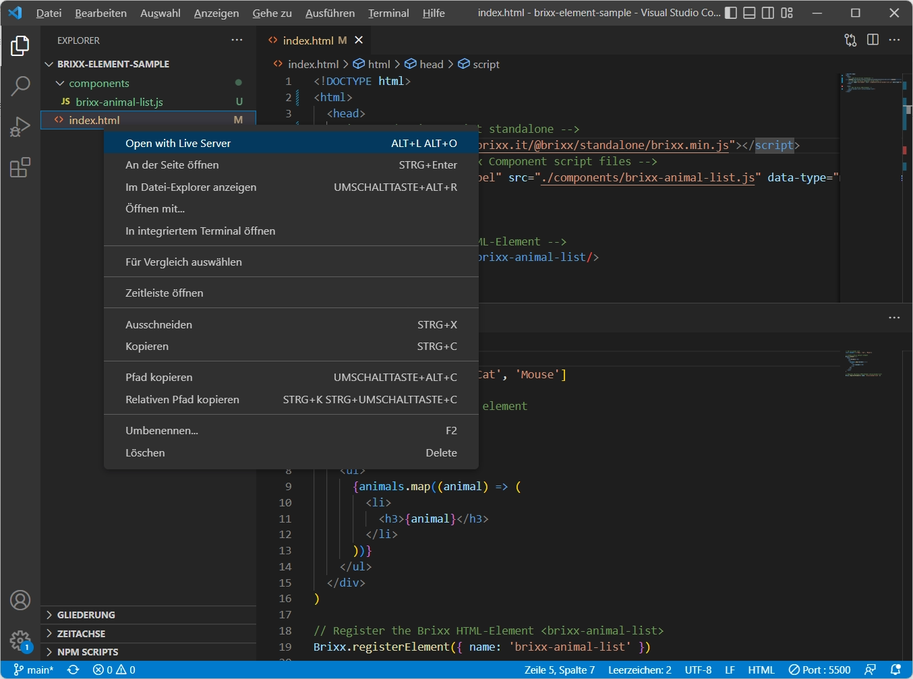

    Visual-Studio-Code - Explorer-Ansicht **`[Open with Live Server]`**

    Die HTML-Datei **`index.html`** wird mit dem _Live Server_ unter der Adresse **`http://127.0.0.1:5500/index.html`** bereitgestellt und im Standard-Browser geöffnet.

    > **Tip:** Der Browser kann bei den _Live Server_ Einstellungen unter **`[Custom Browser]`** festgelegt werden (**`default=null`**).

    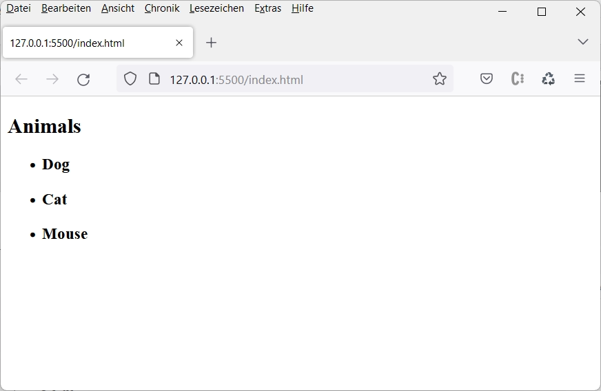

    Der Brixx Web-Baustein `<brixx-animal-list>` im Browser-Fenster

# <div id='tutorial'/> Brixx-Script Tutorial

## Brixx Webkomponente `[brixx-simple-element]` erstellen

Wie erstellen eine „einfache“ **Brixx Webkomponente** und verwenden im Beispiel die Webkomponente wieder als **HTML-Element**. Als erstes erstellen wir wieder einen Projektordner **`[brixx-simple-element]`** und darin die [Projekt-Konfiguration package.json](../NPM-config.md) als Konfigurationsdatei für das Projekt. Dafür nutzen wir das Template [package.json.windows](../downloads/package.json.windows) und speichern die Datei als **`package.json`** im Stammverzeichnis des Projekts. Anschließend können wir die Datei _package.json_ in Visual Studio Code bearbeiten und für unsere Webkomponente anpassen. Das erleichtert den Einstig im Umgang mit der _package.json_ und den Abhängigkeiten durch die benötigten JavaScript-Packages.

Brixx _package.json_ Template für Windows

    {
      "name": "{brixx-component-name}",
      "scripts": {
        "build": "webpack --env package_name=%npm_package_name%",
        "start": "webpack-dev-server --env package_name=%npm_package_name%"
      },
      "dependencies": {
        "@brixx/script": "{brixx-script-version}"
      },
      "devDependencies": {
        "@babel/core": "7.19.6",
        "@babel/preset-env": "7.19.4",
        "@babel/plugin-transform-react-jsx": "7.19.0",
        "babel-loader": "8.2.5",
        "css-loader": "6.7.1",
        "html-webpack-plugin": "5.5.0",
        "style-loader": "3.3.1",
        "webpack": "5.74.0",
        "webpack-cli": "4.10.0",
        "webpack-dev-server": "4.11.1"
      }
    }

In der _package.json_ ersetzen wir den Platzhalter **`{brixx-component-name}`** für die Eigenschaft **`name`** mit dem Namen für das JavaScript-Package der neuen Brixx Webkomponente. Der Name muss aus Kleinbuchstaben und einem Wort bestehen und darf Bindestriche und Unterstriche enthalten.

    "name": "brixx-simple-element"

Bei den **`dependencies`** ersetzen wir dann noch den Platzhalter **`{brixx-script-version}`** mit der Version für das NPM-Package **`@brixx/script`** das wir verwenden.

    "dependencies": {
      "@brixx/script": "1.0.4"
    }

Die Brixx Webkomponente bekommt den Namen **`brixx-simple-element`** und für das Package **`@brixx/script`** verwenden wir die Version **`1.0.4`**

Die Abhängigkeiten **`devDependencies`** werden für die Entwicklung verwendet um eine eigenständige Brixx Webkomponente zu erstellen, die anschließend als Brixx Web-Baustein in jeder Webseite oder Webanwendung verwendet werden kann. Die NPM-Packages werden „zentral“ in der _package.json_ verwaltet und müssen nicht einzeln mit **`npm install --save-dev  <package>`** installiert werden.

Zur Erstellung der Brixx Webkomponente wird _Webpack_ und _Babel_ verwendet. Das erfordert für die Entwicklung eine Reihe von NPM-Packages als **`devDependencies`** und sind im Template eingetragen. Dabei sind die Versionsnummern der NPM-Packages für das Beispiel „gepinnt“, können aber bei Bedarf angepasst werden.

    ...
    "devDependencies": {
      "@babel/core": "7.19.6",
      "@babel/preset-env": "7.19.4",
      "@babel/plugin-transform-react-jsx": "7.19.0",
      "babel-loader": "8.2.5",
      "css-loader": "6.7.1",
      "html-webpack-plugin": "5.5.0",
      "style-loader": "3.3.1",
      "webpack": "5.74.0",
      "webpack-cli": "4.10.0",
      "webpack-dev-server": "4.11.1"
    }
    ...

Mit den NPM **`scripts`** können wir die Brixx Webkomponente mit **`npm run build`** erstellen und mit **`npm run start`** mit dem _Webpack DevServer_ im Browser testen.

    "scripts": {
      "build": "webpack --env package_name=%npm_package_name%",
      "start": "webpack-dev-server --env package_name=%npm_package_name%"
    }

### [NPM-Packages installieren](../NPM-install.md)

Wenn die Erweiterung _NPM-Scripts_ installiert ist können die NPM-Scripts direkt aus der Explorer-Ansicht ausgeführt werden. Seit der Version 1.23 steht in Visual Studio Code in der Explorer-Ansicht bereits ein integrierter _NPM Script Explorer_ zur Verfügung.

> **Tip:** Halten Sie den Visual Studio Code immer auf neuesten Stand. Dieser bekommt regelmäßige Updates spendiert.

Wir öffnen den Projektordner **`[brixx-element-sample]`** in Visual Studio Code und installieren die NPM-Packages der Abhängigkeiten in der _package.json_ durch Klick mit der rechten Maustaste auf den Eintrag **`[package.json]`** in der Explorer-Ansicht unter **`[NPM-SCRIPTS]`** und Auswahl von **`[Run Intall]`** im Kontextmenü.

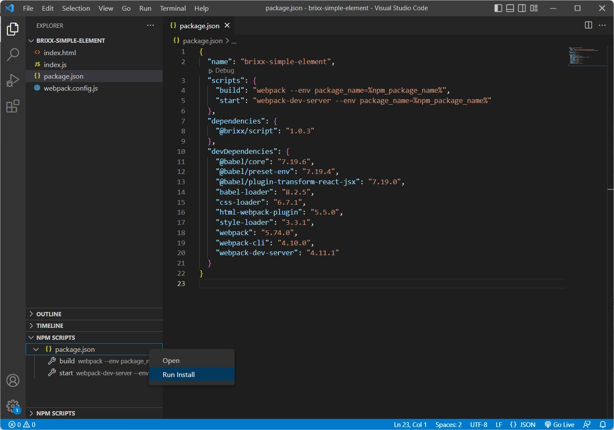

Visual Studio Code - NPM-SCRIPTS (_NPM Script Explorer_)

Nach der Installation der Abhängigkeiten in der _package.json_ für das Projekt sehen wir in der Explorer-Ansicht den Ordner **`[node_modules]`** mit den NPM-Packages und die Datei **`package-lock.json`**

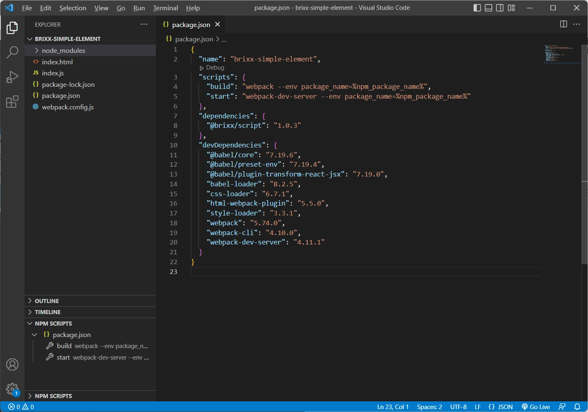

Visual Studio Code - Explorer-Ansicht

### [Webpack-Konfiguration webpack.config.js](../Webpack-config.md)

Für die Webpack-Konfiguration benötigen wir eine Konfigurationsdatei im Stammverzeichnis des Projekts. Zur Erstellung einer „einfachen“ **Brixx Webkomponente** nutzen wir das Template [webpack.config.template.js](../downloads/webpack.config.template.js) und speichern die Datei als **`webpack.config.js`** im Projektordner. Damit sind keine Webpack Kentnisse und Anpassungen der Konfigurationsdatei notwendig. In diesem Fall wird die Eigenschaft **`name`** der _package.json_ als Name für die Brixx Webkomponente verwendet.

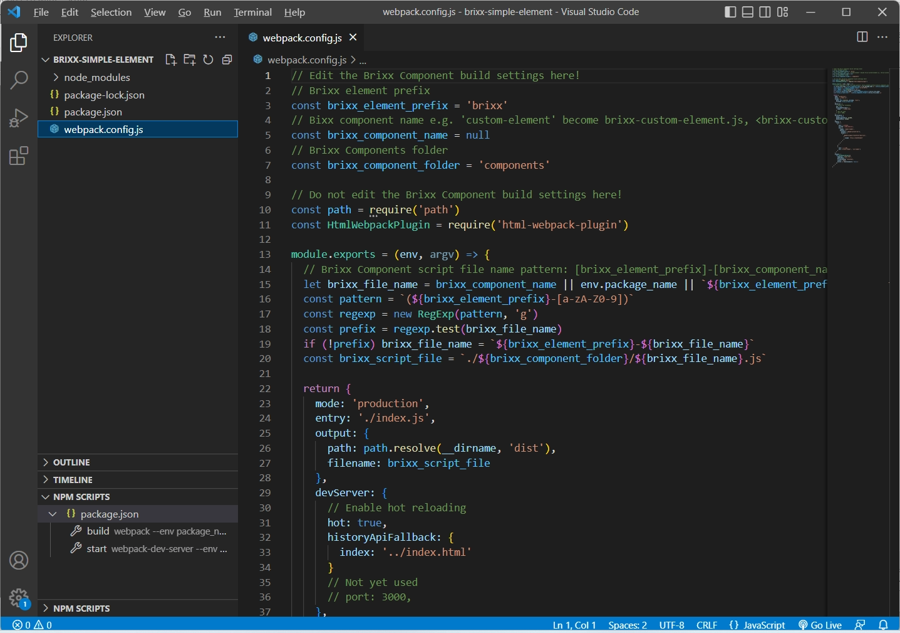

Visual Studio Code - webpack.config.js

Damit sind die Vorbereitungen zur Erstellung der Brixx Webkomponente abgeschlossen wodurch die Projekt-Ordnerstruktur im Beispiel wie folgt aussieht.

    brixx-simple-element/
    ├── node-modules/
    ├── package.json.lock
    ├── package.json
    └── webpack.config.js

> Im Unterschied zum Brixx Web-Baustein importieren wir die Brixx Webkomponente nicht direkt mit der JavaScript-Datei in das HTML-Dokument. Dabei wird die Webkomponente für die Entwicklung mit Webpack in der JavaScript-Datei **`index.js`** erwartet und in einem **Build**-Prozess mit dem NPM-Script **`build`** erstellt.

Wir erstellen die Brixx Webkomponente in der JavaScript-Datei **`index.js`** und importieren zuerst das Modul **`Brixx`** aus dem NPM-Package **`@brixx/script`**, das wir mit der _package.json_ installiert haben.

    // Imports
    import { Brixx } from '@brixx/script'

Anschließend erstellen wir ein **JSX-Element** mit dem HTML Tag Name **`<Greeting>`** und dem HTML Attribut **`name`**. Das Attribut _name_ können wir im JSX-Element mit _Curly Brackets_ **`{}`** verwenden. Ähnlich wie die Liste **`animals`** im Brixx Web-Baustein **`[brixx-animal-list]`**.

    // Create a Brixx JSX-Element
    const Greeting = ({ name }) => (
      <div>
        <h3>Hello {name}. Welcome to the our Brixx world!</h3>
      </div>
    )

Als nächstes erstellen ein **`Brixx.element`** mit dem JSX-Element **`<Greeting>`** und dem Attribut **`name={'Bob the Builder'}`** als Basis für die Brixx Webkomponente.

    // Create a Brixx default element
    Brixx.element = (
      <div>
        <div>
          <hr />
          <h2>Brixx JSX-Element</h2>
          <Greeting name={'Bob the Builder'} />
          <hr />
        </div>
      </div>
    )

Abschließend wird das Brixx Element als HTML-Elemet **`<brixx-simple-element>`** registriert.

    // Register the Brixx HTML-Element <brixx-simple-element>
    Brixx.registerElement({ name: 'brixx-simple-element' })

Komplette Brixx Webkomponente in der JavaScript-Datei (Brixx Script-Baustein) **`./index.js`**

    // Imports
    import { Brixx } from '@brixx/script'

    // Create a Brixx JSX-Element
    const Greeting = ({ name }) => (
      <div>
        <h3>Hello {name}. Welcome to the our Brixx world!</h3>
      </div>
    )

    // Create a Brixx default element
    Brixx.element = (
      <div>
        <hr />
        <h2>Brixx JSX-Element</h2>
        <Greeting name={'Bob the Builder'} />
        <hr />
      </div>
    )

    // Register the Brixx HTML-Element <brixx-simple-element>
    Brixx.registerElement({ name: 'brixx-simple-element' })

WirBei der Erstellung einer Brixx Webkomponente dient die HTML-Datei als Template für den **Build**-Prozess mit Webpack und wird in der Regel nur zum testen mit dem _Webpack DevServer_ verwendet. Wir nutzen im Beispiel das Template [index.element.template.html](../downloads/index.element.template.html) und speichern die Datei als **`index.html`** im Projektordner. Dabei sind keine Anpassungen für das Template erforderlich und kann direkt verwendet werden.

HTML-Template in der HTML-Datei **`index.html`**

    <!DOCTYPE html>
    <html lang='en'>
      <head>
        <meta charset='UTF-8' />
        <meta name='viewport' content='width=device-width, initial-scale=1' />
        <title>Brixx HTML-Element &lt;<%= htmlWebpackPlugin.options.component %>&gt;</title>
        <!-- Include the Brixx Component script files-->
      </head>

      <body>
        <h1>Brixx HTML-Element &lt;<%= htmlWebpackPlugin.options.component %>&gt;</h1>
        <!-- Add the Brixx HTML-Element -->
        <<%= htmlWebpackPlugin.options.component %>></<%= htmlWebpackPlugin.options.component %>>
      </body>
    </html>

Vor der Erstellung der Brixx Webkomponente mit Webpack sieht die Projekt-Ordnerstruktur folgendermaßen aus.

    brixx-simple-element/
    ├── node-modules/
    ├── index.html
    ├── index.js
    ├── package.json.lock
    ├── package.json
    └── webpack.config.js

### Brixx Webkomponente bauen

Die Brixx Webkomponente wird mit **`npm run build`** erstellt. Wir öffnen den Projektordner **`[brixx-simple-element]`** in Visual Studio Code und bauen (erstellen) die Brixx Webkomponente durch Klick mit der rechten Maustaste auf den Eintrag **`[build]`** in der Explorer-Ansicht unter **`[NPM-SCRIPTS]`** und Auswahl von **`[Run]`** im Kontextmenü oder Klick auf das Symbol **[**  **]**

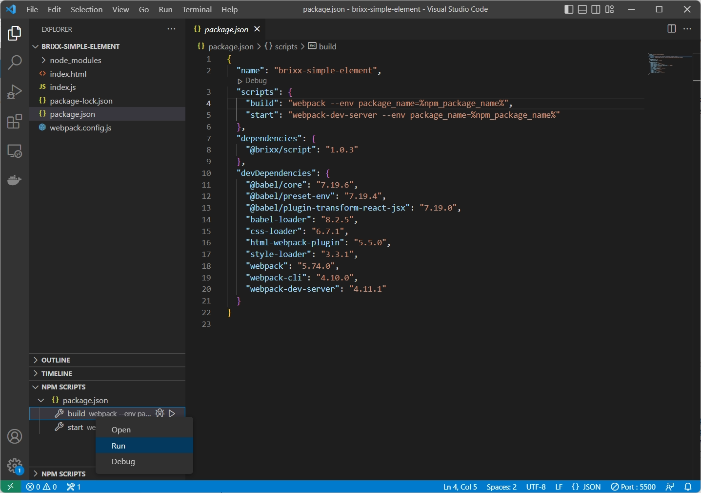

Visual Studio Code - Run build

Nach dem **`Build`**-Prozess sieht die Projekt-Ordnerstruktur abschließend wie folgt aussieht.

    brixx-simple-element/
    ├── dist/
    │   ├── components/
    │   │   └── brixx-simple-element.js
    │   └── index.html
    ├── node-modules/
    ├── index.html
    ├── index.js
    ├── package.json.lock
    ├── package.json
    └── webpack.config.js

Beim **Build**-Prozess wird der Ordner **`[dist]`** erstellt. Darin die Brixx Webkomponente als **Brixx Script-Component** im Ordner **`[components]`** in der JavaScript-Datei **`brixx-simple-element.js`**. Der Ordner **`[dist]`** entspricht der Live-Umgebung von einem Projektordner und wird zur Distribution der Brixx Webkomponente erstellt.

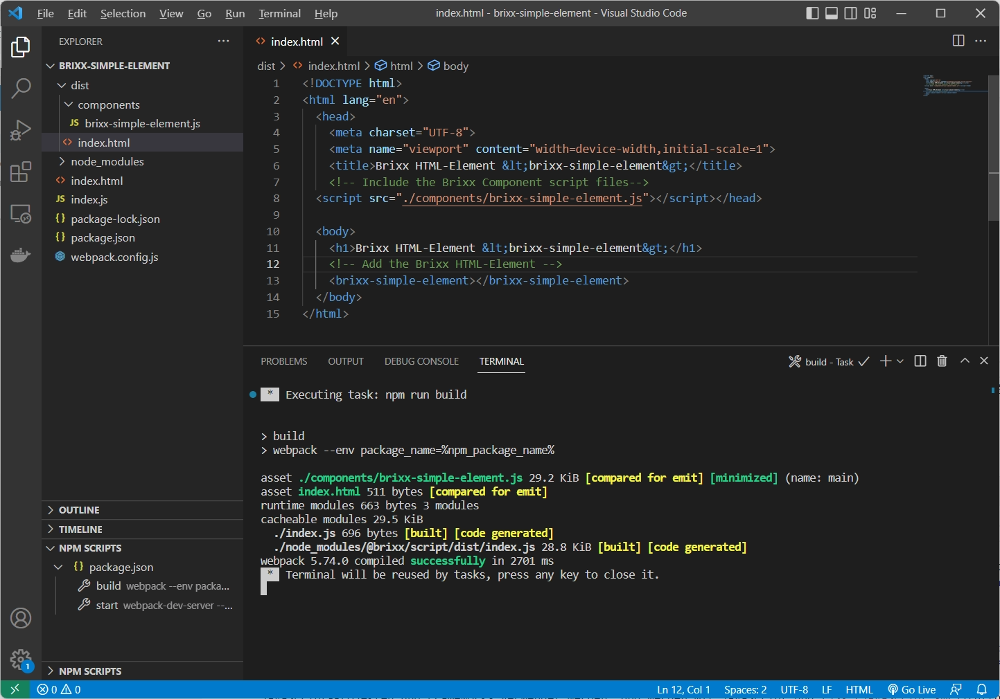

Visual Studio Code - Brixx Component built

### Brixx Webkomponente verwenden

In der Regel wird nur die JavaScript-Datei (Brixx Script-Component) der Brixx Webkomponente im Ordner **`[dist]`** in Projekten verwendet und verteilt.

Auf dem ersten Blick scheint das Ergebnis im Ordner **`[dist]`** identisch zum Brixx Web-Baustein **`[brixx-animal-list]`** zu sein. Auch die Brixx Webkomponente ist eine JavaScript-Datei im Ordner **`[components]`** und wird als Brixx HTML-Element im HTML-Dokument verwendet. Aber anders als beim Brixx Web-Baustein ist die Brixx Webkomponente **eigenstängig**, kann direkt ohne Brixx-Script Standalone als **Brixx Script-Baustein** in das HTML-Dokument importiert werden.

Komplettes Beispiel als ZIP-Archiv herunterladen [[brixx-simple-element.zip]](../downloads/brixx-simple-element.zip)

### Brixx Webkomponente testen

Die HTML-Datei **`index.html`** wird in erster Linie zum testen der Brixx Webkomponente während der Entwicklung verwendet, kann aber auch für die Live-Umgebung angepaßt und verwenet werden. Wir haben zwei Möglichkeiten die Webkomponente zu testen.

-   Die Brixx Webkomponente kann mit **`npm run start`** während der Entwicklung mit dem **Webpack DevServer** getestet werden und muss vorher nicht erstellt werden. Wir starten (testen) die Webkomponente durch Klick mit der rechten Maustaste auf den Eintrag **`[start]`** in der Explorer-Ansicht unter **`[NPM-SCRIPTS]`** und Auswahl von **`[Run]`** im Kontextmenü oder Klick auf das Symbol **[**  **]**

    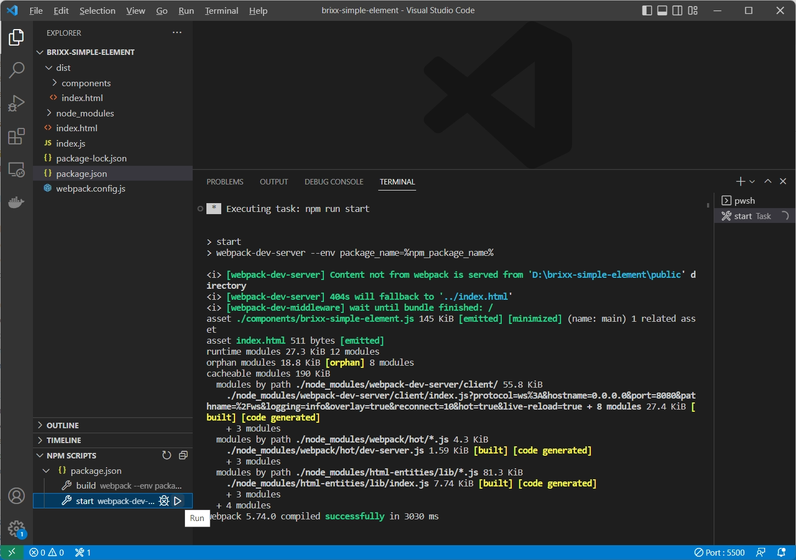

    Visual Studio Code - Run start

    Die HTML-Datei **`index.html`** wird mit dem _Webpack DevServer_ unter der Adresse **`http://127.0.0.1:8080/index.html`** bereitgestellt und im Standard-Browser geöffnet.

    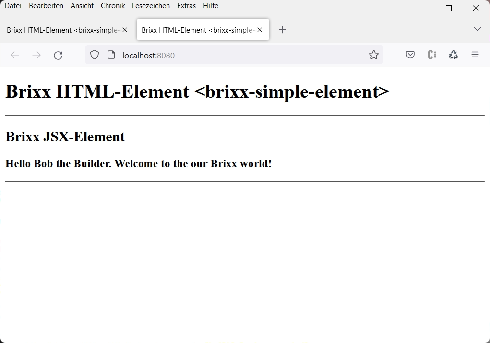

    Der Brixx Web-Baustein `<brixx-simple-element>` im Browser-Fenster

-   Wir können die Brixx Webkomponente mit dem **Live Server** testen wie beim Web-Baustein **`[brixx-animal-list]`**. Dafür muss die Brixx Webkomponente vorher erstellt werden, wobei die Struktur im Ordner **`[dist]`** dem Projektordner vom Web-Baustein entspricht, und starten die HTML-Datei **`index.html`** mit dem _Live Server_.

    ```
    dist/
    ├── components/
    │   └── brixx-simple-element.js
    └── index.html
    ```

    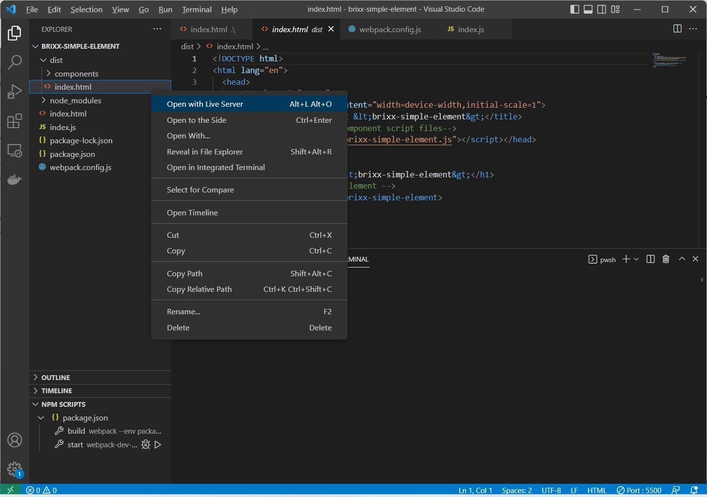

    Visual-Studio-Code - Explorer-Ansicht **`[Open with Live Server]`**

    Die HTML-Datei **`index.html`** wird mit dem _Live Server_ unter der Adresse **`http://127.0.0.1:5500/index.html`** bereitgestellt und im Standard-Browser geöffnet.

    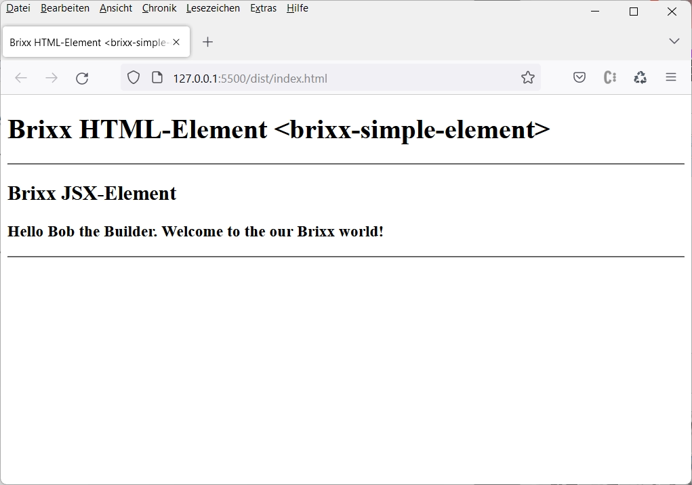

    Der Brixx Web-Baustein `<brixx-simple-element>` im Browser-Fenster

## Brixx Webkomponente `[brixx-complex-element]` erstellen

Wie erweitern die Brixx Webkomponente `[brixx-simple-element]` im ersten Schritt mit zusätzlichen CSS-Dateien und danach mit einer **Brixx Class Component** (Klassen-Komponente). Klassen-Komponenten können zur besseren Strukturierung komplexer Projekten verwendet werden und sind besonders für fortgeschrittene Entwickler interessant. Dafür erstellen wir zuerst einen Projektordner **`[brixx-complex-element]`** und kopieren alle Dateien aus dem vorherigen Beispiel in den Projektordner.

### HTML Styles hinzufügen

Wir „stylen“ die Brixx-Webkomponente mit **CSS** (Cascade Style Sheet) und erstellen dafür einen Ordner **`./styles`** im Projektordner. Wir nutzen dafür zum einen [Bootstrap](https://getbootstrap.com/) und kopieren die [`bootstrap.min.css`](../downloads/bootstrap.min.css) in den Ordner **`[styles]`** und erstellen eine weitere CSS-Datei **`index.css`** für die Brixx Webkomponente.

Komplette Styles der CSS-Datei **`index.css`**

    body {
      margin: 10px;
    }

    a {
      font-size: 14px;
    }

    a:link {
      color: #095484;
      text-decoration: none;
    }

    a:visited {
      color: #aaa;
      text-decoration: none;
    }

    a:hover {
      color: #8ebf42;
      text-decoration: none;
    }

    a:active {
      color: #800000;
      text-decoration: none;
    }

Die verwendeten Styles dienen als einfaches Beispiel und müssen nicht im Einzelnen betrachtet werden. Damit sieht die Projekt-Ordnerstruktur folgendermaßen aus.

    brixx-complex-element/
    ├── styles/
    │   ├── bootstrap.min.css
    │   └── index.css
    ├── index.html
    ├── index.js
    ├── package.json
    └── webpack.config.js

### HTML-Dokument erweitern

Wir erweitern das HTML-Dokument nur mit einem einfachen HTML-Hyperlink-Element um die Styles in der CSS-Datei zu testen.

    ...
    <a href="https://brixx.it/docs/brixx-script" target="_bank">[Learn more about Brixx-Script]</a>
    ...

Komplettes HTML-Dokument in der HTML-Datei **`index.html`**

    <!DOCTYPE html>
    <html lang="en">
      <head>
        <meta charset="UTF-8" />
        <meta name="viewport" content="width=device-width, initial-scale=1" />
        <title>Brixx HTML-Element &lt;<%= htmlWebpackPlugin.options.component %>&gt;</title>
        <!-- Include the Brixx Component script files-->
      </head>

      <body>
        <h1>Brixx HTML-Element &lt;<%= htmlWebpackPlugin.options.component %>&gt;</h1>
        <!-- Add the Brixx HTML-Element -->
        <<%= htmlWebpackPlugin.options.component %>></<%= htmlWebpackPlugin.options.component %>>
        <a href="https://brixx.it/docs/brixx-script" target="_bank">[Learn more about Brixx-Script]</a>
      </body>
    </html>

### Brixx Webkomponente erweitern

Wir erweitern die Brixx Webkomponente in der JavaScript-Datei **`index.js`** und importieren zuerst die CSS-Dateien.

    // Styles
    import './styles/bootstrap.min.css'
    import './styles/index.css'

Danach registrieren wir das Brixx HTML-Element unter dem neuen Namen **`brixx-complex-element`**

    // Register the Brixx HTML-Element <brixx-complex-element>
    Brixx.registerElement({ name: 'brixx-complex-element' })

Bevor wir das Beispiel mit einer **Brixx Class Component** erweitern machen wir die restlichen notwendigen Anpassungen und Erweiterungen.

### Webpack-Konfiguration erweitern

Für die „Integration“ der CSS-Dateien erweitern wir die Webpack-Konfiguration mit dem Webpack Plugin [MiniCssExtractPlugin](https://webpack.js.org/plugins/mini-css-extract-plugin/). Damit haben wir u. a. die Möglichkeit eine externe CSS-Datei für die Brixx Webkomponente einzubinden, und unterstützt auch On-Demand-Loading von CSS und SourceMaps.

    ...
    const MiniCssExtractPlugin = require('mini-css-extract-plugin')
    ...

Anschließend ersetzen wir bei den _module.rules_ den `style-loader` mit dem **`MiniCssExtractPlugin.loader`**.

    ...
    use: [MiniCssExtractPlugin.loader, 'css-loader']
    ...

Das Plugin wird in der Webpack-Konfiguration initialisiert und konfiguriert. Dabei legen wir mit der Eigenschaft **`filename`** die CSS-Datei fest die beim **Build**-Prozess erstellt werden soll. Das hat z. B. den Vorteil das die CSS-Datei gemeinsam von mehreren Webkomponenten und vom HTML-Dokument direkt verwendet werden kann.

      new MiniCssExtractPlugin({
        filename: 'styles/index.css',
      })

### Projekt-Konfiguration anpassen

In der Projekt-Konfiguration _package.json_ müssen auch nicht viele Anpassungen gemacht werden. Wir ersetzen den aktuellen Namen `brixx-simple-element` bei der Eigenschaft **`name`** mit dem Namen für das JavaScript-Package der neuen Brixx Webkomponente.

    "name": "brixx-complex-element"

Bei den **`devDependencies`** ersetzen wir das Package `style-loader` gegen **`mini-css-extract-plugin`** wie für das Plugin in der Webpack Konfiguration.

    ...
    "mini-css-extract-plugin": "2.7.2",
    ...

### NPM-Packages installieren

Nach der Änderung der _package.json_ installieren wir die NPM-Packages mit **`npm install`** und testen anschließend die Brixx Webkomponente.

### Brixx Webkomponente testen

Die Brixx Webkomponente können wir während der Entwicklung immer mit **`npm run start`** testen, ohne vorher die Brixx Webkomponente erstellen zu müssen.

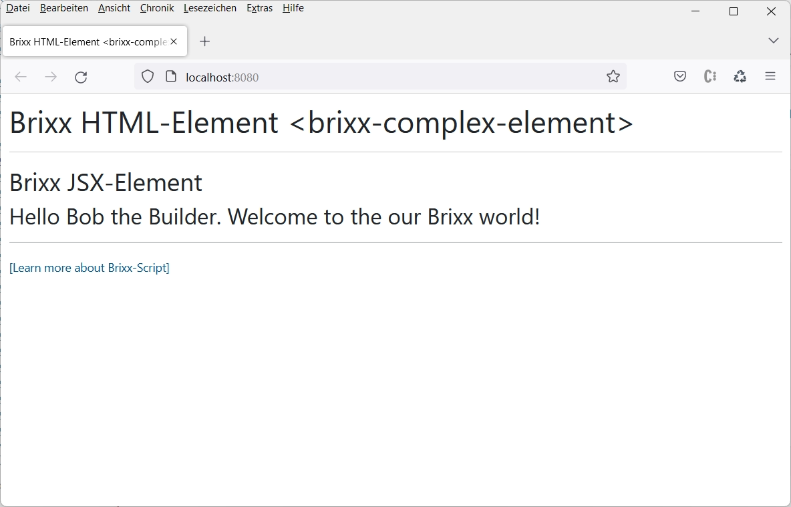

Der Brixx Web-Baustein `<brixx-complex-element>` im Browser-Fenster

### Brixx Class Component hinzufügen

Damit der Name der Brixx Wekomponente auch hält was er verspricht erweitern wir die Webkomponente mit der **Brixx Class Component** (Klassen-Komponente) und erstellen im Ordner **[`components`]** die Class Component **`Counter`** in der JavaScript-Datei **`Counter.js`** Damit sieht die Projekt-Ordnerstruktur folgendermaßen aus.

    brixx-complex-element/
    ├── components/
    │   └── counter.js
    ├── node_modules/
    ├── styles/
    │   ├── bootstrap.min.css
    │   └── index.css
    ├── index.html
    ├── index.js
    ├── package.json.lock
    ├── package.json
    └── webpack.config.js

Under Construction ...

Komplette Brixx Class Component **`Counter`** in der JavaScript-Datei **`Counter.js`**

    // Imports
    import { Brixx } from '@brixx/script'

    /**
    * Class Brixx Counter component
    */
    export default class Counter extends Brixx.Component {
      /**
      * Create a Brixx Counter component object
      *
      * @param {*} props - the Counter props
      */
      constructor(props) {
        super(props)
        this.state = {
          count: 0
        }
      }

      /**
      * Brixx Counter component mounted
      */
      componentDidMount() {
        Brixx.console.log('Brixx Counter Component mounted')

        // Force render if component is mounted
        this.forceUpdate()
      }

      /**
      * Render the Brixx Counter component
      */
      render() {
        return (
          <div id={this.id}>
            {this.props.children}
            <h3>Count: {this.state.count}</h3>
            <button
              onClick={(event) => {
                this.setState({
                  count: this.state.count + 1
                })
              }}
            >
              Increment
            </button>
          </div>
        )
      }
    }

Um die Brixx Class Component **`Counter`** zu verwenden wird die JavaScript-Datei **`Counter.js`** im Ordner **[`components`]** in die Brixx Webkomponente importiert.

    import Counter from './components/Counter'

Anschließend können wir die Class Component direkt als HTML-Element **`<Counter>`** in der Brixx Webkomponente verwenden.

    // Create a Brixx default element
    Brixx.element = (
      ...
        <h2>Brixx Component</h2>
        <Counter></Counter>
        <hr />
      ...
    )

Komplette Brixx Webkomponente in der JavaScript-Datei **`./index.js`**

    // Imports
    import { Brixx } from '@brixx/script'
    import Counter from './components/Counter'

    // Styles
    import './styles/bootstrap.min.css'
    import './styles/index.css'

    // Create a Brixx JSX-Element
    const Greeting = ({ name }) => (
      <div>
        <h3>Hello {name}. Welcome to the our Brixx world!</h3>
      </div>
    )

    // Create a Brixx default element
    Brixx.element = (
      <div>
        <hr />
        <h2>Brixx JSX-Element</h2>
        <Greeting name={'Bob the Builder'} />
        <hr />
        <h2>Brixx Component</h2>
        <Counter></Counter>
        <hr />
      </div>
    )

    // Register the Brixx HTML-Element <brixx-complex-element>
    Brixx.registerElement({ name: 'brixx-complex-element' })

### Brixx Webkomponente bauen

Wir erstellen die Brixx Webkomponente wie im Beispiel vorher. Wir öffnen den Projektordner **`[brixx-complex-element]`** in Visual Studio Code und bauen die Brixx Webkomponente mit dem NPM-Script **`[build]`** in der Explorer-Ansicht unter **`[NPM-SCRIPTS]`**. Nach dem **`Build`**-Prozess sieht die Projekt-Ordnerstruktur abschließend folgendermaßen aus.

    brixx-complex-element/
    ├── components/
    │   └── Counter.js
    ├── dist/
    │   ├── components/
    │   │   └── brixx-complex-element.js
    │   ├── styles/
    │   │   └── index.css
    │   └── index.html
    ├── node-modules/
    ├── styles/
    │   ├── bootstrap.min.js
    │   └── index.css
    ├── index.html
    ├── index.js
    ├── package.json.lock
    ├── package.json
    └── webpack.config.js

Beim **Build**-Prozess wird der Ordner **`[dist]`** erstellt. Darin die Brixx Webkomponente als **Brixx Script-Component** im Ordner **`[components]`** in der JavaScript-Datei **`brixx-complex-element.js`**. Zudem wird noch der Ordner **`[styles]`** erstellt mit der CSS-Datei für die Webkomponente **`index.css`**
Der Ordner **`[dist]`** entspricht der Live-Umgebung von einem Projektordner und wird zur Distribution der Brixx Webkomponente erstellt.

### Brixx Webkomponente verwenden

Wir können nach dem **Build**-Prozess die JavaScript-Datei (Brixx Script-Component) der Brixx Webkomponente in Projekten verwenden und verteilen. Die Webkomponente ist eine JavaScript-Datei im Ordner **`[components]`** und wird als Brixx HTML-Element im HTML-Dokument verwendet. Die Brixx Webkomponente ist **eigenstängig** und kann direkt als **Brixx Script-Baustein** in das HTML-Dokument importiert und verwendet werden.

Komplettes Beispiel als ZIP-Archiv herunterladen [[brixx-complex-element.zip]](../downloads/brixx-complex-element.zip)

### Brixx Webkomponente testen

Wir testen die Brixx Webkomponente noch einmal mit **`npm run start`** bevor wir die Brixx Webkomponente endgültig erstellen.

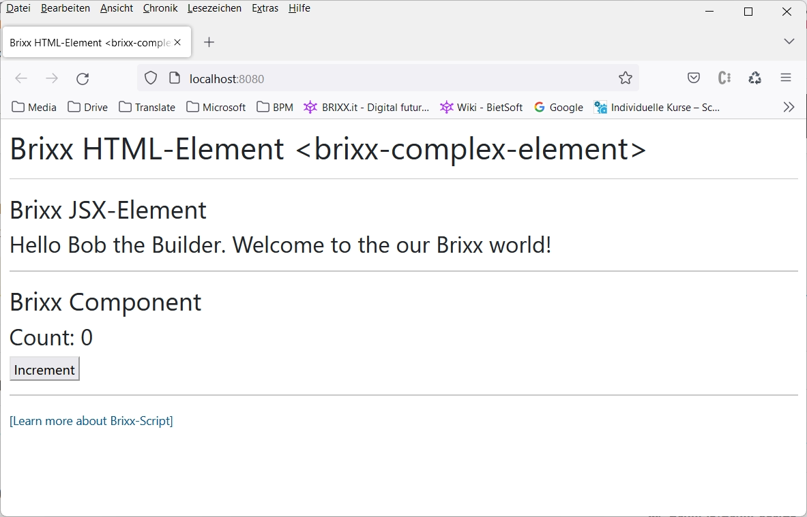

Der Brixx Web-Baustein `<brixx-complex-element>` im Browser-Fenster

## Brixx Script-Component

Under Construction ...

# <div id='reference'/> Brixx-Script Referenz

Under Construction ...

## Brixx-Script Standalone
### Brixx-Script Standalone Datei `brixx.min.js` im `<script>`-Tag referenzieren
`<src="https://brixx.it/@brixx/standalone/brixx.min.js"></script>`

## Brixx-Script Package
### Brixx-Script Package installieren
`npm i @brixx/script`  

### Brixx-Script Modul `Brixx` vom Package `@brixx/script` importieren  
`import { Brixx } from '@brixx/script'`

## Static Variables

### `version (string, readonly, default='1.0.4')`

Gets the Brixx version.

    console.log(Brixx.version)

### `componentFolder (string, readonly)`

Gets the Brixx component folder.

    console.log(Brixx.componentFolder)

### `elementPrefix (string, readonly)`

Gets the Brixx element prefix.

    console.log(Brixx.elementPrefix)

## Static Methods

### `UUID`

### `console`

### `Component`

### `element (default=null)`

### `createElement`

### `createRoot`

### `initLogger`

### `registerPreset`

### `setComponentFolder`

### `setElementPrefix`

### `load`

### `registerElement`

### `run`

## Create an instance

    const instance = new Brixx()

## Class Methods

### `render`

    const instance.render()

## Copyright and License

#

Copyright © BRIXX.it 2022
