# Brixx-Script

  > This document is under construction and is currently only available in German. However, we have decided to make the product available for use in the current version 1.0.3.  
  For information on using Brixx-Script, please contact info@brixx.it

Brixx-Script ist eine JavaScript-Bibliothek zur Erstellen von Webkomponenten (Web-Bausteinen). Mit Brixx-Script können **„Smarte“-Web-Bausteine** (Brixx) für Webseiten und Webanwendungen erstellt werden. Dadurch kannn beispielsweise Programmieraufwand und Projektkomplexität mit unser **Low-Code-Entwicklung** auf ein Minimum reduziert werden. Brixx Web-Bausteine können als HTML-Elemente in jedem HTML-Dokument sowie als Brixx-Script-Baustein in JavaScript-Projekten und Frameworks verwendet werden.  
Brixx Web-Bausteine können mit JavaScript und insbesondere [JSX (JavaScript XML)](https://en.wikipedia.org/wiki/JSX_(JavaScript)) erstellt werden. JSX wurde 2014 mit [React](https://en.wikipedia.org/wiki/React_(JavaScript_library)) eingeführt und gleicht im Syntax [E4X (EcmaScript for XML)](https://en.wikipedia.org/wiki/ECMAScript_for_XML) zur Integration von XML in JavaSript. Brixx-Script hat 1998 seinen Ursprung als Plattform- und Programiersprachen unabhängige Bibliothek **LaSSiE**, wurde 2005 mit E4X erweitert, und zuletzt 2014 E4X durch JSX ersetzt, nachdem E4X von der Mozilla Foundation als deprecated gekennzeichnet wurde. LaSSiE findet in Produkten wie **Brixx-Decision-Script** und **Brixx-Process-Script** als Baustein-System Verwendung und aufgrund der Popularität und Verbreitung von JSX wurde LaSSiE 2022 als unabhängiges Produkt **Brixx-Script** zur Erstellung von Webkomponenten (Web-Bausteinen) zu veröffentlicht.

## Package `@brixx/script`

### **Version: `1.0.0`**

# Was wird alles benötigt?

## Quellcode Editor
Für die Entwicklung kann ein einfacher Texteditor, wie der in der Linux Community beliebte [Vim](https://www.vim.org/), oder unter Windows der Quellcode Editor [Notpad++](https://notepad-plus-plus.org/downloads/) und [Sublime Text](https://www.sublimetext.com/) verwendet werden. Ein kostenlose Alternative zu einer professionellen integrierten Entwicklungsumgebung (IDE) ist [Visual Studio Code](https://code.visualstudio.com/) (VS Code) als leichtgewichtiger Quellcode Editor mit vielen verfügbaren IDE Erweiterungen. Visual Studio Code ist mehr als nur ein Quellcode Bearbeitungstool und derzeit der wohl beliebteste Quellcode Editor. Wir verwenden für die gezeigten Beispiele Visual Studio Code.

### **Installation Visual Studio Code für Windows**
1. Download the [Visual Studio Code installer](https://go.microsoft.com/fwlink/?LinkID=534107) for Windows.
2. Once it is downloaded, run the installer. This will only take a minute.
3. By default, VS Code is installed under `C:\Users\{Username}\AppData\Local\Programs\Microsoft VS Code`.

Alternatively, you can also download a [Zip archive](https://code.visualstudio.com/docs/?dv=winzip), extract it and run Code from there.

> **Tip:** Setup will add Visual Studio Code to your `%PATH%`, so from the console you can type 'code .' to open VS Code on that > folder. You will need to restart your console after the installation for the change to the `%PATH%` environmental variable to >   take effect.

### **User setup versus system setup**
VS Code provides both Windows user and system level setups. Installing the [user setup](https://go.microsoft.com/fwlink/?LinkID=534107) does not require Administrator privileges as the location will be under your user Local AppData (LOCALAPPDATA) folder. User setup also provides a smoother background update experience.

The [system setup](https://go.microsoft.com/fwlink/?linkid=852157) requires elevation to Administrator privileges and will place the installation under Program Files. This also means that VS Code will be available to all users in the system.

See the [Download Visual Studio Code](https://code.visualstudio.com/download) page for a complete list of available installation options.

### **32-bit versions**
If you need to run a 32-bit version of VS Code, both a 32-bit [Installer](https://go.microsoft.com/fwlink/?LinkId=723965) and [Zip archive](https://go.microsoft.com/fwlink/?LinkID=733265) are available.


Visual Studio Code Startbidschirm

### **Visual Studio Code Erweiterungen**
Es gibt viele Erweiterungen (Extensions) für Visual Studio Code. Man kann z.B. die Anzeigesprache in Visual Studio Code mit der Erweiterung [German Language Pack for Visual Studio Code](https://marketplace.visualstudio.com/items?itemName=MS-CEINTL.vscode-language-pack-de) auf Deutsch umzustellen. 

 > **Tip:** Wer mit unterschiedlichen Editoren arbeitet sollte die Anzeigesprache in Visual Studio Code nicht umstellen, das erleichtert die Arbeit mit anderen Editoren die in der Regel die selben englischen Menübezeichnungen verwenden, aber keine Umstellung der Anzeigesprach auf Deutsch möglich ist.

Eine Erweiterung (Extension) kann man im [Visual Studio Code Marketplace](https://marketplace.visualstudio.com/search?target=VSCode&category=Language%20Packs&sortBy=Installs) suchen und installieren oder direkt in Visual Studio Code unter Extensions (`Ctrl+Shift+X`).
Hier kann man im Suchfeld den gesuchten Betreff eingeben und erhält alle möglichen passenden Erweiterungen. Im Beispiel exemplarisch mit der Erweiterung *German Language Pack*.

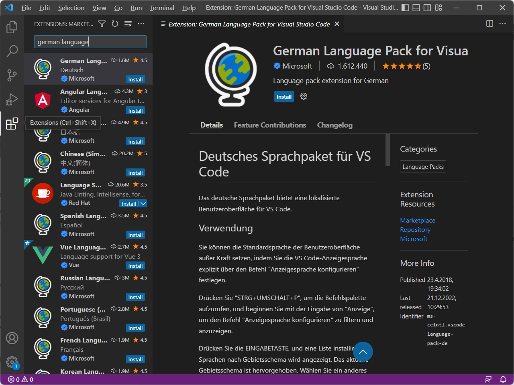

Visual Studio Code Extensions

Nach der Installation wird man in der Regel zu einem Restart von Visual Studio Code aufgefordert und die Anzeigesprache ist anschließend wie erwartet auf Deutsch umgestellt.

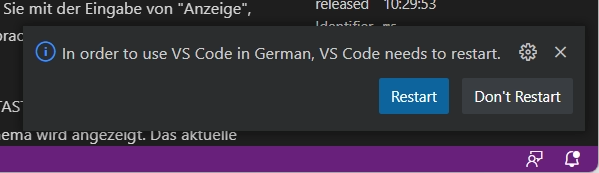

Genauso einfach kann eine Erweiterung auch wieder deinstalliert werden.

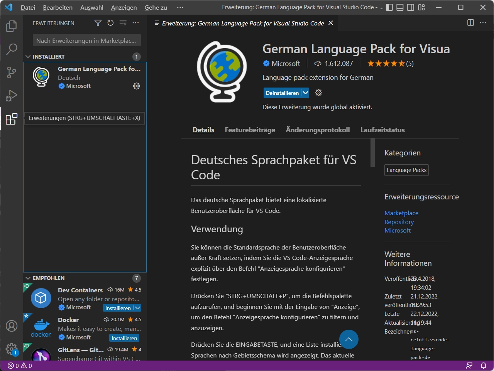

### **Empfohlene Erweiterungen zur Berabeitung von Brixx Webkomponenten**
Es gibt jede Menge nützlicher Erweiterungen für Visual Studio Code die einem die Arbeit erleichten, wie die Erweiterung *German Language Pack*. Nahezu unverzichtbare Plugin Erweiterungen zur Erstellung von Brixx Webkomponenten sind die folgende.

- [Live Server](https://marketplace.visualstudio.com/items?itemName=ritwickdey.LiveServer) Ein lokaler Entwicklungsserver (Webserver) mit Auto Reload (Live reload) bei Änderungen am Quellcode. Der Live Server ermöglicht das Verhalten der Brixx Webkomponente im Browser zu testen, und verhindert darüber hinaus die *blocked by CORS policy* ([Cross-Origin Resource Sharing](https://developer.mozilla.org/en-US/docs/Web/HTTP/CORS)) beim Zugriff vom Browser auf lokale Ressourcen.
- [NPM-Scripts](https://marketplace.visualstudio.com/items?itemName=traBpUkciP.vscode-npm-scripts) Anzeigen und Ausführen von NPM-SCRIPTS aus der Explorer Ansicht.

## Node.js und Npm
Um eigenständige Brixx **Webkomponenten** zu erstellen verwenden wir [Node.js®](https://nodejs.org/en/ 'Opensource cross platform JavaScript runtime environment') (cross-platform JavaScript runtime environment) und [npm](https://www.npmjs.com/ 'Node package manager') (Node Package Manager). 

### **Node.js**
Wird als Entwicklungswerkzeug für den **Build** (Erstellung) eigenständiger Brixx Webkomponenten verwendet, **nicht zur Laufzeit** benötigt, und erfordert keine besonderen Node.js Kenntnisse. Durch die Verwendung von Node.js können nahezu alle **State-of-the-art** Entwicklungswerkzeuge wie Webpack und Babel verwendet werden.

### **Npm**
Npm ist fester Bestandteil bei der Installation von Node.js und im Ursprung ein **Node Package Manager** für die Verwaltung der benötigten JavaScript Packages, sowohl für den Build von Brixx Webkomponenten als auch für die Entwicklungswerkzeuge. Npm wird wie Node.js zur Entwicklung benötigt.

### **Installation Node.js und npm für Windows**
1. Download the Node.js [Windows Installer (.msi)](https://nodejs.org/en/download/)
   
   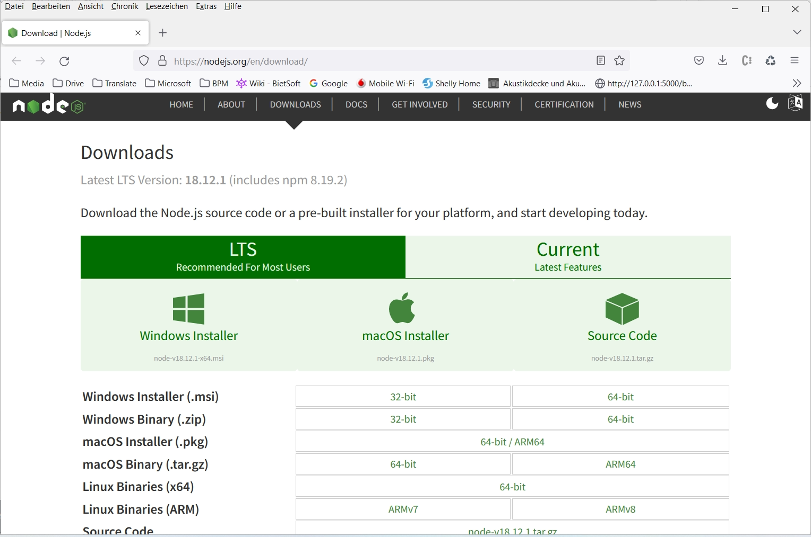
   
   Node.js downloads

2. Once it is downloaded, run the installer. The Node.js Setup wizard will open.
   
   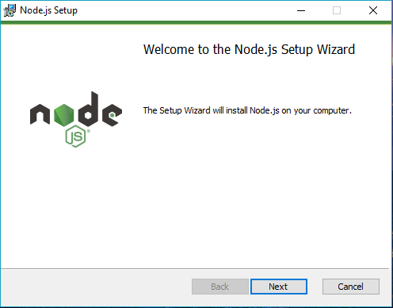

   Select `[Next]`
   
   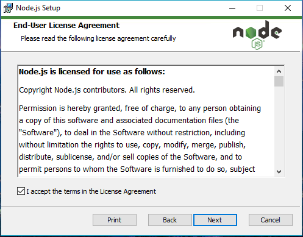

   Check "I accept the terms in the License Agreement" & Select `[Next]`
   
   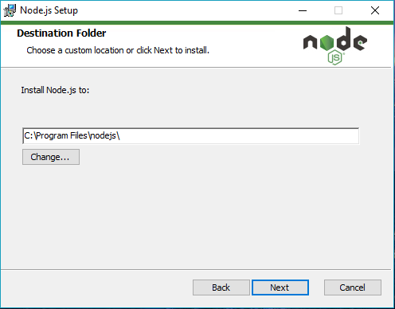

   Set the Destination Folder location to install Node.js & Select `[Next]`
   
   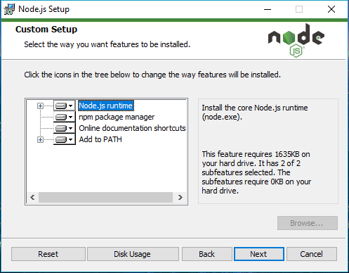

   Select `[Next]`
   
   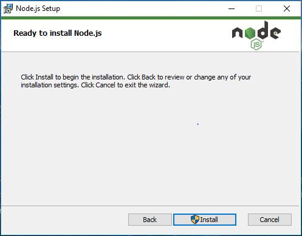

   Select `[Install]`
   
   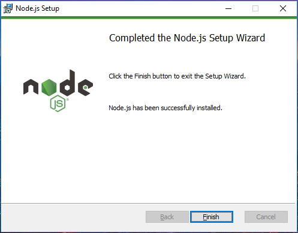

   Click `[Finish]`

## Webpack
Mit dem Modul-Bundler [Webpack](https://webpack.js.org/ 'Opensource JavaScript modul packer') für moderne JavaScript-Anwendungen können Anwendungen in sogenannten **Bundles** erstellt werden in denen alle Assets bereitgestellt werden. Dadurch ist eine einfache Intergration und Verteilung von Brixx Webkomponenten möglich. Für die Erstellung einer Brixx Webkomponente mit Webpack stehen eine Reihe von Beispiele und Vorlagen zur Verfügung, erfordert keine besonderen Vorkenntnisse und hat eine niedrige Einstigshürde.

## Babel
Der JavaScript Compiler [Babel](https://babeljs.io/ 'Opensource JavaScript transcompiler') wird verwendet ECMAScript 2015+ Code in eine abwärtskompatible Version für nicht kompatible und ältere Browser zu konvertieren und wird zusammen mit Webpack verwendet. Dadurch können Brixx Webkomponenten nahezu in allen Browsern und JavaScript Umgebungen verwendet werden. Für die Verwendung von Babel zusammen mit Webpack stehen eine Reihe von Beispiele und Vorlagen zur Verfügung, erfordert keine besonderen Vorkenntnisse und hat eine niedrige Einstigshürde.

## Erste Schritte

Wir verwenden moderne, State-of-the-art Tools und Technologien, um eie einfache Integration in HTML-Dokumentens und Web-Projekten zu ermöglichen. Hierzu zählen neben [Node.js](https://nodejs.org/en/ 'Opensource cross platform JavaScript runtime environment') und [npm](https://www.npmjs.com/ 'Node package manager') auch [Webpack](https://webpack.js.org/ 'Opensource JavaScript modul packer') und [Babel](https://babeljs.io/ 'Opensource JavaScript transcompiler'), um Webkomponenten zu erstellen. Zusätzlich steht für die Entwicklung auch eine Standalone Version zur Verfügung.

## Brixx Web-Baustein [brixx-animal-list] erstellen

 Brixx Web-Bausteine (Webkomponenten) werden standartmäßig im Ordner **`[components]`** abgelegt. Dazu erstellen wir einen Ordner **`.\components`** im Projekt-Ordner **`[brixx-element-sample]`** womit die Prokekt-Ordnerstruktur im Beispiel wie folgt aussieht.

```
[brixx-element-sample]
 │
 ├── [components]
 │    │
 │    └── brixx-animal-list.js
 │
 └── index.html
```

Darin wird eine einfache Brixx Webkomponente **`[brixx-animal-list]`** erstellt und als **`brixx-animal-list.js`** gespeichert. Zuerst wird eine Liste ([JavaScript Array](https://www.w3schools.com/js/js_arrays.asp)) **`anials`** erstellt und symbolisiert im Beispiel Eingabequellen z.B. aus einem HTML-Formular, Webservice oder einer Datenbank.

    // Set an animal list
    const animals = ["Dog", "Cat", "Mouse"];

Anschließend wird ein Brixx Standard Element **`Brixx.element`** mit einer untergeordneten HTML-Liste als JSX-Element erstellt.

    // Create a Brixx default element
    Brixx.element = 
    <div>
      <h2>Animals</h2>
      <ul>
        ...
      </ul>
    </div>

  > **Tip:** Die Formatierung ist frei, wir empfehlen zur besseren Projektstruktur und JavaScript Integration JSX-Code in *Parentheses* **`()`** zu verwenden.

    // Create a Brixx default element
    Brixx.element = (
      <div>
        <h2>Animals</h2>
        <ul>
          ...
        </ul>
      </div>
    );

Die einzelnen Einträge **`anial`** der Liste **`anials`** werden dann als HTML-Listenelement **`<h3>{animal}</h3>`** im HTML-Code mit Unterstützung der JavaScript Methode [Array map()](https://www.w3schools.com/jsref/jsref_map.asp) nacheinander ausgegeben. JavaSrcrit Erweiterungen können, wie im Beispiel zu sehen, sehr einfach mit *Curly Brackets* **`{}`** mit Brixx-Script integriert werden.

    ...
    { 
      animals.map((animal) => (
          <li>
            <h3>{animal}</h3>
          </li>
        )
      ) 
    }
    ...

Abschließend wird das erstellte Brixx Element als HTML-Elemet **`<brixx-animal-list>`** für das HTML-Dokument im Browser registriert.

    // Register the Brixx HTML-Element <brixx-animal-list>
    Brixx.registerElement({ name: "brixx-animal-list" });

Kompletter Brixx Web-Baustein in der JavaScript-Datei **`./components/brixx-animal-list.js`**

    // Set an animal list
    const animals = ["Dog", "Cat", "Mouse"];

    // Create a Brixx default element
    Brixx.element = (
      <div>
        <h2>Animals</h2>
        <ul>
          {animals.map((animal) => (
            <li>
              <h3>{animal}</h3>
            </li>
          ))}
        </ul>
      </div>
    );

    // Register the Brixx HTML-Element <brixx-animal-list>
    Brixx.registerElement({ name: "brixx-animal-list" });

## Brixx Web-Baustein [brixx-animal-list] verwenden
Die integration in ein HTML-Dokument oder eine Webanwendung ist unkompliziert. Der einfachste Weg ist Brixx-Script Standalone zu verwenden. Brixx-Script Standalone beinhaltet alle nötigen Bestandteile und ist im Wesentlichen für die Entwicklung vorgesehen. Bei Verwendung wird in der Console *You are using the in-browser Brixx-Script transformer. It is recommended to build Brixx components for production* als Information ausgegeben.
    <!-- Load Brixx-Script standalone -->
    <script src="https://brixx.it/@brixx/standalone/brixx.min.js"></script>

Die Brixx Webkomponente wird mit einem HTML-Element **`<script>`** im HTML-Dokument eingefügt.

    <!-- Include the Brixx Component script files -->
    <script type="text/babel" src="./components/brixx-animal-list.js"
        data-type="module" data-presets="brixx"></script>

In der Brixx-Script Standalone Version wird [Babel](https://babeljs.io/ 'Opensource JavaScript transcompiler') mit **`type="text/babel"`** verwendet, um die Brixx Webkomponente in den verschiedenen Browsern verwenden zu können. Hierfür müssen nur dann noch die HTML-Element Attribute **`data-type="module"`** und **`data-presets="brixx"`** festgelegt werden. Anschließend kann die Brixx Webkomponente als HTML-Element **`<brixx-animal-list>`** verwendet werden. Somit werden zur Integration in einem HTML-Dokument keine besonderen Programmierkentnisse benötigt.

Komplettes HTML-Dokument in der HTML-Datei **`index.html`**

    <!DOCTYPE html>
    <html>
      <head>
        <!-- Load Brixx-Script standalone -->
        <script src="https://brixx.it/@brixx/standalone/brixx.min.js"></script>
        <!-- Include the Brixx Component script files -->
        <script type="text/babel" src="./components/brixx-animal-list.js"
          data-type="module" data-presets="brixx"></script>
      </head>

      <body>
        <!-- Add the Brixx HTML-Element -->
        <brixx-animal-list></brixx-animal-list/>
      </body>
    </html>

Komplettes Beispiel als ZIP-Archiv herunterladen [[brixx-element-sample.zip]](downloads/brixx-element-sample.zip)

Um den Brixx HTML-Element zu testen können wir den Projektordner **`[brixx-element-sample]`** im Visual Studio Code öffnen. Zum starten der HTML-Datei mit der *Live Server* Erweiterung gibt es verschiedene Möglichkeiten.

1. Klick auf **`[Go Live]`** in der *Status Bar* zum Ein/Ausschalten des Live Servers. 
2. Bei aktivem Quellcodefenster der HTML-Datei **`index.html`** mit der Tastenkombination **`[ALT+L Alt+O]`**
3. Klick mit der rechten Maustaste (Kontextmenüs) auf die HTML-Datei **`index.html`** im Explorer Fenster   
   Klick auf den Menüeintrag **`[Open with Live Server]`**. 

   

   Projektordner **`[brixx-element-sample]`** in Visual-Studio-Code

   

   HTML-Datei **`index.html`** mit der Live Server Erweiterung (http://127.0.0.1:5500/index.html)

## Tutorial

### **Was ist die package.json?**

Die **`package.json`** ist die zentrale **NPM-Konfigurationsdatei** von einem **Node.js** Projekt, die sich im Stammverzeichnis (`root`) eines Projekts befindet. In diesem Tutorial erfahren wir, wie man eine *package.json* Datei mit den Metadaten erstellt, z. B. Name, Version, Beschreibung, Schlüsselwörter und Abhängigkeiten.

Beispiel für eine *package.json* Datei

    {
      "name": "brixx-simple-element",
      "version": "1.0.0",
      "description": "Brixx simple element sample",
      "main": "index.js",
      "scripts": {
        "build": "webpack",
        "start": "webpack-dev-server"
      },
      "keywords": [
        "brixx",
        "element"
      ],
      "author": "Frank Biet",
      "license": "MIT",
      "dependencies": {
        "@brixx/script": "1.0.3"
      },
      "devDependencies": {
        "@babel/core": "7.19.6",
        "@babel/preset-env": "7.19.4",
        "@babel/plugin-transform-react-jsx": "7.19.0",
        "babel-loader": "8.2.5",
        "css-loader": "6.7.1",
        "html-webpack-plugin": "5.5.0",
        "style-loader": "3.3.1",
        "webpack": "5.74.0",
        "webpack-cli": "4.10.0",
        "webpack-dev-server": "4.11.1"
      }
    }    

### **Wofür wird die package.json benötigt?**
Die `package.json` eines Projekts ist der zentrale Ort, an dem man die Anwendung konfigurieren und beschreiben kann und die Abhängigkeiten des Projekts gehandhabt werden. Es ist die `package.json` Datei, die es NPM ermöglicht, ein Projekt zu starten, Skripts auszuführen, Abhängigkeiten zu installieren, in der NPM-Registrierung zu veröffentlichen und viele andere nützliche Aufgaben auszuführen. Die `package.json` erfüllt mehrere Rollen im Projekt, von denen einige nur für in NPM veröffentlichte Pakete gelten. 

Ein Projekt muss eine `package.json` enthalten, bevor Pakete von NPM installiert werden können. Dies ist wahrscheinlich der Hauptgrund, warum Sie einen in Ihrem Projekt benötigen.

### **Wichtige Felder in der package.json**
Sehen wir uns die wichtigsten Felder an, die in einer `package.json` enthalten sein können. Einige sind für die Veröffentlichung in NPM erforderlich, während andere helfen, die Anwendung auszuführen oder Abhängigkeiten zu installieren.

Es gibt mehr Felder als die, die wir behandeln, aber dies sind die wesentlichen Eigenschaften die man kennen sollte.

    name: "brixx-simple-element"

Das Namensfeld **`name`** definiert den Namen des Pakets. Beim Veröffentlichen in der NPM-Registrierung ist das der Name, unter dem das Paket aufgelistet wird. Es darf nicht mehr als 214 Zeichen lang sein, darf nur Kleinbuchstaben enthalten und muss URL-sicher sein (Bindestriche und Unterstriche sind erlaubt, aber keine Leerzeichen oder andere Zeichen, die in URLs nicht erlaubt sind).

    "version": "1.0.0"

Das Versionsfeld **`version`** ist für jedes veröffentlichte Paket wichtig und vor der Veröffentlichung erforderlich. Es ist die aktuelle Version der Software, die die `package.json` beschreibt.

  > Sie müssen die Semantic Version nicht verwenden , aber ist der verwendete Standard und wird empfohlen. Für ein unveröffentlichtes Paket ist diese Eigenschaft nicht erforderlich (optional). Dabei wird die Versionsnummer erhöht, bevor neue Versionen in NPM veröffentlicht werden. Wenn ein Paket als Abhängigkeit verwendet wird, ist es wichtig, das Versionsfeld auf dem neuesten Stand zu halten, um sicherzustellen, dass andere die richtige Version eines Pakets verwenden.

    "description": "Brixx simple element sample"

Das Beschreibungsfeld **`description`** wird von der NPM-Registrierung für veröffentlichte Pakete verwendet, um das Paket in den Suchergebnissen und auf der Website `npmjs.com` zu beschreiben und wird verwendet, Pakete aufzufinden, wenn Benutzer die NPM-Registrierung durchsuchen. Das sollte eine kurze Zusammenfassung sein, wofür das Paket bestimmt ist.

    "main": "index.js"

Das Felt **`main`** ist eine funktionale Eigenschaft der `package.json`. Es definiert den Einstiegspunkt ins Projekt und ist üblicherweise die Datei, die zum Starten des Projekts verwendet wird. In der Regel die Datei **`index.js`** im Stammverzeichnis des Projekts, aber es kann jede Datei sein, die als Haupteinstiegspunkt für Ihr Paket verwendet wird.

    "scripts": {
      "build": "webpack",
      "start": "webpack-dev-server"
    },

Das Feld **`scripts`** ist eine weitere funktionale Eigenschaft und gibt Objekte an, dessen Schlüssel Skripte sind, die mit **`npm run <scriptName>`** aufgeführt werden können. Skripte sind in der Regel Terminalbefehle, mit denen man Aufgaben für ein Projekt ausführen kann, wie im Beispiel mit **`webpack`**.

    "keywords": ["brixx", "element"]

Das Feld **`keywords`** (Schlüsselörter) ist eine Liste von Zeichenfolgen und dient einem ähnlichen Zweck wie die Beschreibung. Es wird von der NPM-Registrierung indiziert, um bei der Suche nach Paketen zu helfen. Jeder Wert ist ein Schlüsselwort, das dem Paket zugeordnet wird. Das Feld wird nicht benötigt und ist optional, wenn das Paket nicht in der NPM-Registrierung veröffentlicht wird, und kann weglassen werden.

    "author": "Frank Biet"

Das Feld **`author`** ist entweder eine Zeichenfolge im Format "Name <email> <url>"oder ein Objekt mit Feldern `name`, `email`, `url`. Die E-Mail-Adresse und die URL sind optional.

    "author": [{
      "name": "Frank Biet",
      "email": "info@brixx.it",
      "url": "https://brixx.it"
    }],

DaS Feld ist nützlich, um einen Kontakt für ein öffentliches Projekt anzugeben.

    "license": "MIT"

Dies ist eine wichtige, oft übersehene Eigenschaft. Mit dem Lizenzfeld **`license`** kann man definieren, welche Lizenz für den Code gilt. Das ist wichtig, wenn man ein Projekt in der NPM-Registrierung veröffentlicht, da die Lizenz die Verwendung der Software durch einige Entwickler oder Organisationen einschränken kann. Eine eindeutige Lizenz hilft, klar zu definieren, unter welchen Bedingungen die Software verwendet werden kann. Das Feld wird nicht benötigt und ist optional, wenn das Paket nicht in der NPM-Registrierung veröffentlicht wird, und kann weglassen werden.

  > Der Wert dieses Felds ist normalerweise der Kennungscode der Lizenz – eine Zeichenfolge wie "MIT"oder "ISC"für die MIT -Lizenz bzw. die ISC -Lizenz. Wenn Sie keine Lizenz bereitstellen oder die Nutzung eines privaten oder unveröffentlichten Pakets ausdrücklich nicht gewähren möchten, können Sie "UNLICENSED"als Lizenz angeben. Lizenz auswählen ist eine hilfreiche Ressource, wenn Sie sich nicht sicher sind, welche Lizenz Sie verwenden sollen.

    "repository": {
      "type": "git",
      "url": "https://github.com/..."
    }

Man kann im Feld **`repository`** wo sich der Code für ein Projekt befindet. Dieses Feld ist ein Objekt, das die URL definiert, unter der sich der Quellcode befindet, und welche Art von Versionskontrollsystem verwendet wird. Das URL-Feld soll darauf hinweisen, von wo aus auf die Versionskontrolle zugegriffen werden kann, nicht nur auf die freigegebene Codebasis. Das Feld wird nicht benötigt und ist optional, wenn das Paket nicht in der NPM-Registrierung veröffentlicht wird, und kann weglassen werden.

    "dependencies": {
      "@brixx/script": "1.0.3"
    }

Dies ist eines der wichtigsten Felder und der Grund, warum wir die `package.json` benötigen. Alle Abhängigkeiten im Projekt werden hier aufgelistet. Wenn man ein Paket mit Npm installiert, werden alle Abhängigkeiten in den **`[node_modules]`** Ordner heruntergeladen und ein Eintrag zur Eigenschaft **`dependencies`** hinzugefügt, der den Namen des Pakets und die installierte Version notiert.  
Das Feld ist ein Objekt mit dem Paketnamen als Schlüssel und einer Version oder einem Versionsbereich als Wert. Damit weiß Npm, welche Pakete in welchen Versionen installiert werden müssen, wenn **`npm install`** in dem Verzeichnis ausgeführt wird. 

  > Das Caretzeichen (**`^`**) und die Tilde (**`~`**) sind Notationen für Versionsbereiche in der `package.json`. [Mehr über Versionen in Npm](https://docs.npmjs.com/cli/v6/using-npm/semver)

    "devDependencies": {
      "@babel/core": "7.19.6",
      "@babel/preset-env": "7.19.4",
      "@babel/plugin-transform-react-jsx": "7.19.0",
      "babel-loader": "8.2.5",
      "css-loader": "6.7.1",
      "html-webpack-plugin": "5.5.0",
      "style-loader": "3.3.1",
      "webpack": "5.74.0",
      "webpack-cli": "4.10.0",
      "webpack-dev-server": "4.11.1"
    }

Ähnlich wie das Feld **`dependencies`**, aber für Pakete, die nur während der Entwicklung und nicht in der Produktion benötigt werden.

Ein Beispiel ist die Verwendung von **`webpack`**, ein Tools zum erstellen von Projekt Bundles, das nicht mehr benötigt wird, wenn die Anwendung bereitgestellt und in Produktion ist. Mit der **`devDependencies`** Eigenschaft kann man angeben welche Abhängigkeiten in Produktion nicht benötigt werden. Wenn man die Anwendung in einer Produktionsumgebung installieren möchte, kann man **`npm install --production`** verwenden , um nur zu installieren, was im **`dependencies`** Feld aufgeführt ist .

Um ein Paket als **`devDependency`** zu installieren, verwendet man  **`npm install --save-dev <package>`**

### **Verwalten der package.json**

Eine `package.json` Datei muss gültiges **JSON** sein. Das bedeutet, dass fehlende Kommas, nicht geschlossene Anführungszeichen oder andere Formatierungsfehler Npm hindern, mit der `package.json` zu interagieren . Wenn Sie einen Fehler einführen, wird beim nächsten Ausführen eines NPM-Befehls ein Fehler angezeigt.

  > Abhängigkeiten werden mit den NPM-Befehlen **`npm install`**, **`npm uninstall`** und **`npm update`** verwaltet, so dass die Datei `package.json` und der Ordner **`[node_modules]`** synchron gehalten werden. Wenn Sie eine Abhängigkeitsliste manuell hinzufügen, muss man **`npm install`** ausführen, bevor die Abhängigkeit im Projekt installiert wird.

Mit Hilfe von **`npm init`** zum Erstellen der `package.json` kann man sicherstellen, dass Sie eine gültige `package.json` Datei erstellt wird. Dazu erstellen als Beispiel einen neuen Ordner **`[brixx-npm-sample]`** und wechseln in der Eingabeaufforderung oder einer anderen Terminal-Anwendung in das erstellte Verzeichnis und starten **`npm init`**

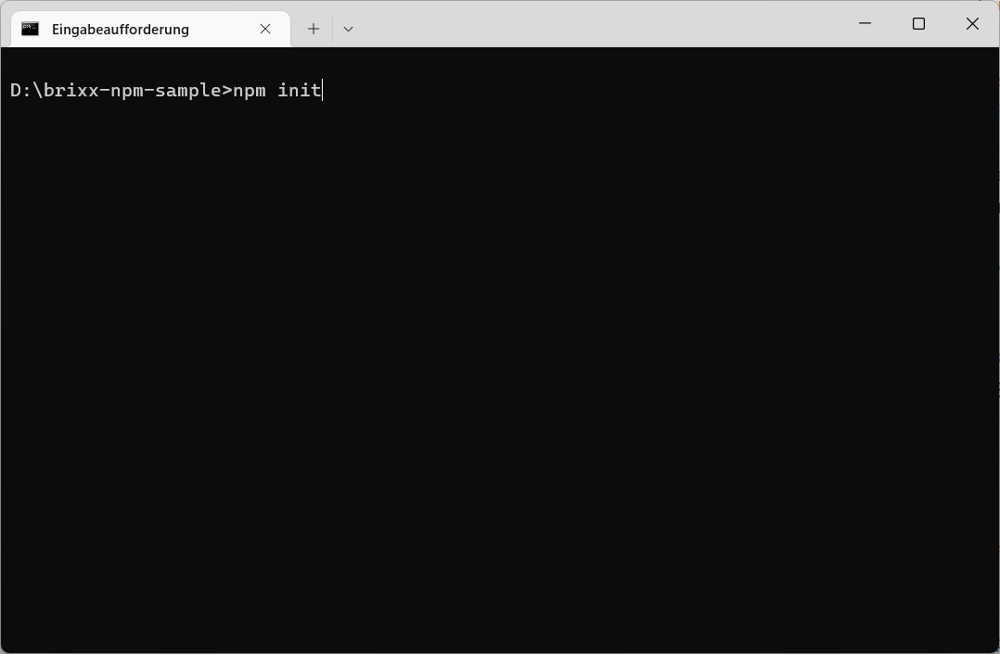

Anschliessend wird man aufgefordert die Angaben zum Projekt zu machen.  

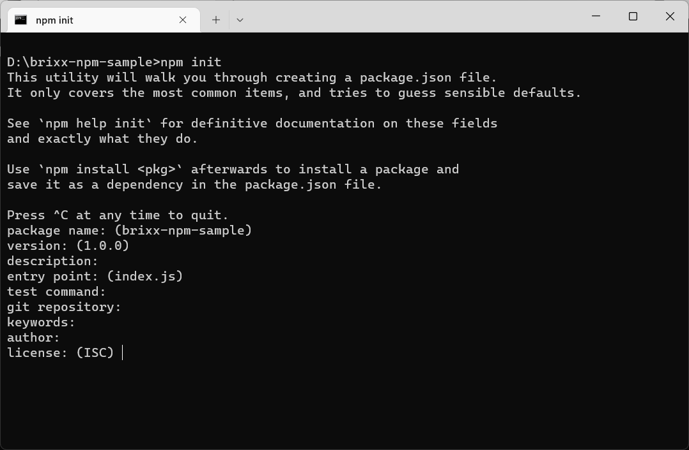

Wir können im ersten Schritt die Eingabevorschläge bestätigen und später erweitern.

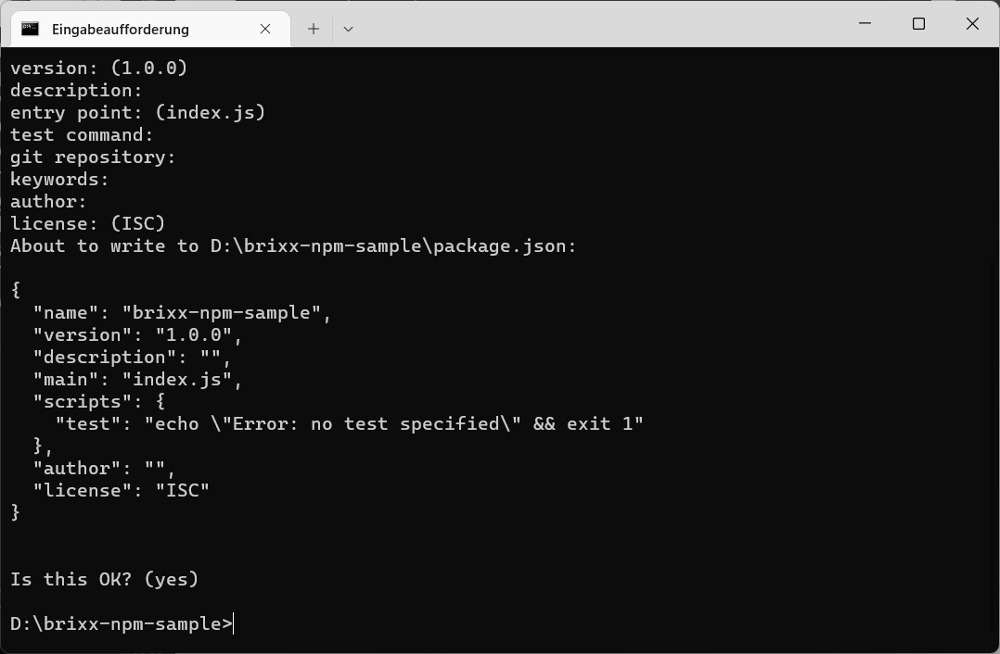

Wir betätigen mit **`[yes]`** und sind fertig.

  > **TIP:** Die `package.json` kann auch im Projektordner **`[brixx-npm-sample]`** innerhalb m Visual Studio Code in einem integrierten Terminal-Fenster (`Ctrl+Shift+ö`) erstellt werden.


Integriertes Terminal-Fenster im Visual Studio Code

#

Under Construction ...

### **webpack**

## Build a Brixx HTML-Element
...  

### Build a Brixx JSX-Element (Preview)

Kompletter Brixx Web-Baustein in der JavaScript-Datei **`./components/brixx-simple-element.js`**

    // Imports
    import { Brixx } from '@brixx/script'

    // Create a Brixx JSX-Element
    const Greeting = ({ name }) => (
      <div>
        <h3>Hello {name}. Welcome to the our Brixx world!</h3>
      </div>
    )

    // Create a Brixx default element
    Brixx.element = (
      <div>
        <div>
          <hr />
          <h2>Brixx JSX-Element</h2>
          <Greeting name={'Bob the Builder'} />
          <hr />
        </div>
      </div>
    )

    // Register the Brixx HTML-Element <brixx-simple-element>
    Brixx.registerElement({ name: 'brixx-simple-element' })

## Build a Brixx Component Class

### Brixx Component Class Sample (Preview)

Komplette Brixx Component Class **`Counter`** in der JavaScript-Datei **`Counter.js`**

    // Imports
    import { Brixx } from '@brixx/script'

    /**
    * Class Brixx Counter component
    */
    export default class Counter extends Brixx.Component {
      /**
      * Create a Brixx Counter component object
      *
      * @param {*} props - the Counter props
      */
      constructor(props) {
        super(props)
        this.state = {
          count: 0
        }
      }

      /**
      * Brixx Counter component mounted
      */
      componentDidMount() {
        Brixx.console.log('Brixx Counter Component mounted')

        // Force render if component is mounted
        this.forceUpdate()
      }

      /**
      * Render the Brixx Counter component
      */
      render() {
        return (
          <div id={this.id}>
            {this.props.children}
            <h3>Count: {this.state.count}</h3>
            <button
              onClick={(event) => {
                this.setState({
                  count: this.state.count + 1
                })
              }}
            >
              Increment
            </button>
          </div>
        )
      }
    }

## Build a Brixx-Script-Component
...