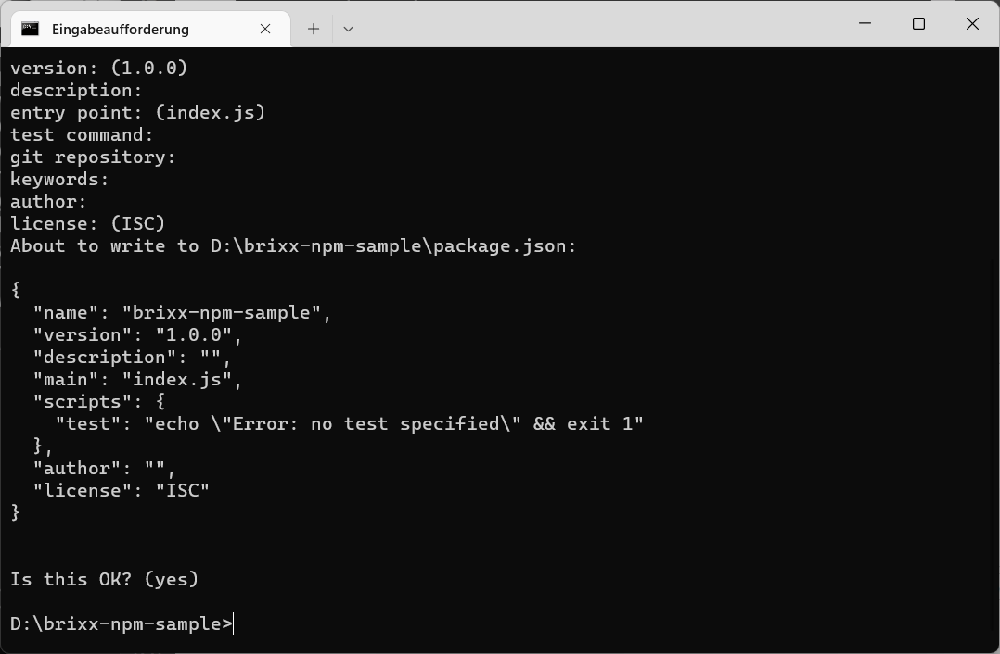

# Projekt-Konfiguration package.json

Die `package.json` ist die **Konfigurationsdatei** in einem modernen JavaScript Projekt mit **Node.js**, die sich in der Regel im Stammverzeichnis (`root`) des Projekts befindent.

Beispiel für eine _package.json_ Datei

    {
      "name": "brixx-simple-element",
      "version": "1.0.0",
      "description": "This is a Brixx JavaSript package sample",
      "main": "index.js",
      "scripts": {
        "build": "webpack --env package_name=%npm_package_name%",
        "start": "webpack-dev-server --env package_name=%npm_package_name%"
      },
      "keywords": [
        "brixx",
        "npm",
        "package"
      ],
      "author": "Frank Biet",
      "license": "MIT",
      "dependencies": {
        "@brixx/script": "1.0.0"
      },
      "devDependencies": {
        "@babel/core": "7.19.6",
        "@babel/preset-env": "7.19.4",
        "@babel/plugin-transform-react-jsx": "7.19.0",
        "babel-loader": "8.2.5",
        "css-loader": "6.7.1",
        "html-webpack-plugin": "5.5.0",
        "style-loader": "3.3.1",
        "webpack": "5.74.0",
        "webpack-cli": "4.10.0",
        "webpack-dev-server": "4.11.1"
      }
    }

## Wofür wird die package.json benötigt?

Die _package.json_ ist der zentrale Ort im JavaScript Projekt, an dem man das Projekt konfigurieren kann und die Abhängigkeiten des Projekts verwaltet werden. Sie wird für das Package-Handling mit **npm** benötigt, um ein Projekt starten, Scripte ausführen, Abhängigkeiten installieren, in der npm-Registry veröffentlichen und andere nützliche Aufgaben auszuführen zu können. Die _package.json_ erfüllt mehrere Rollen im Projekt, von denen einige nur für die in der npm-Registry veröffentlichten Packages gelten.

> Ein Projekt muss eine _package.json_ enthalten, bevor Packages mit npm installiert werden können.

## Wichtige Felder in der package.json

Wir sehen uns die wichtigsten Felder (Eigenschaften) der _package.json_ an. Einige sind für die Veröffentlichung in der npm-Registry erforderlich, während andere helfen, die Anwendung auszuführen oder Abhängigkeiten zu installieren. Es gibt mehr Felder als wir behandeln, sind aber die wesentlichen die man kennen sollte.

    name: "brixx-simple-element"

Das Feld `name` definiert den Namen des Package. Beim Veröffentlichen in der npm-Registry ist das der Name, unter dem das Package aufgelistet wird. Der Name darf nicht mehr als 214 Zeichen lang sein, nur Kleinbuchstaben enthalten und muss URL-sicher sein (Bindestriche und Unterstriche sind erlaubt, aber keine Leerzeichen oder andere Zeichen, die in URLs nicht erlaubt sind).

    "version": "1.0.0"

Das Feld `version` ist für jedes veröffentlichte Package wichtig und bei der Veröffentlichung erforderlich. Es ist die aktuelle Version der Software, die die _package.json_ beschreibt, und sollte im [Semantic Versioning](https://semver.org/) Format sein.

> Sie müssen Semantic Version nicht verwenden, aber es ist der verwendete Standard und wird empfohlen. Für ein unveröffentlichtes Package ist die Eigenschaft nicht erforderlich und ist optional. Die Versionsnummer wird entsprechend erhöht bevor eine neue Version in der npm-Registry veröffentlicht wird. Wird ein Package als Abhängigkeit verwendet ist es wichtig die Version auf dem neuesten Stand zu halten, um sicherzustellen, dass andere die richtige Version eines Package verwenden.

    "description": "This is a Brixx JavaSript package sample"

Das Feld `description` wird von der npm-Registry für veröffentlichte Packages verwendet, um das Package in den Suchergebnissen und auf der Website `npmjs.com` zu beschreiben. und wird verwendet, Packages aufzufinden, wenn Benutzer die npm-Registry durchsuchen. Das sollte eine kurze Zusammenfassung sein wofür das Package bestimmt ist.

    "main": "index.js"

Das Felt `main` ist eine funktionale Eigenschaft der _package.json_. Es definiert den Einstiegspunkt in das Projekt und ist üblicherweise die Datei, die zum Starten des Projekts verwendet wird. In der Regel die Datei `index.js` im Stammverzeichnis des Projekts, kann aber jede Datei sein.

    "scripts": {
      "build": "webpack --env package_name=%npm_package_name%",
      "start": "webpack-dev-server --env package_name=%npm_package_name%"
    },

Das Feld `scripts` ist eine weitere funktionale Eigenschaft und gibt ein Objekte an, dessen Schlüssel die Scripte sind, die mit `npm run <scriptName>` aufgeführt werden können. Scripte sind in der Regel Terminalbefehle, mit denen man Aufgaben für ein Projekt ausführen kann, wie im Beispiel `npm run build`.

    "keywords": ["brixx", "npm", "package"]

Das Feld `keywords` ist eine Liste von Schlüsselörter und dient einem ähnlichen Zweck wie die Beschreibung. Es wird von der npm-Registry indiziert, um bei der Suche nach Packages zu helfen. Jeder Wert ist ein Schlüsselwort, das dem Package zugeordnet wird. Das Feld wird nicht benötigt und ist optional, wenn das Package nicht in der npm-Registry veröffentlicht wird.

    "author": "Frank Biet"

Das Feld `author` ist eine Zeichenfolge im Format `"Name <email> <url>"`oder ein Objekt mit den Eigenschaften `name`, `email`, `url`. Die Eigenschaften für die E-Mail-Adresse und URL sind optional.

    "author": [{
      "name": "Frank Biet",
      "email": "info@brixx.it",
      "url": "https://brixx.it"
    }],

Diese Eigenschaft ist nützlich um einen Kontakt für ein öffentliches Projekt anzugeben.

    "license": "MIT"

Das Feld `license` ist eine wichtige und oft übersehene Eigenschaft. Mit der Eigenschaft wird definiert welche Lizenz für den Code gilt. Das ist wichtig, wenn man ein Projekt in der npm-Registry veröffentlicht, da die Lizenz die Verwendung der Software durch einige Entwickler oder Organisationen einschränken kann. Eine eindeutige Lizenz hilft, klar zu definieren, unter welchen Bedingungen die Software verwendet werden kann. Das Feld wird nicht benötigt und ist optional, wenn das Package nicht in der npm-Registry veröffentlicht wird.

> Der Wert ist normalerweise der Kennungscode der Lizenz – eine Zeichenfolge wie `"MIT"` oder `"ISC"` für die MIT- bzw. ISC-Lizenz. Wenn Sie keine Lizenz bereitstellen oder die Nutzung eines privaten oder unveröffentlichten Package ausdrücklich nicht gewähren möchten, können Sie `"UNLICENSED"` angeben.

    "repository": {
      "type": "git",
      "url": "https://github.com/..."
    }

Mit dem Feld `repository` kann man angeben wo sich der Code für das Projekt befindet. Das Feld enthält ein Objekt, das eine URL definiert unter der sich der Quellcode befindet, und welche Art von Versionskontrollsystem verwendet wird. Die Eigenschaft für die URL soll darauf hinweisen, von wo aus auf die Versionskontrolle zugegriffen werden kann, nicht nur auf die freigegebene Codebasis. Das Feld wird nicht benötigt und ist optional, wenn das Package nicht in der npm-Registry veröffentlicht wird.

    "dependencies": {
      "@brixx/script": "1.0.0"
    }

Mit dem Feld `dependencies` werden die Abhängigkeiten im Projekt aufgelistet, ist eines der wichtigsten Felder, und der Grund warum wir die _package.json_ benötigen. Wird ein Package mit npm installiert, werden alle Abhängigkeiten im Ordner `[node_modules]` heruntergeladen und ein Eintrag zur Eigenschaft `dependencies` hinzugefügt. Das Feld enthält ein Objekt mit dem Namen der Packages als Schlüssel und einer Version oder einem Versionsbereich als Wert. Damit „weiß“ npm, welches Package in welcher Versioner installiert werden muss, wenn `npm install` im Ordner ausgeführt in der sich die package.json befindet.

> Das Caretzeichen ( `^` ) und die Tilde ( `~` ) sind zusätzliche Notationen für Versionsbereiche in der _package.json_ ([mehr über Versionen in npm](https://docs.npmjs.com/cli/v6/using-npm/semver)).

    "devDependencies": {
      "@babel/core": "7.19.6",
      "@babel/preset-env": "7.19.4",
      "@babel/plugin-transform-react-jsx": "7.19.0",
      "babel-loader": "8.2.5",
      "css-loader": "6.7.1",
      "html-webpack-plugin": "5.5.0",
      "style-loader": "3.3.1",
      "webpack": "5.74.0",
      "webpack-cli": "4.10.0",
      "webpack-dev-server": "4.11.1"
    }

Mit dem Feld `devDependencies` kann man angeben welche Abhängigkeiten für die Entwicklung benötigt werden. Ein Beispiel ist `webpack`, ein Tools zum erstellen von Projekt Bundles, das nicht benötigt wird wenn die Anwendung bereitgestellt und in einer Live-Umgebung ist. Wenn man die Anwendung in einer Live-Umgebung installieren möchte, kann man `npm install --production` verwenden, um nur zu installieren was im Feld `dependencies` aufgeführt ist.

> Um ein Package als `devDependency` zu installieren, verwendet man `npm install --save-dev <package>`

## Verwalten der package.json

Eine _package.json_ Datei muss im gültigen **JSON-Format** sein. Das bedeutet, dass fehlende Kommas, nicht geschlossene Anführungszeichen oder andere Formatierungsfehler npm daran hindern, mit der _package.json_ zu interagieren, und beim nächsten Ausführen eines npm-Befehls wird ein Fehler angezeigt.

NPM-Packages werden mit den npm-Befehlen `npm install`, `npm uninstall` und `npm update` verwaltet, so dass die Datei _package.json_ und der Ordner `[node_modules]` synchron gehalten werden. Wenn man eine Abhängigkeit manuell hinzufüget, muss man `npm install` ausführen bevor man die Abhängigkeit im Projekt verwenden kann.

> Packages für die Entwicklung können aternativ im „globalen“ Ordner `[node_modules]` mit `npm install <package> -g` installiert werden, müssen dann nicht im Projekt bereitgestellt werden, und sind in allen Projekten verfügbar. Das ist aber nicht empfohlen, wenn man mehreren Entwicklern an einem Projekt arbeiten. Das kann auch zu Konflikten in Projekten kommen die eine spezielle Package Version benötigen. Es ist kein Nachteil Packages für ein Projekte bereitzustellen. Zuerst werden Packages im Projektordner gesucht, werden diese nicht gefunden wird im globalen Package Ordner gesucht.

Mit Hilfe von `npm init` zum Erstellen der _package.json_ kann man sicherstellen, dass Sie eine gültige _package.json_ Datei erstellt wird. Dazu erstellen als Beispiel einen neuen Ordner `[brixx-npm-sample]` und wechseln in die Eingabeaufforderung, oder einer anderen Terminal Anwendung in das erstellte Verzeichnis und starten `npm init`

Anschliessend wird man aufgefordert Angaben zum Projekt zu machen.

Wir können Eingabevorschläge bestätigen und später anpassen oder erweiten.

Wir betätigen die Eingaben in der Eingabeaufforderung und sind fertig.

> **TIP:** Die _package.json_ kann auch im Projektordner `[brixx-npm-sample]` in Visual Studio Code in einem Terminal-Fenster (`Ctrl+Shift+ö`) erstellt werden.

Visual Studio Code - Terminal-Fenster
