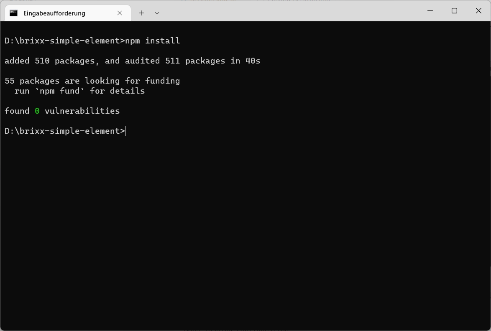
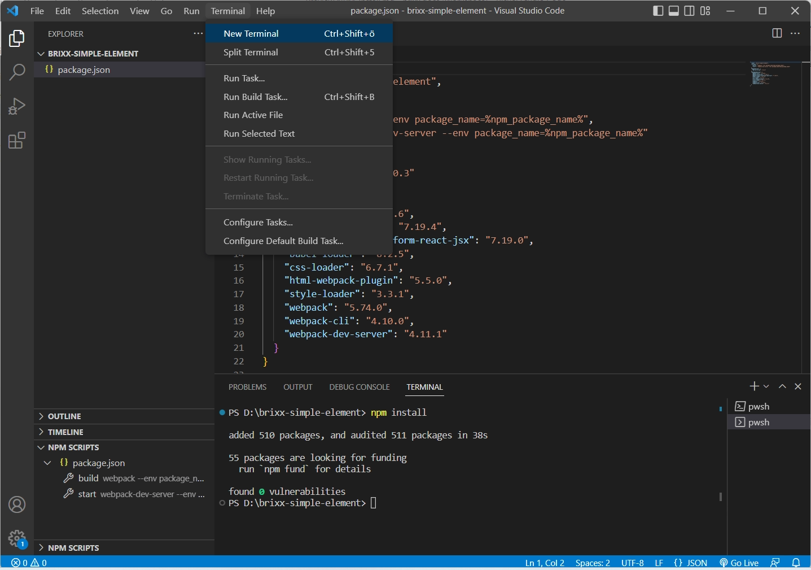

# NPM-Packages installieren 
Wir öffnen die Eingabeaufforderung unter Windows, oder eine entsprechende Terminal Anwendung in einem anderen Betriebssystem, und wechseln in den Projektordner, im Beispiel `[brixx-simple-element]`. Anschließend werden die NPM-Packages der Abhängigkeiten `dependencies` und `devDependencies` in der *package.json* mit `npm install` oder mit der Abkürzung (Shorthand) `npm i` installiert und im Ordner `[node_modules]` für die Entwicklung im Projektordner bereitgestellt.

Windows Eingabeaufforderung

  > **Tip:** Die Abhängigkeiten der *package.json* können auch in der Entwicklungsumgebung in Visual Studio Code in einem  Terminal-Fenster (Eingabeaufforderung) installiert werden. Dadurch kann man innerhalb der Entwicklungsumgebung bleiben und muss diese nicht für andere Aufgaben verlassen. Das gilt für alle Betriebssysteme.

Visual Studio Code - Terminal-Fenster

Mit dem *NPM Script Explorer* haben wir eine zusätzliche Möglichkeit die Abhängigkeiten in der *package.json* zu installieren.

Visual Studio Code - NPM-SCRIPTS (*NPM Script Explorer*)

Die NPM-Packages kann man dann durch Klick mit der rechten Maustaste (Kontextmenü) auf den Eintrag `package.json` in der Explorer-Ansicht unter `[NPM-SCRIPTS]` und Auswahl im Kontextmenü `[Run Intall]` installieren.

Nach der Installation der Abhängigkeiten in der *package.json* für das Projekt sehen wir in der Explorer-Ansicht den Ordner `node_modules` mit den NPM-Packages und die Datei `package-lock.json`

  > Die Datei *package-lock.json* enthält eine Beschreibung der installierten NPM-Packages und wird automatisch für alle Vorgänge generiert, bei denen npm die *package.json* ändert. Die *package-lock.json* wird erstellt wenn die Datei nicht vorhanden ist. In seltenen Fällen kann es notwendig sein, z. B.bei einem Update, die Datei *package-lock.json* vor der Installation zu löschen.

Visual Studio Code - Explorer-Ansicht
