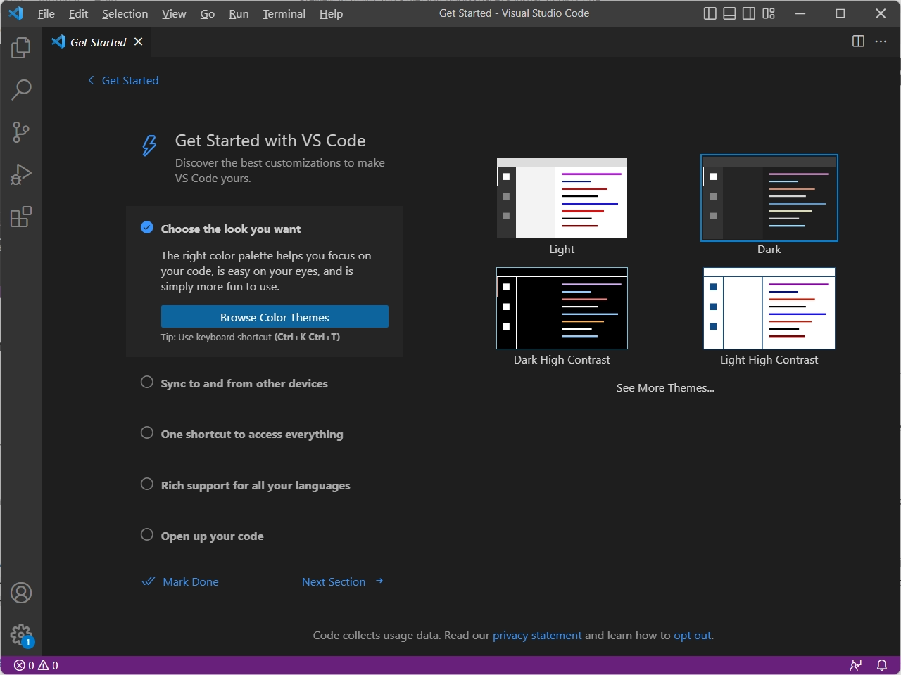
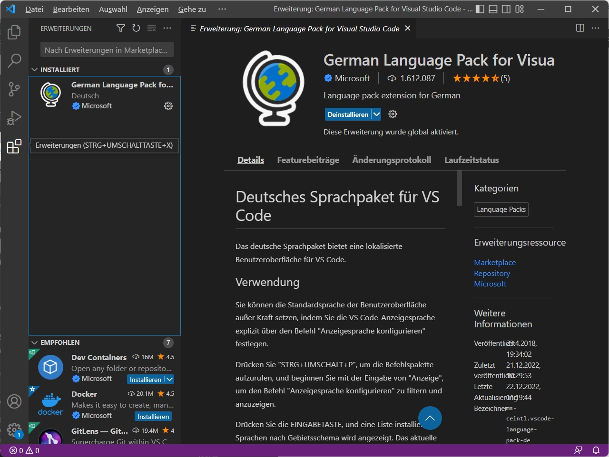
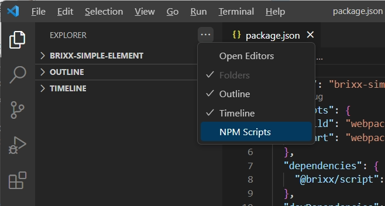

# Install Visual Studio Code for Windows
Visual Studio Code is a free code editor, which runs on the macOS, Linux, and Windows operating systems. Getting up and running with Visual Studio Code is quick and easy. It is a small download so you can install in a matter of minutes. Let's see how to install Visual Studio Code for Windows.

## Installation
1. Download the [Visual Studio Code installer](https://go.microsoft.com/fwlink/?LinkID=534107) for Windows.
2. Once it is downloaded, run the installer. This will only take a minute.
3. By default, VS Code is installed under `C:\Users\{Username}\AppData\Local\Programs\Microsoft VS Code`.

Alternatively, you can also download a [Zip archive](https://code.visualstudio.com/docs/?dv=winzip), extract it and run Code from there.

> **Tip:** Setup will add Visual Studio Code to your `%PATH%`, so from the console you can type 'code .' to open VS Code on that folder. You will need to restart your console after the installation for the change to the `%PATH%` environmental variable to take effect.

## User setup versus system setup
VS Code provides both Windows user and system level setups. Installing the [user setup](https://go.microsoft.com/fwlink/?LinkID=534107) does not require Administrator privileges as the location will be under your user Local AppData (`LOCALAPPDATA`) folder. User setup also provides a smoother background update experience.

The [system setup](https://go.microsoft.com/fwlink/?linkid=852157) requires elevation to Administrator privileges and will place the installation under Program Files. This also means that VS Code will be available to all users in the system.

See the [Download Visual Studio Code](https://code.visualstudio.com/download) page for a complete list of available installation options.

## 32-bit versions
If you need to run a 32-bit version of VS Code, both a 32-bit [Installer](https://go.microsoft.com/fwlink/?LinkId=723965) and [Zip archive](https://go.microsoft.com/fwlink/?LinkID=733265) are available.

Visual Studio Code - Get started

## Visual Studio Code Erweiterungen
Man kann die Leistung von Visual Studio Code durch Erweiterungen (Extensions) erhöhen. Features die Visual Studio Code standardmäßig enthält sind nur der „Anfang“. Mit VS Code-Erweiterungen kann man der Installation Sprachen, Debugger und Tools hinzufügen, um den Entwicklungsworkflow zu unterstützen, beispielsweise die Sprache in Visual Studio Code mit der Erweiterung [German Language Pack for Visual Studio Code](https://marketplace.visualstudio.com/items?itemName=MS-CEINTL.vscode-language-pack-de) auf Deutsch umzustellen. 

 > **Tip:** Wer mit unterschiedlichen Editoren arbeitet sollte die Sprache nicht umstellen. Das erleichtert den Umgang mit anderen Editoren, die in der Regel die selben englischen Menübezeichnungen verwenden, aber nicht bei allen Editoren ist eine Umstellung der Sprache möglich.

### Erweiterungen installieren
Erweiterung kann man im [Visual Studio Code Marketplace](https://marketplace.visualstudio.com/search?target=VSCode&category=Language%20Packs&sortBy=Installs) oder in Visual Studio Code z. B. in der Aktivitätsleiste unter Extensions (`Ctrl+Shift+X`) mit dem Suchfeld `[Search Extensions in Marktplace]` suchen und installieren. Im Beispiel exemplarisch mit der Erweiterung *German Language Pack*.

Visual Studio Code - Extensions

Nach der Installation wird man zu einem Restart aufgefordert.

### Erweiterungen deinstallieren
Genauso einfach kann man in Visual Studio Code eine Erweiterung auch wieder deinstallieren.

## Empfohlene Erweiterungen für die Entwicklung
Es gibt ein reichhaltiges Angebot nützlicher Erweiterungen für Visual Studio Code die einem die Arbeit bei der Entwicklung erleichten. Für die Erstellung von Brixx Webkomponenten sind folgende Erweiterungen nahezu unverzichtbar.

- [Live Server](https://marketplace.visualstudio.com/items?itemName=ritwickdey.LiveServer)  
  Ein lokaler Webserver (Entwicklungsserver) mit Auto Reload (Live reload) Funktion bei Änderungen am Quellcode. Der *Live Server*    ermöglicht es bei der Entwicklung das Verhalten der Brixx Webkomponente  in einer Browserumgebung zu testen, und verhindert die *blocked by CORS policy* ([Cross-Origin Resource Sharing](https://developer.mozilla.org/en-US/docs/Web/HTTP/CORS)) beim Zugriff vom Browser auf lokale Ressourcen in der Testumgebung.

- [NPM-Scripts](https://marketplace.visualstudio.com/items?itemName=traBpUkciP.vscode-npm-scripts) (Visual Studio Code bis Version 1.22)  
  Anzeigen und Ausführen von NPM-Scripts aus der Explorer-Ansicht. Seit der Version 1.23 steht in Visual Studio Code in der Explorer-Ansicht bereits ein integrierter *NPM Script Explorer* zur Verfügung und eine zusätzliche Installation der Erweiterung *NPM-Scripts* wird dann nicht mehr benötigt.

  Der *NPM Script Explorer* kann in im Menü in der Explorer-Ansicht aktiviert werden.

  

  Visual Studio Code - Menü in der Explorer-Ansicht

